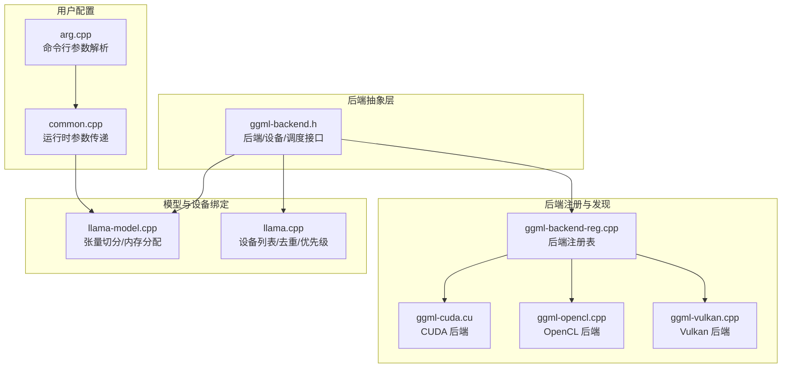
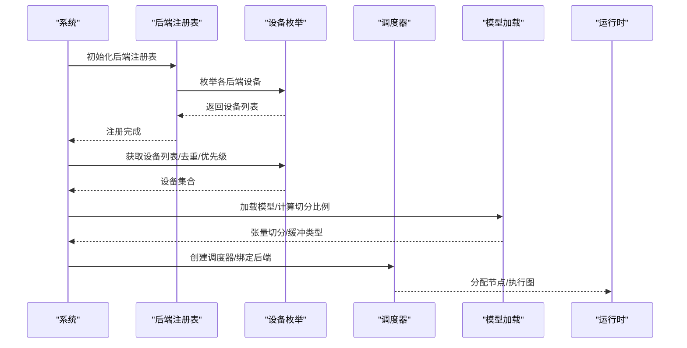
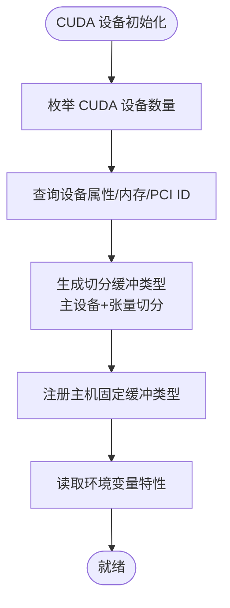
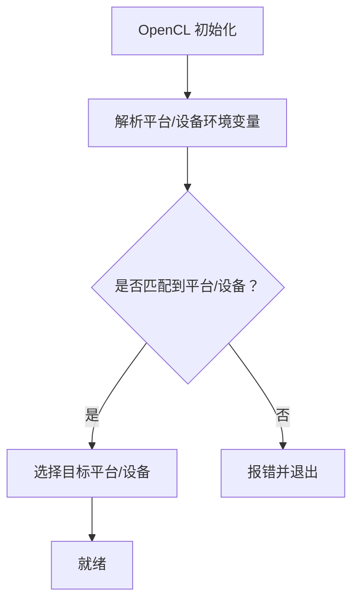
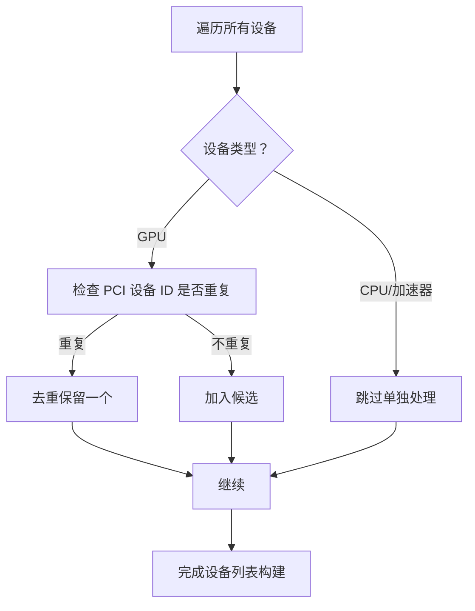
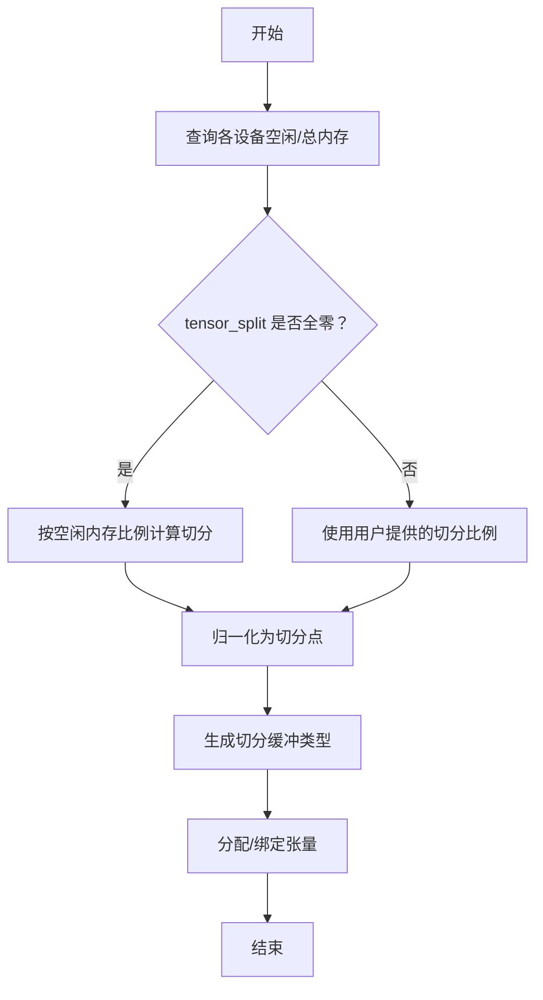
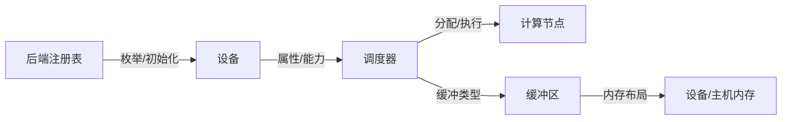

# 设备选择

<cite>
**本文引用的文件**
- [ggml-backend.h](file://ref/llama.cpp/ggml/include/ggml-backend.h)
- [ggml-backend-reg.cpp](file://ref/llama.cpp/ggml/src/ggml-backend-reg.cpp)
- [ggml-cuda.cu](file://ref/llama.cpp/ggml/src/ggml-cuda/ggml-cuda.cu)
- [ggml-cuda.h](file://ref/llama.cpp/ggml/include/ggml-cuda.h)
- [ggml-opencl.cpp](file://ref/llama.cpp/ggml/src/ggml-opencl/ggml-opencl.cpp)
- [CUDA-FEDORA.md](file://ref/llama.cpp/docs/backend/CUDA-FEDORA.md)
- [OPENCL.md](file://ref/llama.cpp/docs/backend/OPENCL.md)
- [ggml-vulkan.cpp](file://ref/llama.cpp/ggml/src/ggml-vulkan/ggml-vulkan.cpp)
- [llama.cpp](file://ref/llama.cpp/src/llama.cpp)
- [llama-model.cpp](file://ref/llama.cpp/src/llama-model.cpp)
- [arg.cpp](file://ref/llama.cpp/common/arg.cpp)
- [common.cpp](file://ref/llama.cpp/common/common.cpp)
</cite>

## 目录
1. [简介](#简介)
2. [项目结构](#项目结构)
3. [核心组件](#核心组件)
4. [架构总览](#架构总览)
5. [详细组件分析](#详细组件分析)
6. [依赖关系分析](#依赖关系分析)
7. [性能考量](#性能考量)
8. [故障排查指南](#故障排查指南)
9. [结论](#结论)
10. [附录](#附录)

## 简介
本文件聚焦于设备选择与后端配置，覆盖 CPU 与 GPU（CUDA、Metal、OpenCL、SYCL/Vulkan/WebGPU 等）的后端选择、设备优先级、自动检测与手动指定、多 GPU 配置与设备内存管理策略，并结合仓库中的实现细节给出可操作的配置建议与性能对比思路。读者无需深入底层即可理解如何在不同硬件平台上正确选择与优化推理后端。

## 项目结构
围绕设备选择与后端的核心代码主要位于以下位置：
- 后端抽象与调度：ggml 后端接口与调度器
- 具体后端实现：CUDA、OpenCL、SYCL、Vulkan、WebGPU 等
- 设备枚举与注册：后端注册表统一收集可用设备
- 模型加载与张量切分：按设备内存与拓扑进行权重与计算分配
- 命令行参数与运行时配置：设备选择、张量切分、线程数等

**图表来源**
- [ggml-backend.h:130-240](file://ref/llama.cpp/ggml/include/ggml-backend.h#L130-L240)
- [ggml-backend-reg.cpp:184-228](file://ref/llama.cpp/ggml/src/ggml-backend-reg.cpp#L184-L228)
- [ggml-cuda.cu:4844-4875](file://ref/llama.cpp/ggml/src/ggml-cuda/ggml-cuda.cu#L4844-L4875)
- [ggml-opencl.cpp:2389-2420](file://ref/llama.cpp/ggml/src/ggml-opencl/ggml-opencl.cpp#L2389-L2420)
- [ggml-vulkan.cpp:5571-5590](file://ref/llama.cpp/ggml/src/ggml-vulkan/ggml-vulkan.cpp#L5571-L5590)
- [llama-model.cpp:2478-2523](file://ref/llama.cpp/src/llama-model.cpp#L2478-L2523)
- [llama.cpp:916-944](file://ref/llama.cpp/src/llama.cpp#L916-L944)
- [arg.cpp:2352-2374](file://ref/llama.cpp/common/arg.cpp#L2352-L2374)
- [common.cpp:1099-1365](file://ref/llama.cpp/common/common.cpp#L1099-L1365)

**章节来源**
- [ggml-backend.h:130-240](file://ref/llama.cpp/ggml/include/ggml-backend.h#L130-L240)
- [ggml-backend-reg.cpp:184-228](file://ref/llama.cpp/ggml/src/ggml-backend-reg.cpp#L184-L228)

## 核心组件
- 后端与设备类型
  - 设备类型枚举涵盖 CPU、GPU、集成 GPU（igpu）、加速器（如 BLAS/AMX），用于区分资源属性与能力。
  - 设备属性包含名称、描述、内存信息、PCI 设备 ID、能力标志（异步、主机缓冲、事件同步等）。
- 后端注册与发现
  - 注册表在编译期启用对应后端宏，动态注册各后端及其设备；支持从动态库加载后端。
  - 提供按名称/类型/索引获取后端与设备的能力查询接口。
- 调度器与缓冲区类型
  - 调度器负责多后端协同：根据算子支持、张量所在缓冲区位置、权重与计算的缓冲区使用标记，自动选择最优后端执行。
  - 缓冲区类型定义了对齐、最大尺寸、从主机指针创建缓冲等能力；CUDA/ROCm/MUSA/HIP 等通过统一接口暴露。
- 设备内存与张量切分
  - 按设备空闲内存比例或显式切分数组进行张量切分，支持多 GPU 并行与主设备切分缓冲类型。
  - 当设备无法报告内存时回退到主机内存，保证可用性。

**章节来源**
- [ggml-backend.h:130-240](file://ref/llama.cpp/ggml/include/ggml-backend.h#L130-L240)
- [ggml-backend-reg.cpp:184-228](file://ref/llama.cpp/ggml/src/ggml-backend-reg.cpp#L184-L228)
- [llama-model.cpp:2478-2523](file://ref/llama.cpp/src/llama-model.cpp#L2478-L2523)

## 架构总览
下图展示设备选择与后端调度的整体流程：系统通过注册表发现可用后端与设备，构建设备列表并去重/优先级排序，随后在模型加载阶段依据内存与拓扑进行张量切分与缓冲分配，最终由调度器在运行时将节点分配到合适的后端执行。

**图表来源**
- [ggml-backend-reg.cpp:184-228](file://ref/llama.cpp/ggml/src/ggml-backend-reg.cpp#L184-L228)
- [llama.cpp:916-944](file://ref/llama.cpp/src/llama.cpp#L916-L944)
- [llama-model.cpp:2478-2523](file://ref/llama.cpp/src/llama-model.cpp#L2478-L2523)

## 详细组件分析

### CUDA 后端
- 设备发现与属性
  - 注册表为每个 CUDA 设备创建设备上下文，填充名称、描述、PCI 总线 ID、最小批大小等；同时查询设备内存并填充设备属性。
- 多 GPU 切分与缓冲
  - 支持“主设备切分缓冲类型”，基于张量切分数组生成切分映射；当未提供切分数组时使用默认切分。
  - 提供 pinned 主机缓冲类型以提升 CPU/GPU 间拷贝性能。
- 环境变量与特性
  - 可通过环境变量控制是否使用固定内存、禁用 peer copy、启用 graphs 等；后端特性通过特征标志返回。
- 安装与环境
  - 提供在 Fedora 系统上安装 CUDA 的完整步骤，包括工具链、驱动库、元包安装与环境变量配置。

**图表来源**
- [ggml-cuda.cu:4844-4875](file://ref/llama.cpp/ggml/src/ggml-cuda/ggml-cuda.cu#L4844-L4875)
- [ggml-cuda.cu:1066-1096](file://ref/llama.cpp/ggml/src/ggml-cuda/ggml-cuda.cu#L1066-L1096)
- [ggml-cuda.h:20-48](file://ref/llama.cpp/ggml/include/ggml-cuda.h#L20-L48)
- [CUDA-FEDORA.md:100-170](file://ref/llama.cpp/docs/backend/CUDA-FEDORA.md#L100-L170)

**章节来源**
- [ggml-cuda.cu:4844-4875](file://ref/llama.cpp/ggml/src/ggml-cuda/ggml-cuda.cu#L4844-L4875)
- [ggml-cuda.cu:1066-1096](file://ref/llama.cpp/ggml/src/ggml-cuda/ggml-cuda.cu#L1066-L1096)
- [ggml-cuda.h:20-48](file://ref/llama.cpp/ggml/include/ggml-cuda.h#L20-L48)
- [CUDA-FEDORA.md:100-170](file://ref/llama.cpp/docs/backend/CUDA-FEDORA.md#L100-L170)

### OpenCL 后端
- 手动指定与平台/设备选择
  - 支持通过环境变量指定平台号与设备号；若未指定则按子串匹配平台名称/厂商名。
- 设备族与编译器版本
  - 区分 Adreno、Intel 等 GPU 家族与编译器版本，便于针对性优化与兼容性处理。
- 平台与驱动要求
  - 文档提供了在 Android、Windows 11 ARM64、Linux 上的构建与依赖准备步骤，以及已验证的设备与数据类型支持情况。

**图表来源**
- [ggml-opencl.cpp:2389-2420](file://ref/llama.cpp/ggml/src/ggml-opencl/ggml-opencl.cpp#L2389-L2420)
- [OPENCL.md:86-154](file://ref/llama.cpp/docs/backend/OPENCL.md#L86-L154)

**章节来源**
- [ggml-opencl.cpp:2389-2420](file://ref/llama.cpp/ggml/src/ggml-opencl/ggml-opencl.cpp#L2389-L2420)
- [OPENCL.md:86-154](file://ref/llama.cpp/docs/backend/OPENCL.md#L86-L154)

### Vulkan 后端
- 设备优先级与驱动优先级
  - 通过比较驱动 ID 与驱动优先级，动态调整设备列表顺序，优先选择更优的驱动组合。
- 多 GPU 场景
  - 在存在多个候选设备时，按驱动优先级进行替换与追加，确保最佳设备被选中。

**章节来源**
- [ggml-vulkan.cpp:5571-5590](file://ref/llama.cpp/ggml/src/ggml-vulkan/ggml-vulkan.cpp#L5571-L5590)

### 设备优先级与自动检测
- 设备列表构建与去重
  - 枚举所有后端设备，跳过 CPU 后端；对 GPU 设备按 PCI 设备 ID 去重，避免重复设备影响调度。
- 优先级策略
  - 注册表中后端顺序即为优先级顺序；调度器会优先选择支持算子且与权重所在后端一致的设备。
  - Vulkan 后端通过驱动优先级动态调整设备顺序。

**图表来源**
- [llama.cpp:916-944](file://ref/llama.cpp/src/llama.cpp#L916-L944)

**章节来源**
- [llama.cpp:916-944](file://ref/llama.cpp/src/llama.cpp#L916-L944)

### 多 GPU 配置与设备内存管理
- 张量切分与缓冲类型
  - 默认按设备空闲内存比例进行切分；若设备无法报告内存，则回退到主机内存。
  - 支持显式 tensor_split 数组，按比例归一化后作为切分点。
- 主设备切分缓冲
  - CUDA 后端提供“主设备切分缓冲类型”，将大矩阵按行切分到多个设备，提升多卡吞吐。
- 运行时参数
  - 命令行参数支持 --tensor-split 传入切分比例；运行时将这些参数传递给模型加载逻辑。

**图表来源**
- [llama-model.cpp:2478-2523](file://ref/llama.cpp/src/llama-model.cpp#L2478-L2523)
- [ggml-cuda.cu:1066-1096](file://ref/llama.cpp/ggml/src/ggml-cuda/ggml-cuda.cu#L1066-L1096)
- [arg.cpp:2352-2374](file://ref/llama.cpp/common/arg.cpp#L2352-L2374)
- [common.cpp:1099-1365](file://ref/llama.cpp/common/common.cpp#L1099-L1365)

**章节来源**
- [llama-model.cpp:2478-2523](file://ref/llama.cpp/src/llama-model.cpp#L2478-L2523)
- [ggml-cuda.cu:1066-1096](file://ref/llama.cpp/ggml/src/ggml-cuda/ggml-cuda.cu#L1066-L1096)
- [arg.cpp:2352-2374](file://ref/llama.cpp/common/arg.cpp#L2352-L2374)
- [common.cpp:1099-1365](file://ref/llama.cpp/common/common.cpp#L1099-L1365)

## 依赖关系分析
- 后端注册表集中管理所有后端与设备，提供统一的枚举与初始化入口。
- 设备属性与能力决定调度器的节点分配策略；缓冲区类型决定内存布局与拷贝路径。
- 模型加载阶段的张量切分依赖设备内存信息与用户配置；运行时通过调度器执行。

**图表来源**
- [ggml-backend-reg.cpp:184-228](file://ref/llama.cpp/ggml/src/ggml-backend-reg.cpp#L184-L228)
- [ggml-backend.h:130-240](file://ref/llama.cpp/ggml/include/ggml-backend.h#L130-L240)
- [llama-model.cpp:2478-2523](file://ref/llama.cpp/src/llama-model.cpp#L2478-L2523)

**章节来源**
- [ggml-backend-reg.cpp:184-228](file://ref/llama.cpp/ggml/src/ggml-backend-reg.cpp#L184-L228)
- [ggml-backend.h:130-240](file://ref/llama.cpp/ggml/include/ggml-backend.h#L130-L240)

## 性能考量
- CUDA
  - 使用 pinned 主机缓冲可显著降低 CPU/GPU 拷贝延迟；合理设置张量切分可提升多卡吞吐。
  - 环境变量可用于开启/关闭某些优化路径（如 graphs、peer copy）。
- OpenCL
  - 不同 GPU 家族与编译器版本存在性能差异；建议优先使用纯 Q4_0 或针对 MoE 的 MXFP4 量化以获得更好性能。
- Vulkan
  - 通过驱动优先级动态选择最优设备，减少跨驱动切换带来的性能抖动。
- 通用建议
  - 尽可能让权重所在后端与计算后端一致，减少跨后端拷贝。
  - 在多 GPU 场景下，优先使用“主设备切分缓冲类型”并结合空闲内存比例进行切分。

[本节为通用指导，不直接分析具体文件]

## 故障排查指南
- CUDA 安装与环境
  - 若 nvcc 无法找到，请确认 PATH 已包含 CUDA 二进制目录；参考 Fedora 环境下的安装步骤。
- OpenCL 平台/设备选择
  - 若指定的平台或设备无效，程序会报错并退出；请检查环境变量与平台/设备编号。
- 设备去重与优先级
  - 若出现设备重复或优先级不符合预期，检查 PCI 设备 ID 去重逻辑与后端注册顺序。
- 多 GPU 切分
  - 若切分比例无效或内存不足，检查 tensor_split 参数与设备内存信息；必要时回退到按空闲内存比例切分。

**章节来源**
- [CUDA-FEDORA.md:234-254](file://ref/llama.cpp/docs/backend/CUDA-FEDORA.md#L234-L254)
- [ggml-opencl.cpp:2389-2420](file://ref/llama.cpp/ggml/src/ggml-opencl/ggml-opencl.cpp#L2389-L2420)
- [llama.cpp:916-944](file://ref/llama.cpp/src/llama.cpp#L916-L944)
- [llama-model.cpp:2478-2523](file://ref/llama.cpp/src/llama-model.cpp#L2478-L2523)

## 结论
通过统一的后端抽象与注册表，系统能够自动发现并优先选择合适的设备；结合设备属性、能力与内存信息，调度器可在运行时高效分配计算任务。对于多 GPU 场景，合理的张量切分与主设备切分缓冲类型是提升性能的关键。OpenCL、CUDA、Vulkan 等后端各有适用平台与优化空间，应根据硬件与驱动条件选择最合适的后端与配置。

[本节为总结，不直接分析具体文件]

## 附录
- 常用配置要点
  - 后端选择：通过编译期宏启用所需后端；运行时可通过注册表与设备枚举自动发现。
  - 设备优先级：后端注册顺序即优先级；Vulkan 可按驱动优先级动态调整。
  - 多 GPU：使用主设备切分缓冲类型与张量切分数组；回退到按空闲内存比例切分。
  - OpenCL：通过环境变量指定平台/设备；注意不同 GPU 家族与编译器版本的性能差异。
- 参考文档
  - CUDA 安装与环境配置：参见 CUDA-FEDORA.md。
  - OpenCL 平台与设备支持：参见 OPENCL.md。

**章节来源**
- [CUDA-FEDORA.md:100-170](file://ref/llama.cpp/docs/backend/CUDA-FEDORA.md#L100-L170)
- [OPENCL.md:86-154](file://ref/llama.cpp/docs/backend/OPENCL.md#L86-L154)