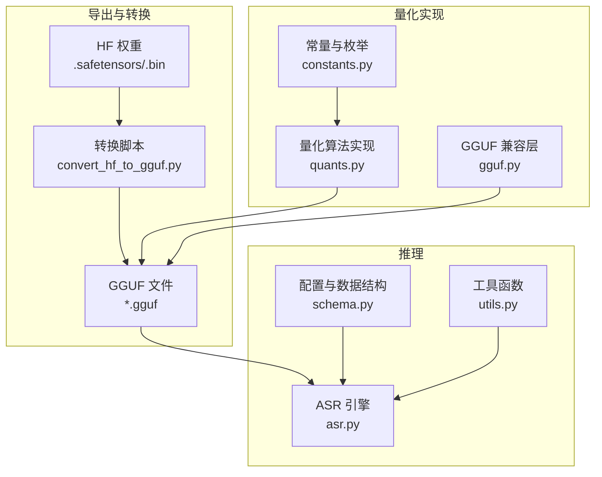
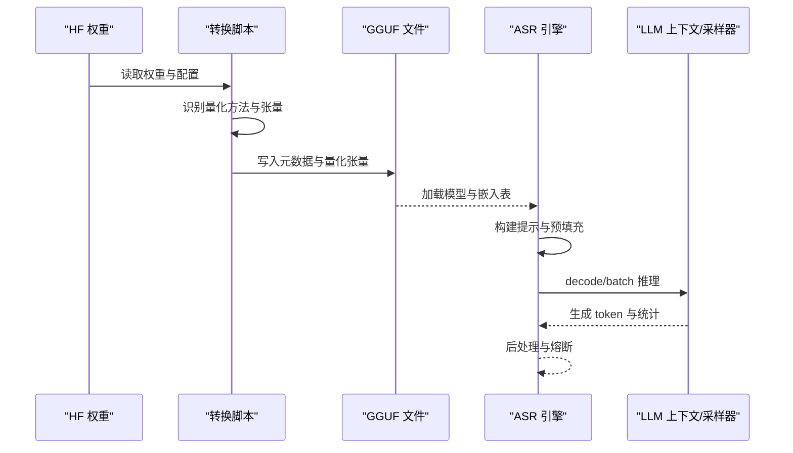
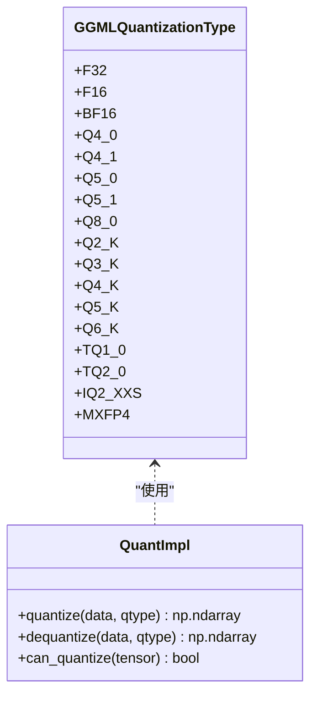
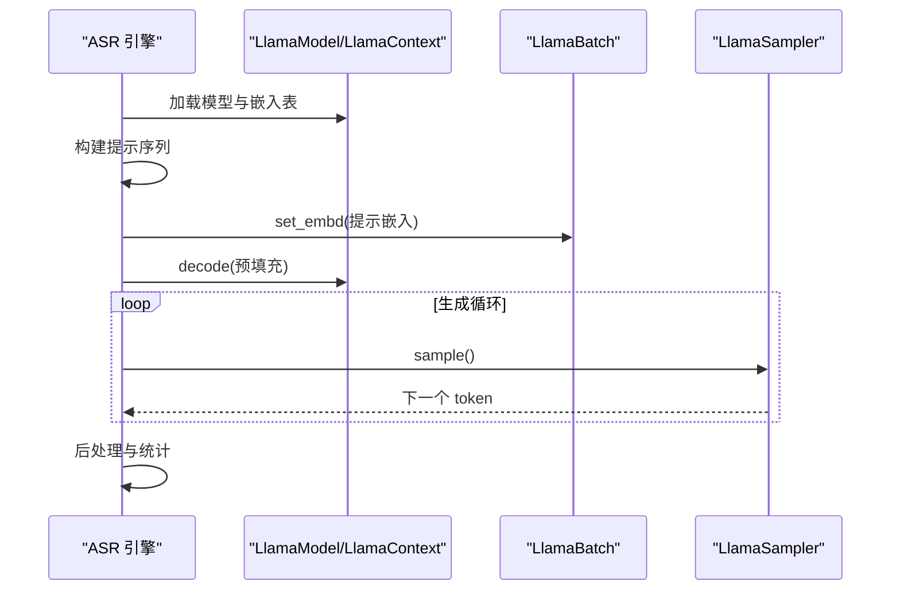
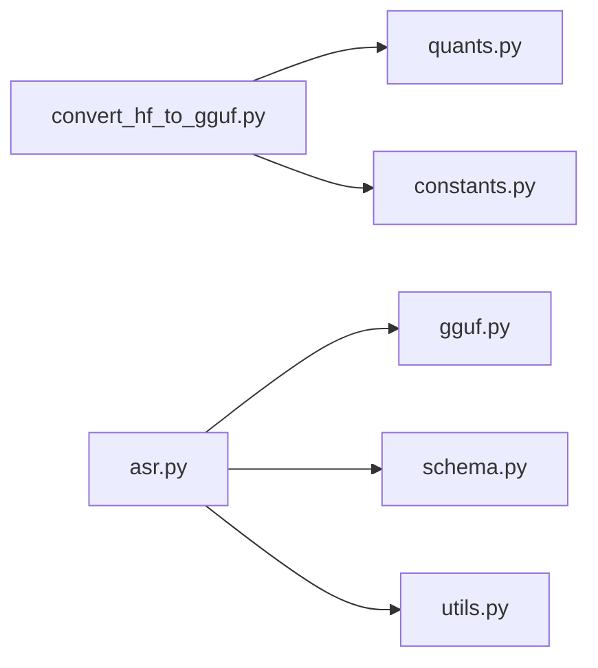

# 量化配置

<cite>
**本文引用的文件**
- [configuration_qwen3_asr.py](file://qwen_asr_gguf/export/qwen3_asr_custom/configuration_qwen3_asr.py)
- [convert_hf_to_gguf.py](file://qwen_asr_gguf/export/convert_hf_to_gguf.py)
- [quants.py](file://qwen_asr_gguf/export/gguf/quants.py)
- [constants.py](file://qwen_asr_gguf/export/gguf/constants.py)
- [asr.py](file://qwen_asr_gguf/inference/asr.py)
- [schema.py](file://qwen_asr_gguf/inference/schema.py)
- [utils.py](file://qwen_asr_gguf/inference/utils.py)
- [gguf.py](file://qwen_asr_gguf/export/gguf/gguf.py)
- [FileType.kt](file://ref/llama.cpp/examples/llama.android/lib/src/main/java/com/arm/aichat/gguf/FileType.kt)
- [ggml.c](file://ref/llama.cpp/ggml/src/ggml.c)
</cite>

## 目录
1. [简介](#简介)
2. [项目结构](#项目结构)
3. [核心组件](#核心组件)
4. [架构总览](#架构总览)
5. [详细组件分析](#详细组件分析)
6. [依赖分析](#依赖分析)
7. [性能考量](#性能考量)
8. [故障排查指南](#故障排查指南)
9. [结论](#结论)
10. [附录](#附录)

## 简介
本文件系统性梳理本仓库中的量化配置与实现，覆盖以下主题：
- 量化级别与类型：包括常见 int4、Q4_K、BF16、F16 等，并解释其在工程中的映射与约束
- 量化对性能与精度的影响：结合推理路径与内存占用分析
- 量化配置参数设置与最佳实践：如何在转换与推理阶段选择合适的量化方案
- 量化模型加载机制：从权重转换到 GGUF 文件再到推理引擎的完整链路
- 兼容性与选择建议：针对不同硬件与部署场景给出推荐

## 项目结构
围绕量化配置的关键目录与文件如下：
- 导出与转换层：将 HuggingFace 权重转换为 GGUF，并按量化类型写入
- 量化实现层：定义量化/反量化算法与数据布局
- 推理层：加载 GGUF 模型，构建提示与解码流程
- 配置层：模型与推理参数的结构化定义

图示来源
- [convert_hf_to_gguf.py:614-636](file://qwen_asr_gguf/export/convert_hf_to_gguf.py#L614-L636)
- [quants.py:56-76](file://qwen_asr_gguf/export/gguf/quants.py#L56-L76)
- [constants.py:10-13](file://qwen_asr_gguf/export/gguf/constants.py#L10-L13)
- [asr.py:90-96](file://qwen_asr_gguf/inference/asr.py#L90-L96)
- [schema.py:162-210](file://qwen_asr_gguf/inference/schema.py#L162-L210)

章节来源
- [convert_hf_to_gguf.py:614-636](file://qwen_asr_gguf/export/convert_hf_to_gguf.py#L614-L636)
- [quants.py:56-76](file://qwen_asr_gguf/export/gguf/quants.py#L56-L76)
- [constants.py:10-13](file://qwen_asr_gguf/export/gguf/constants.py#L10-L13)
- [asr.py:90-96](file://qwen_asr_gguf/inference/asr.py#L90-L96)
- [schema.py:162-210](file://qwen_asr_gguf/inference/schema.py#L162-L210)

## 核心组件
- 量化类型与映射
  - 常见类型：F32、F16、BF16、Q4_0、Q4_1、Q5_0、Q5_1、Q8_0、Q2_K、Q3_K、Q4_K、Q5_K、Q6_K、TQ1_0、TQ2_0、IQ2_XXS、MXFP4 等
  - 映射规则：转换脚本依据文件类型（ftype）与张量维度约束，将浮点权重映射到具体量化类型
- 量化实现
  - 提供量化/反量化函数与各类型的块大小、字节大小、网格表等
  - 支持惰性张量与批量处理，提高转换效率
- 推理加载
  - 引擎从 GGUF 文件加载模型与嵌入表，构建提示并执行解码
  - 通过上下文窗口与批处理控制推理开销

章节来源
- [quants.py:56-76](file://qwen_asr_gguf/export/gguf/quants.py#L56-L76)
- [convert_hf_to_gguf.py:614-636](file://qwen_asr_gguf/export/convert_hf_to_gguf.py#L614-L636)
- [asr.py:90-96](file://qwen_asr_gguf/inference/asr.py#L90-L96)

## 架构总览
从权重到推理的整体流程如下：

图示来源
- [convert_hf_to_gguf.py:614-636](file://qwen_asr_gguf/export/convert_hf_to_gguf.py#L614-L636)
- [asr.py:212-318](file://qwen_asr_gguf/inference/asr.py#L212-L318)

## 详细组件分析

### 量化类型与映射
- 类型定义与约束
  - 常量与张量映射：定义了 GGUF 版本、对齐、量化版本以及张量命名映射
  - 量化类型枚举：涵盖多种量化类型，块大小与字节大小由常量表提供
- 转换映射规则
  - 文件类型（ftype）决定默认量化类型
  - 特殊张量（如位置编码、嵌入等）强制为 F32
  - 若某类型量化失败，回退到 F16
- 实现细节
  - 各类型提供量化/反量化函数，支持按块处理与网格表初始化
  - 惰性张量包装，避免不必要的内存拷贝

图示来源
- [constants.py:10-13](file://qwen_asr_gguf/export/gguf/constants.py#L10-L13)
- [quants.py:56-76](file://qwen_asr_gguf/export/gguf/quants.py#L56-L76)

章节来源
- [constants.py:10-13](file://qwen_asr_gguf/export/gguf/constants.py#L10-L13)
- [quants.py:56-76](file://qwen_asr_gguf/export/gguf/quants.py#L56-L76)
- [convert_hf_to_gguf.py:614-636](file://qwen_asr_gguf/export/convert_hf_to_gguf.py#L614-L636)

### 量化配置参数与最佳实践
- 转换阶段
  - 文件类型（ftype）：ALL_F32、MOSTLY_F16、MOSTLY_BF16、MOSTLY_Q8_0、MOSTLY_TQ1_0、MOSTLY_TQ2_0 等
  - 张量维度约束：1D 与某些特定张量强制 F32
  - 量化失败回退：捕获量化错误后回退到 F16
- 推理阶段
  - 上下文窗口（n_ctx）：控制预填充与生成阶段的序列长度
  - 批处理大小（n_batch）：影响吞吐与显存占用
  - 温度与采样器：温度越高，多样性越高，但稳定性下降
- 最佳实践
  - GPU 推理优先考虑 F16/BF16，兼顾精度与速度
  - CPU 推理可考虑 Q4_K/Q5_K/Q6_K，显著降低内存占用
  - 大模型或长序列：适当减小 n_ctx 与 n_batch，避免 OOM
  - 低资源设备：优先选择更高压缩比的量化类型（如 Q4_K）

章节来源
- [convert_hf_to_gguf.py:614-636](file://qwen_asr_gguf/export/convert_hf_to_gguf.py#L614-L636)
- [asr.py:90-96](file://qwen_asr_gguf/inference/asr.py#L90-L96)
- [schema.py:162-210](file://qwen_asr_gguf/inference/schema.py#L162-L210)

### 量化模型加载机制
- 加载流程
  - 通过 LlamaModel 与 LlamaContext 加载 GGUF 模型与上下文
  - 获取 token 嵌入表，构建提示序列
  - 使用 LlamaBatch 设置嵌入并执行 decode
- 关键点
  - 上下文窗口越界保护：超过 n_ctx 将直接跳过推理，避免崩溃
  - 预填充与生成阶段分别统计耗时，便于性能分析
  - 采样器温度控制与重试机制，提升稳定性

图示来源
- [asr.py:212-318](file://qwen_asr_gguf/inference/asr.py#L212-L318)

章节来源
- [asr.py:90-96](file://qwen_asr_gguf/inference/asr.py#L90-L96)
- [asr.py:212-318](file://qwen_asr_gguf/inference/asr.py#L212-L318)

### 量化兼容性与选择建议
- 兼容性
  - GGUF 版本与量化版本：转换脚本写入 GGUF 与量化版本常量
  - 硬件后端：不同后端对量化类型的支持不同，需参考对应实现
- 选择建议
  - 高精度需求：F32/F16/BF16
  - 内存敏感：Q4_K/Q5_K/Q6_K/TQ1_0/TQ2_0
  - 移动端/边缘：Q4_K 为常用折中方案
  - Android 示例：FileType.kt 中列举了常见量化类型标签

章节来源
- [constants.py:10-13](file://qwen_asr_gguf/export/gguf/constants.py#L10-L13)
- [FileType.kt:10-29](file://ref/llama.cpp/examples/llama.android/lib/src/main/java/com/arm/aichat/gguf/FileType.kt#L10-L29)
- [ggml.c:644-876](file://ref/llama.cpp/ggml/src/ggml.c#L644-L876)

## 依赖分析
- 转换脚本依赖量化实现与常量定义，确保张量按规则量化并写入 GGUF
- 推理引擎依赖 GGUF 文件与量化实现，进行加载与解码
- 配置层提供统一的数据结构，贯穿转换与推理

图示来源
- [convert_hf_to_gguf.py:614-636](file://qwen_asr_gguf/export/convert_hf_to_gguf.py#L614-L636)
- [quants.py:56-76](file://qwen_asr_gguf/export/gguf/quants.py#L56-L76)
- [constants.py:10-13](file://qwen_asr_gguf/export/gguf/constants.py#L10-L13)
- [asr.py:90-96](file://qwen_asr_gguf/inference/asr.py#L90-L96)
- [schema.py:162-210](file://qwen_asr_gguf/inference/schema.py#L162-L210)
- [utils.py:58-134](file://qwen_asr_gguf/inference/utils.py#L58-L134)

章节来源
- [convert_hf_to_gguf.py:614-636](file://qwen_asr_gguf/export/convert_hf_to_gguf.py#L614-L636)
- [quants.py:56-76](file://qwen_asr_gguf/export/gguf/quants.py#L56-L76)
- [asr.py:90-96](file://qwen_asr_gguf/inference/asr.py#L90-L96)

## 性能考量
- 内存占用
  - 量化类型越高压缩比越高，内存占用越低
  - Q4_K/Q5_K/Q6_K 在 CPU 推理中尤为有效
- 推理速度
  - F16/BF16 在 GPU 上通常更快
  - QK 系列在 CPU 上有专门优化，适合低功耗设备
- 上下文窗口与批处理
  - n_ctx 过大易导致 OOM 与延迟上升
  - n_batch 影响吞吐与显存占用，需权衡

## 故障排查指南
- 量化错误回退
  - 转换阶段捕获量化异常，自动回退到 F16
- 上下文越界保护
  - 超过 n_ctx 直接跳过推理，避免进程崩溃
- 采样器重试
  - 通过温度递增与重试提升稳定性
- 语言与重复处理
  - 支持语言校验与重复模式修复，减少幻觉

章节来源
- [convert_hf_to_gguf.py:631-636](file://qwen_asr_gguf/export/convert_hf_to_gguf.py#L631-L636)
- [asr.py:226-238](file://qwen_asr_gguf/inference/asr.py#L226-L238)
- [asr.py:319-345](file://qwen_asr_gguf/inference/asr.py#L319-L345)
- [utils.py:58-134](file://qwen_asr_gguf/inference/utils.py#L58-L134)

## 结论
- 本项目提供了从 HuggingFace 权重到 GGUF 的完整量化转换链路，并在推理阶段通过上下文窗口与批处理控制性能
- 量化类型选择需综合考虑精度、内存与速度，不同硬件与场景建议采用不同的量化策略
- 通过错误回退、越界保护与采样器重试等机制，提升了系统的鲁棒性

## 附录
- 量化类型对照（示例）
  - F32：全精度，最高精度
  - F16/BF16：半精度，GPU 推荐
  - Q4_K/Q5_K/Q6_K：K 系列，CPU 推荐
  - TQ1_0/TQ2_0：稀疏量化，进一步压缩
  - IQ2_XXS/MXFP4：特殊类型，按需使用

章节来源
- [FileType.kt:10-29](file://ref/llama.cpp/examples/llama.android/lib/src/main/java/com/arm/aichat/gguf/FileType.kt#L10-L29)
- [ggml.c:644-876](file://ref/llama.cpp/ggml/src/ggml.c#L644-L876)