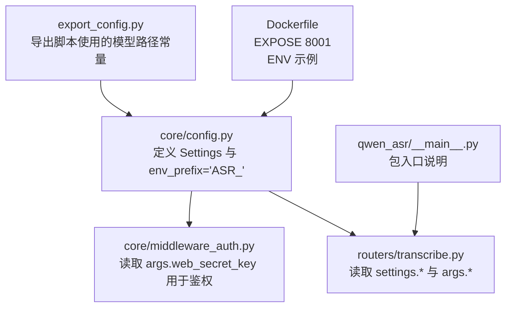
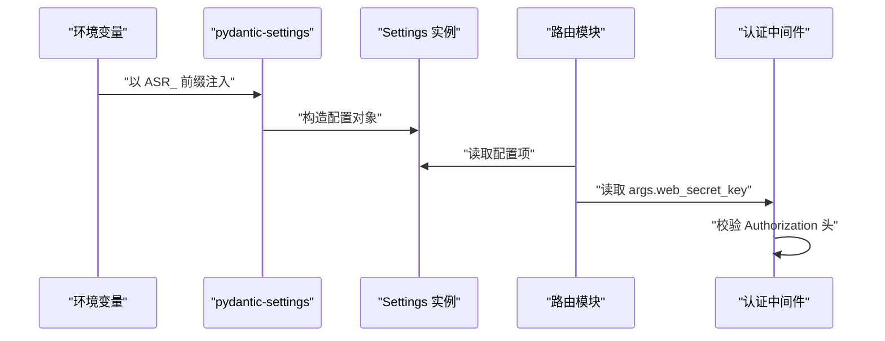
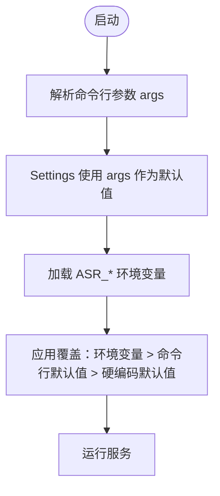

# 环境变量配置

<cite>
**本文引用的文件**
- [core/config.py](file://core/config.py)
- [core/middleware_auth.py](file://core/middleware_auth.py)
- [routers/transcribe.py](file://routers/transcribe.py)
- [export_config.py](file://export_config.py)
- [Dockerfile](file://Dockerfile)
- [qwen_asr/__main__.py](file://qwen_asr/__main__.py)
</cite>

## 目录
1. [简介](#简介)
2. [项目结构](#项目结构)
3. [核心组件](#核心组件)
4. [架构总览](#架构总览)
5. [详细组件分析](#详细组件分析)
6. [依赖分析](#依赖分析)
7. [性能考虑](#性能考虑)
8. [故障排查指南](#故障排查指南)
9. [结论](#结论)
10. [附录](#附录)

## 简介
本文件系统性梳理本项目的环境变量配置，重点覆盖以下方面：
- 支持的环境变量清单与作用说明
- 默认值、取值范围与典型使用场景
- 不同部署环境（Docker、Kubernetes、本地开发）的配置示例
- 环境变量与命令行参数的优先级与覆盖规则
- 安全注意事项与最佳实践

## 项目结构
围绕环境变量配置的关键文件与职责如下：
- 核心配置与环境变量映射：core/config.py
- 认证中间件与密钥来源：core/middleware_auth.py
- 路由与配置使用点：routers/transcribe.py
- 导出脚本中的模型路径常量：export_config.py
- 容器构建与暴露端口：Dockerfile
- 包入口说明（CLI入口）：qwen_asr/__main__.py

图表来源
- [core/config.py:52-108](file://core/config.py#L52-L108)
- [core/middleware_auth.py:1-27](file://core/middleware_auth.py#L1-L27)
- [routers/transcribe.py:33-384](file://routers/transcribe.py#L33-L384)
- [export_config.py:1-12](file://export_config.py#L1-L12)
- [Dockerfile:62-66](file://Dockerfile#L62-L66)
- [qwen_asr/__main__.py:16-23](file://qwen_asr/__main__.py#L16-L23)

章节来源
- [core/config.py:19-47](file://core/config.py#L19-L47)
- [core/config.py:52-108](file://core/config.py#L52-L108)
- [core/middleware_auth.py:10-26](file://core/middleware_auth.py#L10-L26)
- [routers/transcribe.py:33-384](file://routers/transcribe.py#L33-L384)
- [export_config.py:1-12](file://export_config.py#L1-L12)
- [Dockerfile:62-66](file://Dockerfile#L62-L66)
- [qwen_asr/__main__.py:16-23](file://qwen_asr/__main__.py#L16-L23)

## 核心组件
- Settings 类：集中定义所有可由环境变量覆盖的配置项，统一前缀为 ASR_，并通过 pydantic-settings 自动从环境变量注入。
- args 命令行参数：用于初始化 Settings 的默认值，并在认证中间件中作为密钥来源。
- 认证中间件 TokenAuthMiddleware：基于 args.web_secret_key 进行 Bearer Token 校验。
- 路由模块 routers/transcribe.py：在运行期读取 settings 与 args，执行业务逻辑。

章节来源
- [core/config.py:52-108](file://core/config.py#L52-L108)
- [core/middleware_auth.py:10-26](file://core/middleware_auth.py#L10-L26)
- [routers/transcribe.py:33-384](file://routers/transcribe.py#L33-L384)

## 架构总览
环境变量与配置的交互流程如下：

图表来源
- [core/config.py:104-108](file://core/config.py#L104-L108)
- [core/middleware_auth.py:10-26](file://core/middleware_auth.py#L10-L26)
- [routers/transcribe.py:33-384](file://routers/transcribe.py#L33-L384)

## 详细组件分析

### 环境变量清单与说明
- ASR_HOST
  - 作用：服务绑定的主机地址
  - 默认值：来自命令行参数，默认为 0.0.0.0
  - 取值范围：合法的网络地址字符串
  - 使用场景：容器或服务器多网卡环境指定监听地址
  - 章节来源
    - [core/config.py:54](file://core/config.py#L54)
    - [core/config.py:35](file://core/config.py#L35)

- ASR_PORT
  - 作用：服务绑定的端口号
  - 默认值：来自命令行参数，默认为 8002
  - 取值范围：1-65535
  - 使用场景：端口冲突时切换端口；容器映射端口
  - 章节来源
    - [core/config.py:55](file://core/config.py#L55)
    - [core/config.py:36](file://core/config.py#L36)

- ASR_MODEL_DIR
  - 作用：模型存储根目录
  - 默认值：./models
  - 取值范围：有效文件路径
  - 使用场景：挂载外部卷或自定义模型路径
  - 章节来源
    - [core/config.py:58](file://core/config.py#L58)

- ASR_DATA_DIR
  - 作用：数据集目录
  - 默认值：./datasets
  - 取值范围：有效文件路径
  - 使用场景：训练/评测数据挂载
  - 章节来源
    - [core/config.py:59](file://core/config.py#L59)

- ASR_HOTWORDS_PATH
  - 作用：热词文件路径
  - 默认值：./hot-word.txt
  - 取值范围：有效文件路径
  - 使用场景：定制热词提升识别准确率
  - 章节来源
    - [core/config.py:60](file://core/config.py#L60)

- ASR_SIMILAR_THRESHOLD
  - 作用：相似度阈值（用于某些匹配逻辑）
  - 默认值：0.6
  - 取值范围：[0.0, 1.0]
  - 使用场景：热词匹配/纠错策略
  - 章节来源
    - [core/config.py:63](file://core/config.py#L63)

- ASR_MAX_HOTWORDS
  - 作用：最大热词数量
  - 默认值：10
  - 取值范围：正整数
  - 使用场景：控制热词规模
  - 章节来源
    - [core/config.py:64](file://core/config.py#L64)

- ASR_ENABLE_CTC
  - 作用：是否启用 CTC 解码
  - 默认值：True
  - 取值范围：布尔值
  - 使用场景：解码策略选择
  - 章节来源
    - [core/config.py:65](file://core/config.py#L65)

- ASR_CHUNK_SIZE
  - 作用：音频分片长度（秒）
  - 默认值：30.0
  - 取值范围：> 0
  - 使用场景：离线/流式转写的分片窗口
  - 章节来源
    - [core/config.py:68](file://core/config.py#L68)

- ASR_MEMORY_NUM
  - 作用：上下文记忆片段数
  - 默认值：1
  - 取值范围：正整数
  - 使用场景：跨分片保持上下文
  - 章节来源
    - [core/config.py:69](file://core/config.py#L69)

- ASR_DYNAMIC_CHUNK_THRESHOLD
  - 作用：动态启用 VAD 分片的音频时长阈值（秒）
  - 默认值：10.0
  - 取值范围：> 0
  - 使用场景：长音频自动启用 VAD 动态分片
  - 章节来源
    - [core/config.py:70-72](file://core/config.py#L70-L72)

- ASR_DEFAULT_LANGUAGE
  - 作用：默认语言
  - 默认值：Chinese
  - 取值范围：字符串枚举（如 Chinese/English 等）
  - 使用场景：未显式指定语言时的默认值
  - 章节来源
    - [core/config.py:73](file://core/config.py#L73)

- ASR_ALIGNER_USE_GPU
  - 作用：对齐模型是否使用 GPU
  - 默认值：来自命令行参数 use_gpu
  - 取值范围：布尔值
  - 使用场景：启用/禁用对齐模型 GPU 加速
  - 章节来源
    - [core/config.py:76](file://core/config.py#L76)
    - [core/config.py:27-31](file://core/config.py#L27-L31)

- ASR_VAD_MODEL_DIR
  - 作用：VAD 模型目录
  - 默认值：./models/FireRedVAD/VAD
  - 取值范围：有效文件路径
  - 使用场景：语音活动检测模型路径
  - 章节来源
    - [core/config.py:80](file://core/config.py#L80)

- ASR_VAD_USE_GPU
  - 作用：VAD 是否使用 GPU
  - 默认值：False
  - 取值范围：布尔值
  - 使用场景：VAD 推理加速
  - 章节来源
    - [core/config.py:81](file://core/config.py#L81)

- ASR_VAD_SPEECH_THRESHOLD
  - 作用：初始语音概率阈值
  - 默认值：0.35
  - 取值范围：[0.0, 1.0]
  - 使用场景：VAD 判定灵敏度
  - 章节来源
    - [core/config.py:82](file://core/config.py#L82)

- ASR_VAD_MIN_DURATION
  - 作用：最小语音段时长
  - 默认值：10.0
  - 取值范围：> 0
  - 使用场景：过滤噪声片段
  - 章节来源
    - [core/config.py:83](file://core/config.py#L83)

- ASR_VAD_SMOOTH_WINDOW_SIZE
  - 作用：平滑窗口大小
  - 默认值：5
  - 取值范围：正整数
  - 使用场景：VAD 平滑滤波
  - 章节来源
    - [core/config.py:84](file://core/config.py#L84)

- ASR_VAD_MIN_SPEECH_FRAME
  - 作用：最短语音帧数
  - 默认值：15
  - 取值范围：正整数
  - 使用场景：短促词语保护
  - 章节来源
    - [core/config.py:85](file://core/config.py#L85)

- ASR_VAD_MAX_SPEECH_FRAME
  - 作用：最长语音帧数
  - 默认值：3000
  - 取值范围：正整数
  - 使用场景：长语音段上限
  - 章节来源
    - [core/config.py:86](file://core/config.py#L86)

- ASR_VAD_MIN_SILENCE_FRAME
  - 作用：最短静音帧数
  - 默认值：40
  - 取值范围：正整数
  - 使用场景：避免句内短停顿割裂
  - 章节来源
    - [core/config.py:87](file://core/config.py#L87)

- ASR_VAD_MERGE_SILENCE_FRAME
  - 作用：合并静音帧阈值
  - 默认值：30
  - 取值范围：正整数
  - 使用场景：合并相邻语音段
  - 章节来源
    - [core/config.py:88](file://core/config.py#L88)

- ASR_VAD_EXTEND_SPEECH_FRAME
  - 作用：语音边界扩展帧数
  - 默认值：8
  - 取值范围：正整数
  - 使用场景：捕捉词首/尾音
  - 章节来源
    - [core/config.py:89](file://core/config.py#L89)

- ASR_VAD_CHUNK_MAX_FRAME
  - 作用：VAD 处理的最大帧数
  - 默认值：30000
  - 取值范围：正整数
  - 使用场景：内存与性能平衡
  - 章节来源
    - [core/config.py:90](file://core/config.py#L90)

- ASR_UPLOAD_DIR
  - 作用：上传文件保存目录
  - 默认值：./uploads
  - 取值范围：有效文件路径
  - 使用场景：接收音频文件
  - 章节来源
    - [core/config.py:93](file://core/config.py#L93)

- ASR_MAX_FILE_SIZE_MB
  - 作用：上传文件大小上限（MB）
  - 默认值：120
  - 取值范围：正整数
  - 使用场景：防止单文件过大占用资源
  - 章节来源
    - [core/config.py:94](file://core/config.py#L94)

- ASR_DEFAULT_CONTEXT
  - 作用：默认上下文提示词
  - 默认值：空字符串
  - 取值范围：字符串
  - 使用场景：引导识别方向
  - 章节来源
    - [core/config.py:97](file://core/config.py#L97)

- ASR_WEB_SECRET_KEY
  - 作用：接口请求密钥（用于 Bearer Token 认证）
  - 默认值：来自命令行参数，默认为 qwen3-asr-token
  - 取值范围：字符串
  - 使用场景：保护 API 接口
  - 章节来源
    - [core/config.py:33](file://core/config.py#L33)
    - [core/middleware_auth.py:20](file://core/middleware_auth.py#L20)

- ASR_BASE_URL
  - 作用：接口基础路径
  - 默认值：来自命令行参数，默认为 /qwen3-asr/api/v1
  - 取值范围：URL 路径
  - 使用场景：统一路由前缀
  - 章节来源
    - [core/config.py:38](file://core/config.py#L38)

- ASR_USE_GPU
  - 作用：是否使用 GPU 推理
  - 默认值：来自命令行参数，若 CUDA 可用则默认启用
  - 取值范围：布尔值
  - 使用场景：控制推理设备
  - 章节来源
    - [core/config.py:27-31](file://core/config.py#L27-L31)

- ASR_CONFIGS
  - 作用：配置文件路径（用于加载额外 YAML/JSON 配置）
  - 默认值：空字符串
  - 取值范围：有效文件路径或空
  - 使用场景：集中化配置管理
  - 章节来源
    - [core/config.py:40](file://core/config.py#L40)

### 关键配置项的默认值与取值范围
- 端口与主机
  - ASR_PORT：默认 8002；范围 1-65535
  - ASR_HOST：默认 0.0.0.0
- 存储与上传
  - ASR_MODEL_DIR：默认 ./models
  - ASR_DATA_DIR：默认 ./datasets
  - ASR_HOTWORDS_PATH：默认 ./hot-word.txt
  - ASR_UPLOAD_DIR：默认 ./uploads
  - ASR_MAX_FILE_SIZE_MB：默认 120
- 转写与对齐
  - ASR_SIMILAR_THRESHOLD：默认 0.6；范围 [0.0,1.0]
  - ASR_MAX_HOTWORDS：默认 10
  - ASR_ENABLE_CTC：默认 True
  - ASR_CHUNK_SIZE：默认 30.0；> 0
  - ASR_MEMORY_NUM：默认 1
  - ASR_DYNAMIC_CHUNK_THRESHOLD：默认 10.0；> 0
  - ASR_DEFAULT_LANGUAGE：默认 Chinese
  - ASR_DEFAULT_CONTEXT：默认 空字符串
- VAD 参数
  - ASR_VAD_MODEL_DIR：默认 ./models/FireRedVAD/VAD
  - ASR_VAD_USE_GPU：默认 False
  - ASR_VAD_SPEECH_THRESHOLD：默认 0.35；[0.0,1.0]
  - ASR_VAD_MIN_DURATION：默认 10.0；> 0
  - ASR_VAD_SMOOTH_WINDOW_SIZE：默认 5
  - ASR_VAD_MIN_SPEECH_FRAME：默认 15
  - ASR_VAD_MAX_SPEECH_FRAME：默认 3000
  - ASR_VAD_MIN_SILENCE_FRAME：默认 40
  - ASR_VAD_MERGE_SILENCE_FRAME：默认 30
  - ASR_VAD_EXTEND_SPEECH_FRAME：默认 8
  - ASR_VAD_CHUNK_MAX_FRAME：默认 30000
- 认证与路由
  - ASR_WEB_SECRET_KEY：默认 qwen3-asr-token
  - ASR_BASE_URL：默认 /qwen3-asr/api/v1
  - ASR_USE_GPU：默认 若 CUDA 可用则 True
  - ASR_CONFIGS：默认 空字符串

章节来源
- [core/config.py:52-108](file://core/config.py#L52-L108)

### 环境变量与命令行参数的优先级与覆盖规则
- 初始化顺序
  - 先解析命令行参数 args（包含 --host、--port、--web_secret_key、--use_gpu、--base_url、--configs 等）
  - Settings 读取 args 的默认值作为自身默认值
  - 环境变量以 ASR_ 前缀覆盖 Settings 的字段
- 优先级结论
  - 环境变量 > 命令行参数（通过 args 注入的默认值）> 硬编码默认值
  - 认证密钥来源：TokenAuthMiddleware 读取的是 args.web_secret_key，因此可通过命令行参数或环境变量 ASR_WEB_SECRET_KEY 控制
- 验证依据
  - Settings 字段直接使用 args.* 作为默认值
  - Settings.env_prefix = "ASR_"，确保 ASR_* 环境变量生效
  - 认证中间件从 args 读取密钥

图表来源
- [core/config.py:19-47](file://core/config.py#L19-L47)
- [core/config.py:52-108](file://core/config.py#L52-L108)
- [core/middleware_auth.py:10-26](file://core/middleware_auth.py#L10-L26)

章节来源
- [core/config.py:19-47](file://core/config.py#L19-L47)
- [core/config.py:52-108](file://core/config.py#L52-L108)
- [core/middleware_auth.py:10-26](file://core/middleware_auth.py#L10-L26)

### 不同部署环境下的配置示例

- Docker 容器
  - 端口暴露：容器对外暴露 8001（参考 Dockerfile EXPOSE）
  - 环境变量示例：
    - ASR_HOST=0.0.0.0
    - ASR_PORT=8001
    - ASR_MODEL_DIR=/workspace/models
    - ASR_UPLOAD_DIR=/workspace/uploads
    - ASR_WEB_SECRET_KEY=your-super-secret-key
  - 章节来源
    - [Dockerfile:62-66](file://Dockerfile#L62-L66)

- Kubernetes
  - 使用 ConfigMap/Secret 管理配置与密钥
  - 示例键值（按需选择）：
    - ASR_HOST=0.0.0.0
    - ASR_PORT=8002
    - ASR_MODEL_DIR=/models
    - ASR_WEB_SECRET_KEY=替换为 Secret 引用的值
  - 章节来源
    - [core/config.py:52-108](file://core/config.py#L52-L108)

- 本地开发
  - 在 shell 中导出环境变量或使用 .env 文件配合工具
  - 示例：
    - ASR_HOST=127.0.0.1
    - ASR_PORT=8002
    - ASR_WEB_SECRET_KEY=dev-secret
  - 章节来源
    - [core/config.py:52-108](file://core/config.py#L52-L108)

### 安全考虑与最佳实践
- 密钥管理
  - 使用强随机字符串作为 ASR_WEB_SECRET_KEY
  - 在生产环境通过 Secret 管理，避免硬编码在镜像或配置文件中
- 网络与访问控制
  - 仅在内网或受控网络暴露服务
  - 结合反向代理（如 Nginx）设置速率限制与超时
- 数据与文件
  - 限制 ASR_MAX_FILE_SIZE_MB，防止资源滥用
  - 上传目录与模型目录分离，限制写权限
- 日志与监控
  - 记录认证失败与异常事件，便于审计
- 版本与依赖
  - 固定 Python 与依赖版本，减少运行时差异
- 章节来源
  - [core/config.py:94](file://core/config.py#L94)
  - [core/middleware_auth.py:10-26](file://core/middleware_auth.py#L10-L26)

## 依赖分析
- 组件耦合
  - Settings 与 args 之间存在初始化依赖：Settings 的默认值来源于 args
  - 认证中间件依赖 args.web_secret_key
  - 路由模块依赖 settings 与 args
- 外部依赖
  - pydantic-settings 提供环境变量注入能力
  - FastAPI/Starlette 提供中间件与路由框架
- 章节来源
  - [core/config.py:52-108](file://core/config.py#L52-L108)
  - [core/middleware_auth.py:1-27](file://core/middleware_auth.py#L1-L27)
  - [routers/transcribe.py:33-384](file://routers/transcribe.py#L33-L384)

## 性能考虑
- GPU 使用
  - ASR_USE_GPU 控制推理设备；在具备 CUDA 的环境中建议启用
- VAD 参数调优
  - 合理设置 ASR_VAD_MIN_DURATION、ASR_VAD_MIN_SILENCE_FRAME 等参数，平衡准确性与性能
- 分片与内存
  - ASR_CHUNK_SIZE 与 ASR_MEMORY_NUM 影响吞吐与延迟，需结合硬件能力调优
- 章节来源
  - [core/config.py:76](file://core/config.py#L76)
  - [core/config.py:82-90](file://core/config.py#L82-L90)
  - [core/config.py:68-72](file://core/config.py#L68-L72)

## 故障排查指南
- 认证失败
  - 确认 Authorization 头格式为 Bearer {ASR_WEB_SECRET_KEY}
  - 章节来源
    - [core/middleware_auth.py:19-24](file://core/middleware_auth.py#L19-L24)
- 端口占用
  - 修改 ASR_PORT 或停止占用进程
  - 章节来源
    - [core/config.py:55](file://core/config.py#L55)
- 文件过大
  - 调整 ASR_MAX_FILE_SIZE_MB 或压缩音频
  - 章节来源
    - [core/config.py:94](file://core/config.py#L94)
- VAD 行为异常
  - 检查 ASR_VAD_* 参数组合，必要时降低灵敏度或调整阈值
  - 章节来源
    - [core/config.py:82-90](file://core/config.py#L82-L90)

## 结论
- 本项目通过 ASR_* 前缀的环境变量实现灵活配置，覆盖服务端口、模型路径、上传策略、转写与 VAD 参数、认证密钥等关键领域
- 环境变量优先级高于命令行默认值，认证密钥来源明确
- 建议在生产环境采用 Secret 管理密钥、限制文件大小、合理设置 VAD 参数，并结合 GPU 与分片策略优化性能

## 附录
- 导出脚本中的模型路径常量（仅供导出流程使用）
  - ASR_MODEL_DIR：用于导出流程的源模型路径
  - 章节来源
    - [export_config.py:7](file://export_config.py#L7)