# Docker容器部署

<cite>
**本文档引用的文件**
- [Dockerfile](file://Dockerfile)
- [run.sh](file://run.sh)
- [.dockerignore](file://.dockerignore)
- [pyproject.toml](file://pyproject.toml)
- [uv.lock](file://uv.lock)
- [infer.py](file://infer.py)
- [core/config.py](file://core/config.py)
- [services/asr_service.py](file://services/asr_service.py)
- [routers/transcribe.py](file://routers/transcribe.py)
</cite>

## 更新摘要
**变更内容**
- 更新了.dockerignore文件分析，重点说明新增的uploads条目
- 增强了上传功能相关的容器构建优化说明
- 补充了上传目录在容器构建过程中的排除规则说明

## 目录
1. [简介](#简介)
2. [项目结构](#项目结构)
3. [核心组件](#核心组件)
4. [架构概览](#架构概览)
5. [详细组件分析](#详细组件分析)
6. [依赖关系分析](#依赖关系分析)
7. [性能考虑](#性能考虑)
8. [故障排除指南](#故障排除指南)
9. [结论](#结论)

## 简介

本文档详细介绍了基于Docker的容器化部署方案，专门针对Qwen3-ASR-GGUF语音识别服务。该部署方案采用多阶段构建策略，结合uv包管理器优化依赖安装，确保容器镜像的体积最小化和启动效率最大化。

该系统提供了完整的语音识别服务，支持离线转写和流式转写两种模式，具备GPU加速能力，并集成了完整的日志管理和错误处理机制。**更新** 新增了对上传功能的容器构建优化，通过.dockerignore文件的uploads条目确保上传文件不会被包含在构建上下文中。

## 项目结构

项目的Docker相关文件组织如下：

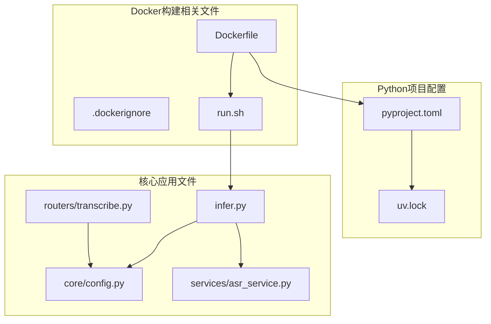

**图表来源**
- [Dockerfile:1-66](file://Dockerfile#L1-L66)
- [run.sh:1-63](file://run.sh#L1-L63)
- [pyproject.toml:1-102](file://pyproject.toml#L1-L102)

**章节来源**
- [Dockerfile:1-66](file://Dockerfile#L1-L66)
- [.dockerignore:1-16](file://.dockerignore#L1-L16)

## 核心组件

### Dockerfile构建流程

Dockerfile采用多阶段构建策略，主要包含以下关键步骤：

1. **基础镜像选择**: 使用python:3.11-slim作为基础镜像，确保镜像体积最小化
2. **系统依赖安装**: 安装curl、procps、ffmpeg、ca-certificates等必需系统工具
3. **uv包管理器配置**: 配置国内镜像源，提高依赖下载速度
4. **Python虚拟环境**: 使用uv创建隔离的Python环境
5. **应用部署**: 复制项目代码并设置执行权限

### 运行时脚本

run.sh提供了完整的应用生命周期管理功能：

- **启动管理**: 使用nohup后台启动Uvicorn服务器
- **进程监控**: 通过PID文件监控应用状态
- **优雅关闭**: 支持SIGTERM信号进行优雅停机
- **日志管理**: 自动创建日志目录和日志文件

### 文件排除规则优化

**更新** .dockerignore文件经过优化，特别添加了uploads条目，改进了容器构建过程中的文件排除规则：

- **uploads目录排除**: 防止上传的音频文件被包含在构建上下文中
- **构建上下文优化**: 减少不必要的文件传输，提升构建速度
- **存储空间节省**: 避免将临时上传文件打包到镜像中

**章节来源**
- [Dockerfile:1-66](file://Dockerfile#L1-L66)
- [run.sh:1-63](file://run.sh#L1-L63)
- [.dockerignore:16](file://.dockerignore#L16)

## 架构概览

整个容器化部署采用分层架构设计：

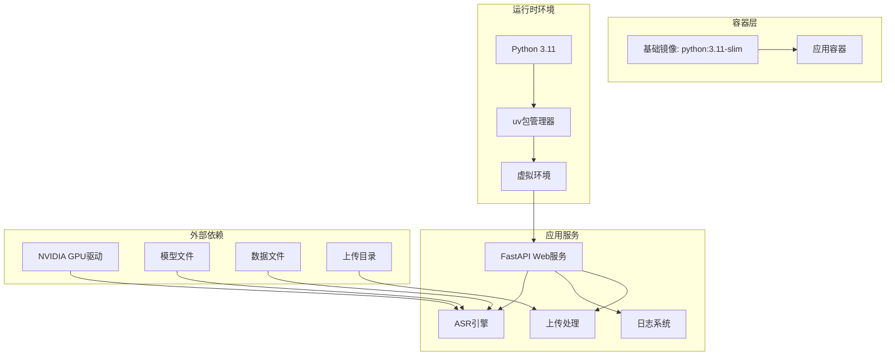

**图表来源**
- [Dockerfile:23-66](file://Dockerfile#L23-L66)
- [infer.py:1-123](file://infer.py#L1-L123)
- [services/asr_service.py:1-322](file://services/asr_service.py#L1-L322)
- [core/config.py:92-102](file://core/config.py#L92-L102)

## 详细组件分析

### Dockerfile详细分析

#### 基础镜像配置
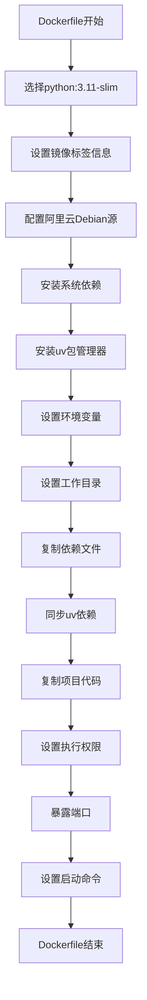

**图表来源**
- [Dockerfile:1-66](file://Dockerfile#L1-L66)

#### 环境变量配置
Dockerfile中配置了关键的环境变量：

- **UV_INDEX_URL**: 使用清华大学PyPI镜像源，提高下载速度
- **UV_HTTP_TIMEOUT**: 设置600秒超时，确保网络不稳定时的稳定性
- **PATH**: 添加uv本地安装路径

#### 端口映射
容器暴露8001端口用于FastAPI服务，但实际运行时使用8002端口。

**章节来源**
- [Dockerfile:1-66](file://Dockerfile#L1-L66)

### 运行时脚本分析

#### 启动流程
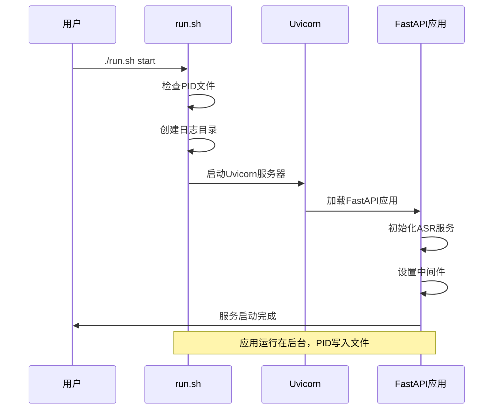

**图表来源**
- [run.sh:9-29](file://run.sh#L9-L29)
- [infer.py:55-82](file://infer.py#L55-L82)

#### 停止流程
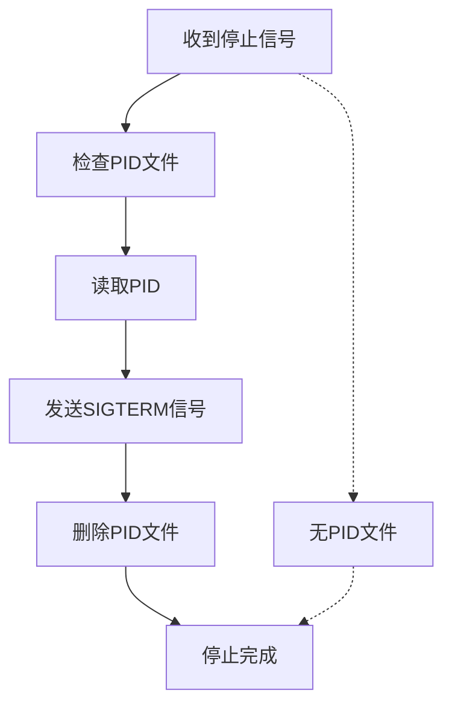

**图表来源**
- [run.sh:31-41](file://run.sh#L31-L41)

**章节来源**
- [run.sh:1-63](file://run.sh#L1-L63)

### 应用配置分析

#### 参数配置
应用支持多种配置参数：

- **GPU配置**: 默认检测CUDA可用性，可通过命令行参数覆盖
- **网络配置**: 主机绑定0.0.0.0，端口8002
- **基础URL**: 默认"/qwen3-asr/api/v1"
- **模型路径**: 默认"./models"
- **上传配置**: 默认上传目录"./uploads"，最大文件大小120MB

#### 环境变量映射
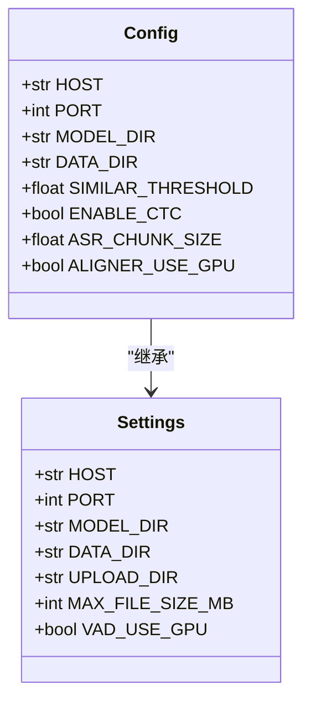

**图表来源**
- [core/config.py:52-108](file://core/config.py#L52-L108)

**章节来源**
- [core/config.py:1-109](file://core/config.py#L1-L109)

### ASR服务架构

#### 引擎初始化流程
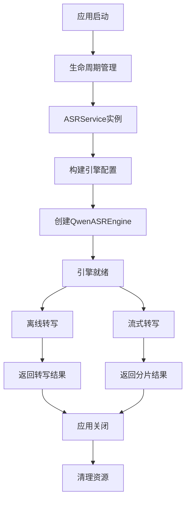

**图表来源**
- [infer.py:55-82](file://infer.py#L55-L82)
- [services/asr_service.py:45-111](file://services/asr_service.py#L45-L111)

#### 并发控制机制
ASR服务采用锁机制确保引擎的串行访问：

- **异步锁**: 使用asyncio.Lock保证同一时间只有一个推理任务
- **线程池**: 使用asyncio.to_thread避免阻塞事件循环
- **流式处理**: 通过队列实现异步生成器与事件循环的桥接

**章节来源**
- [services/asr_service.py:1-322](file://services/asr_service.py#L1-L322)

### 上传功能集成

**更新** 系统集成了完整的上传功能，支持多种音频格式的处理：

#### 上传接口设计
- **多格式支持**: 支持wav、mp3、flac、m4a、ogg等常见音频格式
- **批量处理**: 支持单文件和批量文件的离线转写
- **流式处理**: 支持Server-Sent Events的实时流式转写
- **文件大小限制**: 默认最大120MB，可配置调整

#### 上传目录管理
- **动态创建**: 上传目录会在首次使用时自动创建
- **权限管理**: 确保上传目录具有适当的读写权限
- **清理机制**: 临时文件在处理完成后自动清理

**章节来源**
- [routers/transcribe.py:133-218](file://routers/transcribe.py#L133-L218)
- [core/config.py:92-102](file://core/config.py#L92-L102)

## 依赖关系分析

### Python依赖管理

#### uv包管理器优势
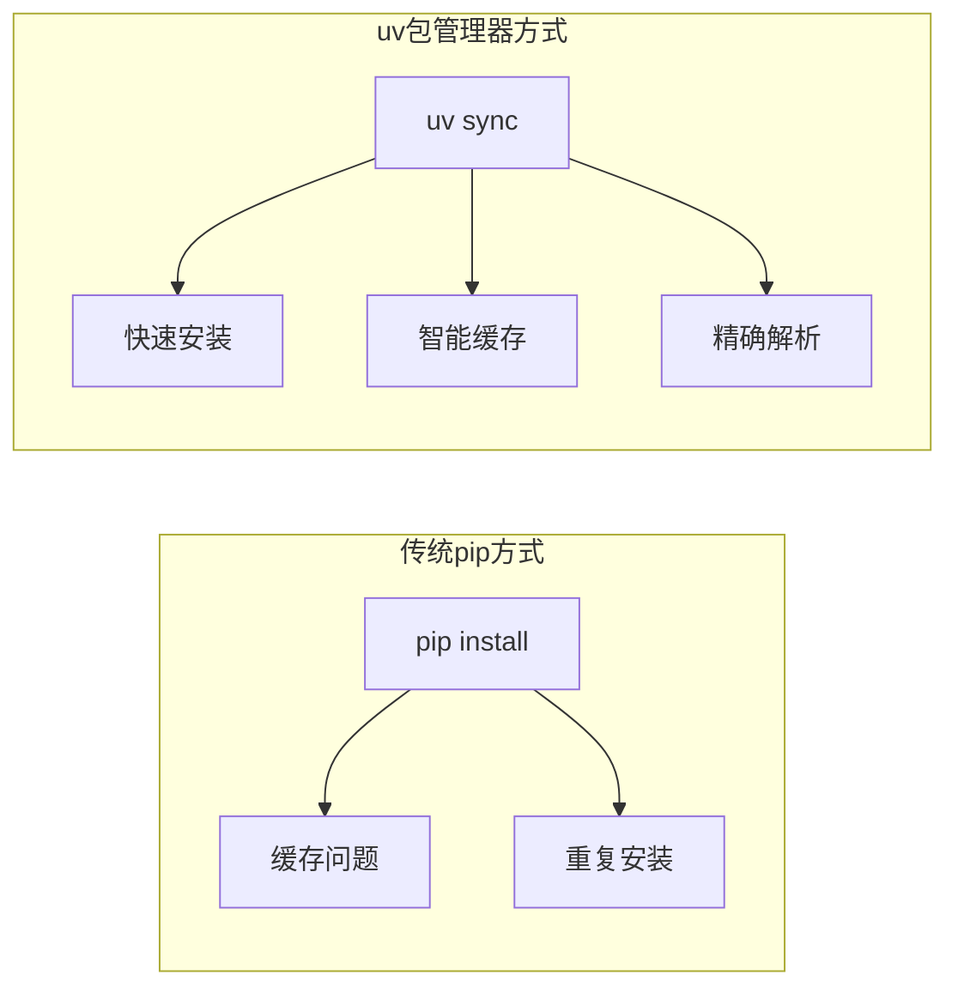

**图表来源**
- [Dockerfile:51](file://Dockerfile#L51)
- [pyproject.toml:50-57](file://pyproject.toml#L50-L57)

#### 依赖冲突解决
项目使用uv的冲突检测机制：

- **互斥依赖**: CPU、GPU、Windows版本互斥
- **精确版本**: 通过uv.lock锁定具体版本
- **镜像源配置**: 支持多个国内镜像源

**章节来源**
- [pyproject.toml:1-102](file://pyproject.toml#L1-L102)
- [uv.lock:1-578](file://uv.lock#L1-L578)

### 系统依赖分析

#### Debian包管理
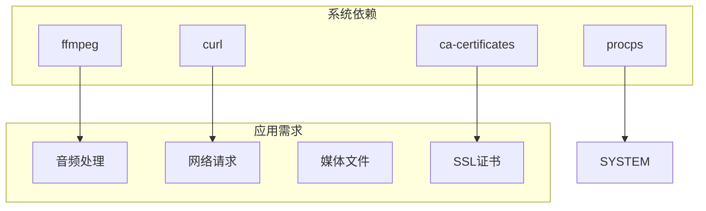

**图表来源**
- [Dockerfile:24-31](file://Dockerfile#L24-L31)

**章节来源**
- [Dockerfile:23-31](file://Dockerfile#L23-L31)

### 构建上下文优化

**更新** .dockerignore文件的uploads条目对构建过程产生了重要影响：

#### 构建上下文优化策略
- **排除规则**: uploads目录被明确排除在构建上下文之外
- **构建速度**: 减少了不必要的文件传输和处理
- **镜像大小**: 避免将上传的临时文件包含在最终镜像中
- **安全性**: 防止敏感数据被意外打包到镜像中

#### 文件排除规则详解
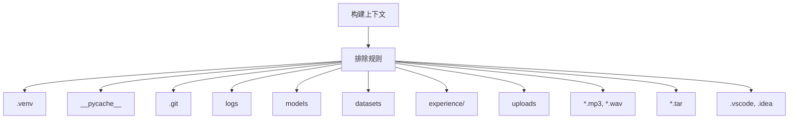

**图表来源**
- [.dockerignore:1-16](file://.dockerignore#L1-L16)

**章节来源**
- [.dockerignore:1-16](file://.dockerignore#L1-L16)

## 性能考虑

### 镜像优化策略

#### 分层缓存利用
- **依赖层分离**: 先复制pyproject.toml，再复制代码，充分利用Docker层缓存
- **最小化安装**: 使用--no-install-recommends减少包大小
- **清理缓存**: 删除apt缓存避免增加镜像大小

#### 启动性能优化
- **预热机制**: 在容器启动时预热ASR引擎
- **连接池**: 复用数据库和外部服务连接
- **异步处理**: 使用异步I/O避免阻塞

### 运行时性能优化

#### 资源管理
- **内存限制**: 建议设置合理的内存限制防止OOM
- **CPU亲和性**: 可配置CPU亲和性提升性能
- **GPU资源**: 合理配置GPU内存分配

#### 缓存策略
- **模型缓存**: 预加载常用模型到内存
- **结果缓存**: 缓存频繁查询的结果
- **静态资源**: 使用CDN加速静态资源加载

### 上传功能性能优化

**更新** 上传功能的性能优化措施：

#### 上传处理优化
- **文件大小限制**: 防止大文件占用过多资源
- **异步处理**: 上传和转写过程异步执行
- **内存管理**: 及时清理临时文件和内存
- **并发控制**: 控制同时处理的上传任务数量

#### 存储空间管理
- **磁盘空间监控**: 定期清理过期的上传文件
- **空间配额**: 可配置上传目录的空间限制
- **自动清理**: 实现定期清理机制

## 故障排除指南

### 常见问题诊断

#### 启动失败排查
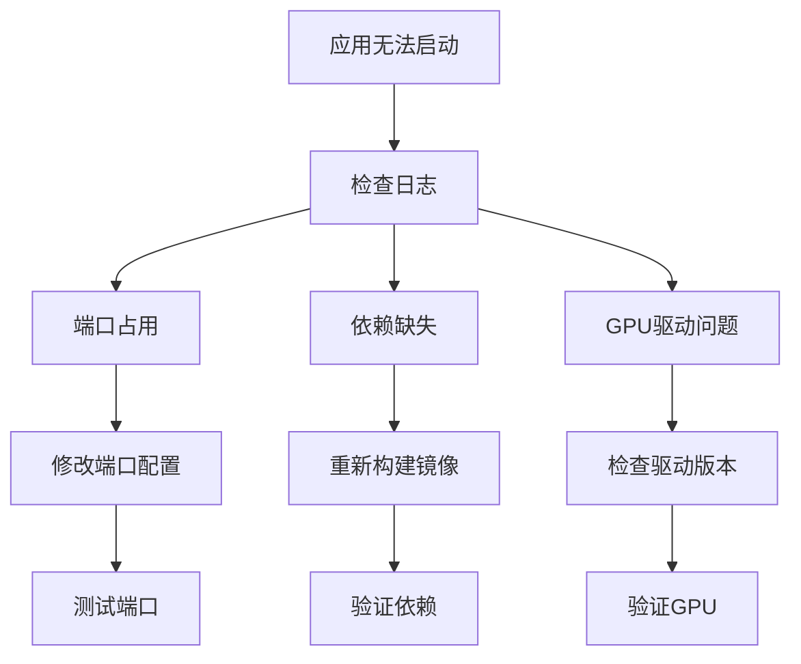

#### 性能问题排查
- **内存泄漏**: 监控RSS内存使用情况
- **CPU瓶颈**: 检查并发设置和算法复杂度
- **I/O等待**: 优化文件系统和网络配置

### 上传功能故障排除

**更新** 上传功能相关的故障排除：

#### 上传失败排查
- **文件大小**: 检查是否超过MAX_FILE_SIZE_MB限制
- **格式支持**: 确认音频格式是否在支持列表中
- **权限问题**: 验证上传目录的读写权限
- **磁盘空间**: 检查上传目录的可用空间

#### 性能问题排查
- **上传速度**: 监控网络带宽和磁盘I/O
- **转写性能**: 检查ASR引擎的处理能力
- **内存使用**: 监控内存占用情况
- **并发限制**: 调整并发处理参数

### 日志分析

#### 日志级别配置
- **生产环境**: WARNING及以上级别
- **开发环境**: DEBUG及以上级别
- **文件轮转**: 100MB单文件，7天保留期

**章节来源**
- [run.sh:9-29](file://run.sh#L9-L29)
- [core/logger.py:14-73](file://core/logger.py#L14-L73)

## 结论

本Docker容器部署方案通过以下关键特性实现了高效的语音识别服务部署：

1. **优化的构建流程**: 使用uv包管理器替代传统pip，显著提升依赖安装速度
2. **多阶段构建策略**: 最小化镜像体积，提高部署效率
3. **完善的运行时管理**: 提供完整的生命周期管理功能
4. **灵活的配置选项**: 支持多种部署场景和环境需求
5. **健壮的错误处理**: 包含完整的日志记录和错误恢复机制
6. **上传功能优化**: 通过.dockerignore的uploads条目优化构建过程，提升构建效率和安全性

**更新** 特别值得一提的是，新增的uploads条目显著改进了容器构建过程中的文件排除规则，避免了上传文件被包含在构建上下文中，从而减少了不必要的文件传输和存储空间占用，提升了整体的构建效率和安全性。

该方案特别适合需要高性能语音识别服务的企业级应用场景，能够满足高并发、低延迟的服务需求，同时保持部署的简便性和维护的低成本。上传功能的集成使得系统能够处理各种音频格式的转写任务，为用户提供完整的语音识别解决方案。