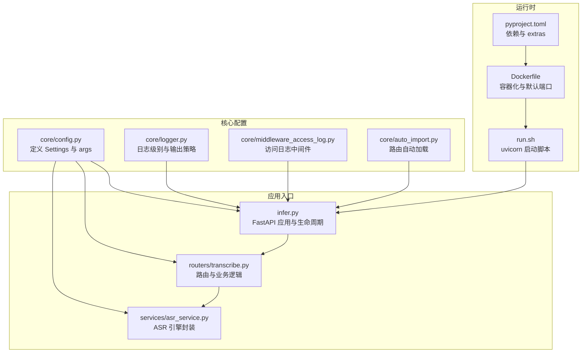
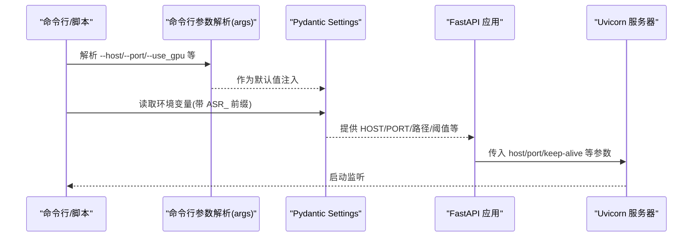
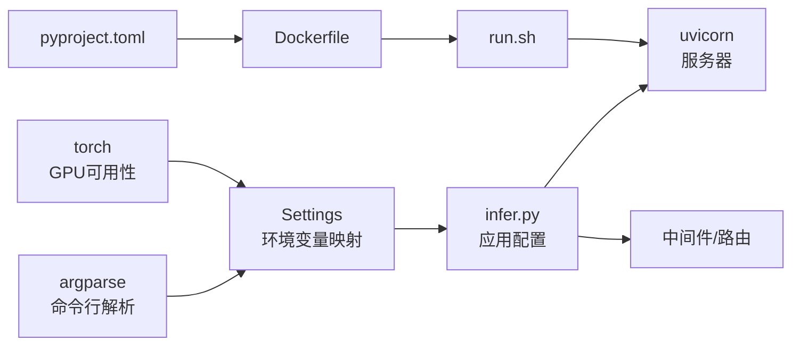

# 服务配置

<cite>
**本文引用的文件**
- [core/config.py](file://core/config.py)
- [infer.py](file://infer.py)
- [run.sh](file://run.sh)
- [Dockerfile](file://Dockerfile)
- [pyproject.toml](file://pyproject.toml)
- [core/logger.py](file://core/logger.py)
- [core/middleware_access_log.py](file://core/middleware_access_log.py)
- [core/auto_import.py](file://core/auto_import.py)
- [routers/transcribe.py](file://routers/transcribe.py)
- [services/asr_service.py](file://services/asr_service.py)
</cite>

## 目录
1. [简介](#简介)
2. [项目结构](#项目结构)
3. [核心组件](#核心组件)
4. [架构总览](#架构总览)
5. [详细组件分析](#详细组件分析)
6. [依赖分析](#依赖分析)
7. [性能考虑](#性能考虑)
8. [故障排查指南](#故障排查指南)
9. [结论](#结论)
10. [附录](#附录)

## 简介
本文件面向服务配置与部署，聚焦以下目标：
- 说明 FastAPI 应用的启动配置（主机地址、端口、调试模式、workers 数量等）
- 解释配置加载顺序与优先级规则（命令行参数、环境变量、默认值）
- 提供环境变量清单（数据库、日志级别、模型路径等）
- 说明配置验证机制与默认值来源
- 给出生产与开发环境的配置模板与最佳实践

## 项目结构
本项目采用“核心配置 + FastAPI 应用 + 路由与服务”的分层组织。关键配置入口位于核心配置模块，应用启动入口在推理入口文件，容器与脚本负责运行时参数注入。

图表来源
- [core/config.py:52-109](file://core/config.py#L52-L109)
- [infer.py:84-123](file://infer.py#L84-L123)
- [run.sh:25-28](file://run.sh#L25-L28)
- [Dockerfile:63-66](file://Dockerfile#L63-L66)
- [pyproject.toml:1-102](file://pyproject.toml#L1-L102)

章节来源
- [core/config.py:19-47](file://core/config.py#L19-L47)
- [infer.py:84-123](file://infer.py#L84-L123)
- [run.sh:1-63](file://run.sh#L1-L63)
- [Dockerfile:1-66](file://Dockerfile#L1-L66)
- [pyproject.toml:1-102](file://pyproject.toml#L1-L102)

## 核心组件
- 配置解析与默认值
  - 命令行参数：主机、端口、基础路径、是否使用 GPU、密钥、配置文件路径等
  - 运行时配置：基于 Pydantic Settings 的环境变量映射，统一前缀与默认值
- 日志系统
  - 根据环境变量选择控制台级别；文件日志按级别落盘；开发环境额外输出 debug 日志
- 应用入口
  - FastAPI 应用创建、中间件注册、路由自动加载、生命周期管理
- 启动脚本与容器
  - run.sh 使用 uvicorn 启动；Dockerfile 暴露端口并设置默认端口

章节来源
- [core/config.py:52-109](file://core/config.py#L52-L109)
- [core/logger.py:14-73](file://core/logger.py#L14-L73)
- [infer.py:84-123](file://infer.py#L84-L123)
- [run.sh:25-28](file://run.sh#L25-L28)
- [Dockerfile:63-66](file://Dockerfile#L63-L66)

## 架构总览
下图展示配置在启动流程中的作用与流向。

图表来源
- [core/config.py:19-47](file://core/config.py#L19-L47)
- [core/config.py:52-109](file://core/config.py#L52-L109)
- [infer.py:114-122](file://infer.py#L114-L122)

## 详细组件分析

### 配置加载顺序与优先级
- 命令行参数优先级最高：通过 argparse 解析，作为 Settings 的默认值
- 环境变量次之：Settings 使用 env_prefix="ASR_"，自动从环境变量加载同名键
- 默认值最低：Settings 类中定义的字段提供最终兜底
- 说明
  - 本项目未实现“配置文件”加载逻辑，因此不存在“配置文件 > 环境变量”的覆盖链
  - 如需引入外部配置文件，请在配置模块中扩展加载逻辑，并明确其与环境变量的合并策略

章节来源
- [core/config.py:19-47](file://core/config.py#L19-L47)
- [core/config.py:52-109](file://core/config.py#L52-L109)

### 启动参数与运行时配置
- 主机与端口
  - 命令行参数：--host、--port
  - 运行时：Settings.HOST/PORT 由 args.host/port 赋值
  - 应用入口：infer.py 读取 args.host/port 传递给 uvicorn.run
- workers 数量
  - 本项目未显式设置 workers 参数，默认由 uvicorn 使用其默认策略
- 调试模式
  - 本项目未显式设置 log_level；应用入口使用默认 info
  - 日志级别可通过环境变量控制（见“日志配置”）

章节来源
- [core/config.py:35-40](file://core/config.py#L35-L40)
- [core/config.py:54-55](file://core/config.py#L54-L55)
- [infer.py:114-122](file://infer.py#L114-L122)

### 环境变量清单（ASR_ 前缀）
- 命名规范：所有环境变量需以 ASR_ 为前缀，名称与 Settings 字段一致（区分大小写）
- 示例字段（非穷举，以实际代码为准）
  - HOST、PORT
  - MODEL_DIR、DATA_DIR、HOTWORDS_PATH
  - ASR_CHUNK_SIZE、ASR_MEMORY_NUM、ASR_DYNAMIC_CHUNK_THRESHOLD、DEFAULT_LANGUAGE
  - ALIGNER_USE_GPU、VAD_MODEL_DIR、VAD_USE_GPU、VAD_SPEECH_THRESHOLD、VAD_MIN_DURATION、VAD_SMOOTH_WINDOW_SIZE、VAD_MIN_SPEECH_FRAME、VAD_MAX_SPEECH_FRAME、VAD_MIN_SILENCE_FRAME、VAD_MERGE_SILENCE_FRAME、VAD_EXTEND_SPEECH_FRAME、VAD_CHUNK_MAX_FRAME
  - UPLOAD_DIR、MAX_FILE_SIZE_MB、DEFAULT_CONTEXT
- 说明
  - 本项目未提供“数据库连接”相关配置项，因此不涉及数据库连接字符串的环境变量
  - 若需新增环境变量，请在 Settings 中声明并确保前缀正确

章节来源
- [core/config.py:52-109](file://core/config.py#L52-L109)

### 日志配置与环境变量
- 环境变量
  - ENVIRONMENT：production 或 development（默认 production）
- 控制台级别
  - production：WARNING 及以上
  - development：DEBUG 及以上
- 文件日志
  - 应用日志：INFO 及以上，按日切割、压缩、保留 7 天
  - 错误日志：ERROR 及以上，保留 14 天
  - 开发环境：额外输出 DEBUG 日志文件
- 访问日志中间件
  - 自定义中间件记录请求状态码、耗时、来源 IP 等

章节来源
- [core/logger.py:14-73](file://core/logger.py#L14-L73)
- [core/middleware_access_log.py:8-39](file://core/middleware_access_log.py#L8-L39)

### 路由与服务如何使用配置
- 路由层
  - 路由自动加载使用基础路径前缀（来自 args.base_url）
  - 上传大小限制使用 settings.MAX_FILE_SIZE_MB
- 服务层
  - ASR 引擎构建使用 settings 与 args（如 use_gpu、模型路径、VAD 阈值等）

章节来源
- [core/auto_import.py:7-30](file://core/auto_import.py#L7-L30)
- [routers/transcribe.py:77-89](file://routers/transcribe.py#L77-L89)
- [services/asr_service.py:72-102](file://services/asr_service.py#L72-L102)

### 启动流程与守护脚本
- run.sh
  - 默认 APP_MODULE="infer:app"
  - 默认 HOST="0.0.0.0"、PORT=8002
  - 使用 nohup 后台启动 uvicorn，重定向日志至 logs/app.log
  - 支持 start/stop/restart
- Dockerfile
  - EXPOSE 8001（容器暴露端口）
  - CMD bash run.sh start（容器启动即启动服务）

章节来源
- [run.sh:4-29](file://run.sh#L4-L29)
- [Dockerfile:63-66](file://Dockerfile#L63-L66)

### 配置验证机制与默认值
- 验证机制
  - 命令行布尔参数通过自定义解析函数进行容错转换
  - Pydantic Settings 自动将环境变量转换为对应类型并校验
- 默认值来源
  - 命令行参数默认值
  - Settings 类字段默认值
  - 未设置时由 Settings 提供默认值

章节来源
- [core/config.py:7-16](file://core/config.py#L7-L16)
- [core/config.py:52-109](file://core/config.py#L52-L109)

## 依赖分析
- 配置模块依赖
  - argparse：解析命令行参数
  - pydantic-settings：环境变量映射与类型校验
  - torch：检测 GPU 可用性并作为默认值
- 应用入口依赖
  - fastapi：创建应用与生命周期
  - uvicorn：WSGI 服务器
  - 中间件与路由：日志、认证、请求 ID、自动路由加载
- 运行时依赖
  - Dockerfile：容器化与端口暴露
  - run.sh：进程守护与日志输出
  - pyproject.toml：依赖与 extras（CPU/GPU/Windows）

图表来源
- [core/config.py:19-47](file://core/config.py#L19-L47)
- [core/config.py:49-109](file://core/config.py#L49-L109)
- [infer.py:84-123](file://infer.py#L84-L123)
- [run.sh:25-28](file://run.sh#L25-L28)
- [Dockerfile:63-66](file://Dockerfile#L63-L66)
- [pyproject.toml:1-102](file://pyproject.toml#L1-L102)

章节来源
- [core/config.py:19-47](file://core/config.py#L19-L47)
- [infer.py:84-123](file://infer.py#L84-L123)
- [run.sh:1-63](file://run.sh#L1-L63)
- [Dockerfile:1-66](file://Dockerfile#L1-L66)
- [pyproject.toml:1-102](file://pyproject.toml#L1-L102)

## 性能考虑
- workers 数量
  - 本项目未显式设置 workers，建议在高并发场景结合 CPU 核心数与推理负载评估
- keep-alive 超时
  - 应用入口设置了较长的 keep-alive 超时，适合长音频流式转写
- 日志级别
  - 生产环境控制台仅输出 WARNING 及以上，降低日志 IO 压力
- GPU 使用
  - 默认根据 GPU 可用性决定是否使用 GPU；可通过命令行或环境变量强制切换

章节来源
- [infer.py:114-122](file://infer.py#L114-L122)
- [core/logger.py:14-17](file://core/logger.py#L14-L17)
- [core/config.py:29](file://core/config.py#L29)

## 故障排查指南
- 无法启动或端口占用
  - 检查 run.sh 是否已有 PID 文件；确认 HOST/PORT 是否被占用
- 日志级别不符合预期
  - 确认 ENVIRONMENT 是否设置为 production 或 development
- 配置未生效
  - 确认环境变量是否带有 ASR_ 前缀且名称与 Settings 字段一致
  - 确认命令行参数是否覆盖了期望的默认值
- GPU 推理问题
  - 检查 GPU 可用性与驱动；必要时在命令行显式指定 --use_gpu

章节来源
- [run.sh:9-29](file://run.sh#L9-L29)
- [core/logger.py:14-17](file://core/logger.py#L14-L17)
- [core/config.py:52-109](file://core/config.py#L52-L109)

## 结论
本项目通过“命令行参数 + 环境变量 + 默认值”的组合实现灵活的服务配置。建议在生产环境使用环境变量与 run.sh/Dockerfile 统一管理，开发环境通过较低的日志级别提升可观测性。若需引入外部配置文件，应在配置模块中明确其加载顺序与覆盖规则。

## 附录

### 配置模板与最佳实践
- 开发环境模板
  - 设置 ENVIRONMENT=development
  - 使用较低日志级别以便调试
  - 通过命令行参数快速切换 HOST/PORT
- 生产环境模板
  - 使用环境变量设置 ASR_* 参数
  - 通过 run.sh 启动并监控 logs/app.log
  - 容器部署时注意端口映射与 EXPOSE 的一致性

章节来源
- [core/logger.py:14-17](file://core/logger.py#L14-L17)
- [run.sh:25-28](file://run.sh#L25-L28)
- [Dockerfile:63-66](file://Dockerfile#L63-L66)