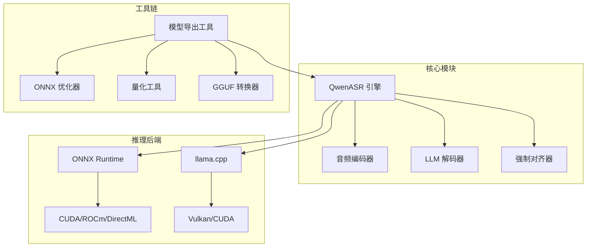
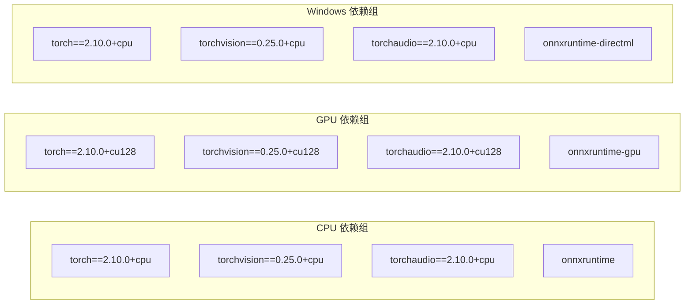
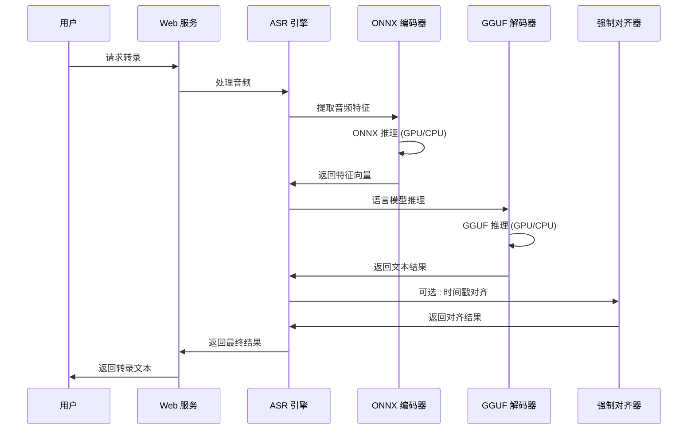
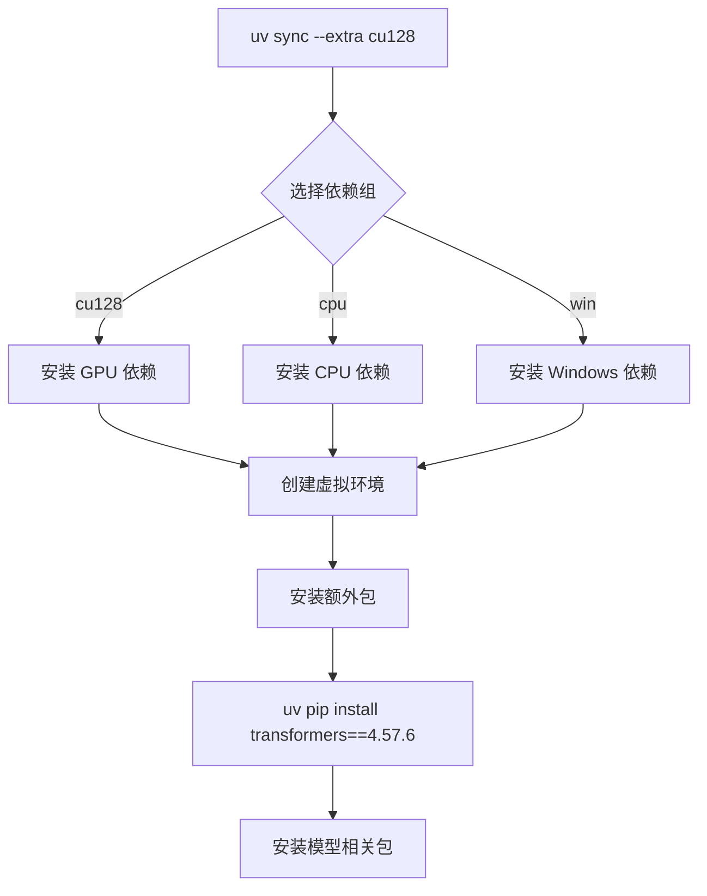
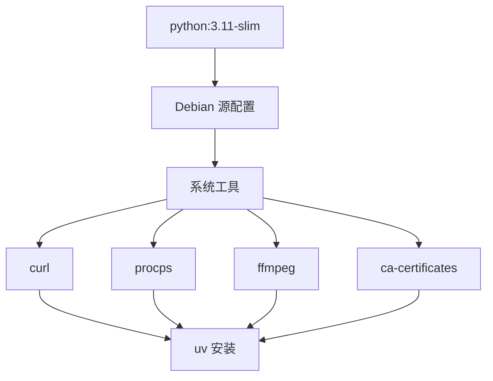
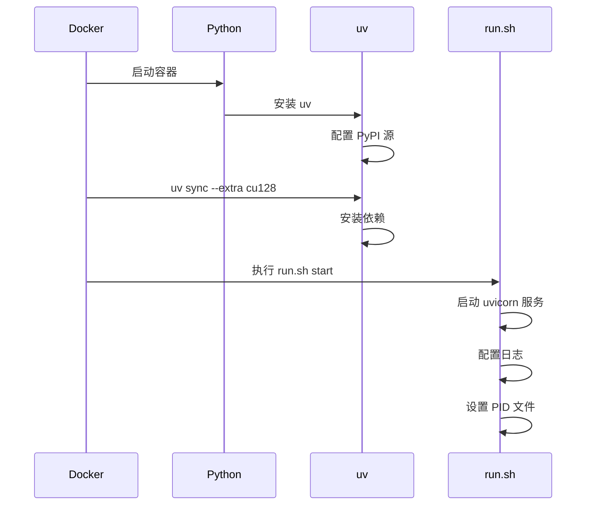
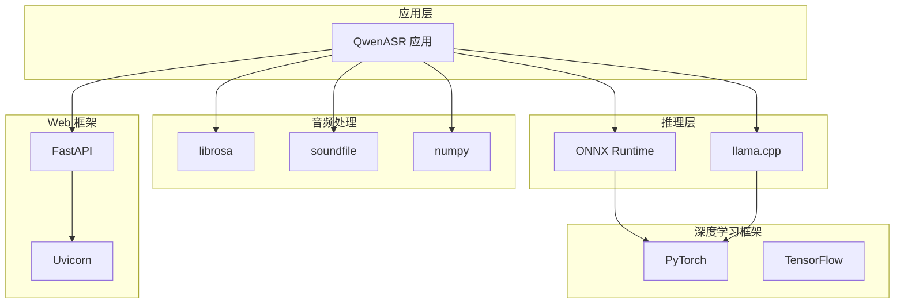
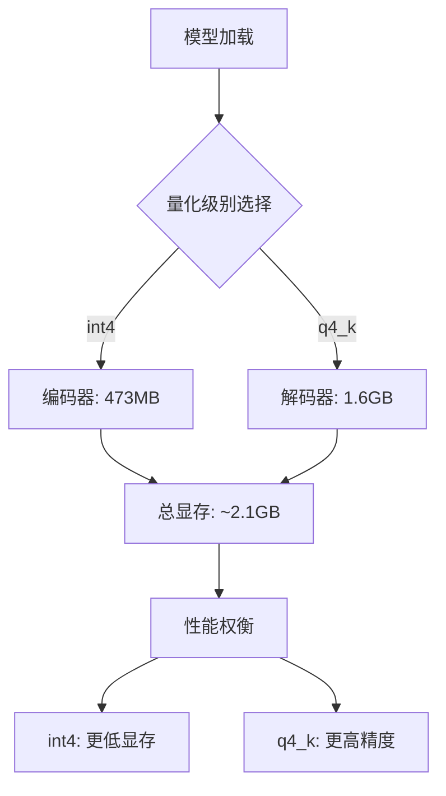

# 环境配置

<cite>
**本文档引用的文件**
- [pyproject.toml](file://pyproject.toml)
- [uv.lock](file://uv.lock)
- [Dockerfile](file://Dockerfile)
- [run.sh](file://run.sh)
- [README.md](file://README.md)
</cite>

## 目录
1. [简介](#简介)
2. [项目结构](#项目结构)
3. [核心组件](#核心组件)
4. [架构概览](#架构概览)
5. [详细组件分析](#详细组件分析)
6. [依赖关系分析](#依赖关系分析)
7. [性能考虑](#性能考虑)
8. [故障排除指南](#故障排除指南)
9. [结论](#结论)

## 简介

本项目是一个基于 Qwen3-ASR 模型的语音识别系统，采用混合推理架构（ONNX Encoder + GGUF Decoder）。该系统支持纯本地运行、GPU 加速、流式输出和字幕生成等核心特性。

## 项目结构

项目采用模块化设计，主要包含以下核心模块：



**图表来源**
- [pyproject.toml:1-102](file://pyproject.toml#L1-L102)
- [README.md:316-344](file://README.md#L316-L344)

**章节来源**
- [pyproject.toml:1-102](file://pyproject.toml#L1-L102)
- [README.md:316-344](file://README.md#L316-L344)

## 核心组件

### Python 版本要求

项目要求 Python 3.11 或更高版本：

- **Python 版本**: >= 3.11
- **包管理器**: uv (推荐)
- **虚拟环境**: 自动创建和管理

### 依赖包管理

项目使用 uv 作为包管理器，提供以下依赖组：

#### 核心依赖
- **FastAPI**: Web 服务框架
- **NumPy**: 数值计算基础
- **librosa**: 音频处理
- **loguru**: 日志记录
- **soundfile**: 音频文件读写
- **sentencepiece**: 分词处理
- **gguf**: GGUF 格式支持

#### 可选依赖组



**图表来源**
- [pyproject.toml:28-48](file://pyproject.toml#L28-L48)

#### 冲突解决机制

项目配置了互斥依赖组，确保同一时间只能使用一个依赖组：

- **冲突规则**: CPU、GPU、Windows 依赖组互斥
- **自动检测**: uv 会自动选择合适的依赖组合

**章节来源**
- [pyproject.toml:28-57](file://pyproject.toml#L28-L57)

## 架构概览

系统采用混合推理架构，结合 ONNX 和 GGUF 两种推理方式：



**图表来源**
- [README.md:296-314](file://README.md#L296-L314)

## 详细组件分析

### uv 包管理器配置

#### 依赖同步策略



**图表来源**
- [Dockerfile:50-52](file://Dockerfile#L50-L52)

#### 锁定文件管理

uv.lock 文件提供了精确的依赖版本锁定：

- **版本兼容性**: 支持 Python 3.11-3.14
- **冲突检测**: 自动检测并报告依赖冲突
- **分辨率标记**: 指定 Python 版本兼容性

**章节来源**
- [uv.lock:1-14](file://uv.lock#L1-L14)

### 环境变量配置

#### Web 服务配置

| 环境变量 | 默认值 | 描述 |
|---------|--------|------|
| ASR_MODEL_DIR | ./models | 模型文件目录 |
| ASR_ENABLE_VAD | true | 是否启用语音活动检测 |
| ASR_VAD_SPEECH_THRESHOLD | 0.3 | VAD 阈值 |
| ASR_VAD_MIN_DURATION | 10 | 最小语音持续时间 |
| ASR_ASR_CHUNK_SIZE | 30 | 分片长度 |
| ASR_ASR_MEMORY_NUM | 1 | 上下文记忆片段数 |
| ASR_ENABLE_ALIGNER | false | 是否启用对齐 |
| ASR_DEFAULT_LANGUAGE | Chinese | 默认语言 |
| ASR_DEFAULT_CONTEXT | "" | 默认上下文 |

#### 性能优化环境变量

| 环境变量 | 用途 | 说明 |
|---------|------|------|
| GGML_VK_DISABLE_F16 | Vulkan 性能 | 禁用 FP16 计算防止溢出 |
| CUDA_VISIBLE_DEVICES | GPU 选择 | 指定可见 GPU 设备 |
| OMP_NUM_THREADS | 线程数 | 设置 OpenMP 线程数量 |

**章节来源**
- [README.md:228-261](file://README.md#L228-L261)
- [README.md:373-382](file://README.md#L373-L382)

### Docker 容器配置

#### 基础镜像和系统依赖



**图表来源**
- [Dockerfile:1-31](file://Dockerfile#L1-L31)

#### 容器启动流程



**图表来源**
- [Dockerfile:33-66](file://Dockerfile#L33-L66)
- [run.sh:9-29](file://run.sh#L9-L29)

**章节来源**
- [Dockerfile:1-66](file://Dockerfile#L1-L66)
- [run.sh:1-63](file://run.sh#L1-L63)

## 依赖关系分析

### 依赖层次结构



**图表来源**
- [pyproject.toml:7-23](file://pyproject.toml#L7-L23)

### 依赖冲突检测

项目使用 uv 的冲突检测机制：

- **自动冲突检测**: 在依赖解析时自动检测互斥依赖
- **错误报告**: 清晰的冲突信息和解决方案建议
- **回退机制**: 当冲突发生时自动选择替代方案

**章节来源**
- [pyproject.toml:50-57](file://pyproject.toml#L50-L57)

## 性能考虑

### GPU 加速配置

#### CUDA 版本兼容性

| CUDA 版本 | 支持状态 | 说明 |
|-----------|----------|------|
| 12.8 | ✅ 推荐 | 官方支持的最新版本 |
| 12.4 | ✅ 兼容 | 向后兼容 |
| 12.1 | ⚠️ 部分兼容 | 功能受限 |
| 11.8 | ❌ 不推荐 | 已过时 |

#### 显存优化策略



**图表来源**
- [README.md:101-115](file://README.md#L101-L115)

### 线程和内存优化

#### 环境变量优化

```bash
# 线程池配置
export OMP_NUM_THREADS=8
export MKL_NUM_THREADS=8

# GPU 内存配置
export CUDA_LAUNCH_BLOCKING=0
export CUDA_DEVICE_MAX_CONNECTIONS=1

# 缓存配置
export HF_DATASETS_CACHE=/tmp/huggingface
export TRANSFORMERS_CACHE=/tmp/transformers
```

**章节来源**
- [README.md:101-115](file://README.md#L101-L115)

## 故障排除指南

### 常见问题和解决方案

#### 依赖安装问题

**问题**: uv 安装失败
**解决方案**:
1. 检查网络连接和 PyPI 源配置
2. 清理 uv 缓存: `uv cache clean`
3. 使用代理: `uv pip install --proxy http://proxy:port`

**问题**: CUDA 版本不兼容
**解决方案**:
1. 检查系统 CUDA 版本: `nvcc --version`
2. 安装匹配的 PyTorch 版本
3. 验证 GPU 可用性: `python -c "import torch; print(torch.cuda.is_available())"`

#### 性能问题

**问题**: 推理速度慢
**解决方案**:
1. 启用 GPU 加速
2. 调整批处理大小
3. 使用量化模型
4. 优化音频预处理

**问题**: 显存不足
**解决方案**:
1. 降低模型量化级别
2. 减少上下文窗口大小
3. 关闭不必要的功能
4. 使用更小的模型变体

#### 环境变量调试

```bash
# 启用详细日志
export LOG_LEVEL=DEBUG
export ASYNCIO_DEBUG=1

# 验证配置
echo "Python 版本: $(python --version)"
echo "uv 版本: $(uv --version)"
echo "CUDA 可用: $(python -c "import torch; print(torch.cuda.is_available())")"
```

**章节来源**
- [README.md:373-382](file://README.md#L373-L382)

## 结论

本项目提供了完整的环境配置解决方案，包括：

1. **灵活的依赖管理**: 通过 uv 实现精确的依赖版本控制和冲突检测
2. **多平台支持**: Docker 容器化部署，支持 Linux、Windows 和 macOS
3. **GPU 加速**: 完整的 CUDA、Vulkan 和 DirectML 支持
4. **性能优化**: 量化模型、线程池配置和内存管理
5. **监控和调试**: 详细的日志记录和环境变量配置

建议用户根据具体硬件配置选择合适的依赖组，并根据实际需求调整环境变量以获得最佳性能。