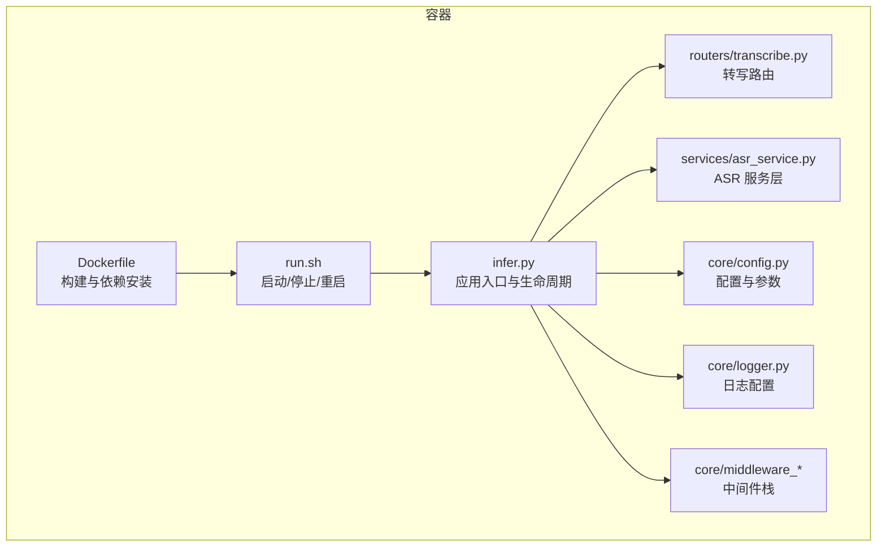
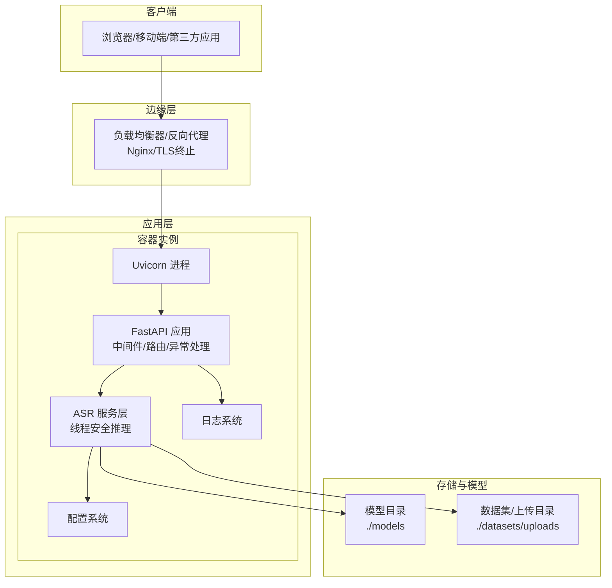
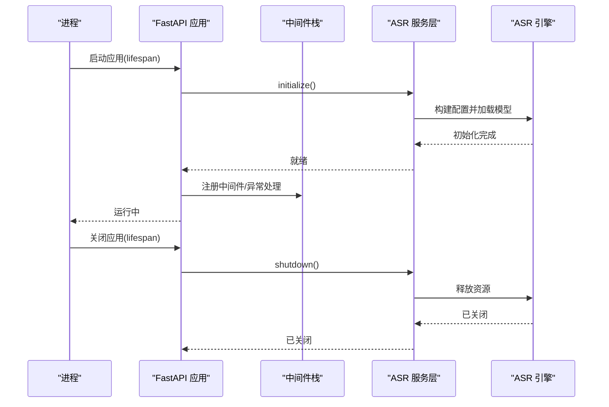
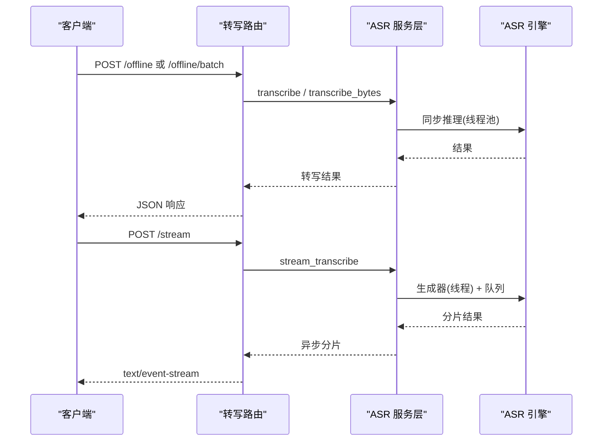
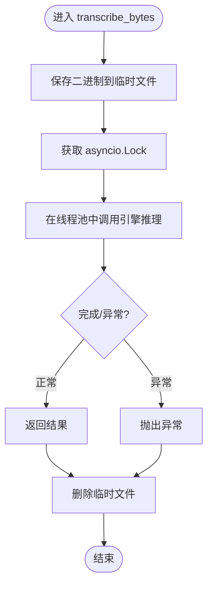
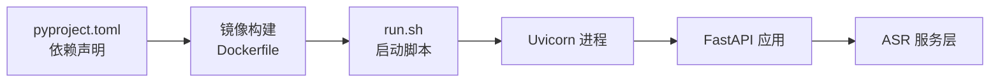

# 生产环境部署

<cite>
**本文引用的文件**
- [Dockerfile](file://Dockerfile)
- [run.sh](file://run.sh)
- [pyproject.toml](file://pyproject.toml)
- [infer.py](file://infer.py)
- [core/config.py](file://core/config.py)
- [core/logger.py](file://core/logger.py)
- [core/middleware_access_log.py](file://core/middleware_access_log.py)
- [core/middleware_auth.py](file://core/middleware_auth.py)
- [core/gobal_exception.py](file://core/gobal_exception.py)
- [routers/transcribe.py](file://routers/transcribe.py)
- [services/asr_service.py](file://services/asr_service.py)
- [qwen_asr/cli/serve.py](file://qwen_asr/cli/serve.py)
</cite>

## 目录
1. [简介](#简介)
2. [项目结构](#项目结构)
3. [核心组件](#核心组件)
4. [架构总览](#架构总览)
5. [详细组件分析](#详细组件分析)
6. [依赖分析](#依赖分析)
7. [性能考虑](#性能考虑)
8. [故障排查指南](#故障排查指南)
9. [结论](#结论)
10. [附录](#附录)

## 简介
本文件面向生产环境部署，围绕硬件要求、网络配置、安全设置、负载均衡与反向代理、高可用与故障转移、监控与日志、性能调优以及灾难恢复与备份策略，结合仓库现有代码与配置，给出可落地的实施建议与最佳实践。

## 项目结构
本项目采用 FastAPI + Uvicorn 的标准 Python Web 服务形态，并通过容器化打包与启动脚本进行统一交付。核心结构如下：
- 应用入口与生命周期：FastAPI 应用、中间件、全局异常处理、路由自动加载
- 业务路由：转写接口（离线/批量/流式）、健康检查
- 服务层：ASR 引擎封装，线程安全与异步桥接
- 配置与日志：参数解析、运行时配置、日志分级与落盘
- 容器与启动：Dockerfile、run.sh、依赖管理与端口暴露

**图表来源**
- [Dockerfile](file://Dockerfile)
- [run.sh](file://run.sh)
- [infer.py](file://infer.py)
- [routers/transcribe.py](file://routers/transcribe.py)
- [services/asr_service.py](file://services/asr_service.py)
- [core/config.py](file://core/config.py)
- [core/logger.py](file://core/logger.py)
- [core/middleware_access_log.py](file://core/middleware_access_log.py)
- [core/middleware_auth.py](file://core/middleware_auth.py)

**章节来源**
- [Dockerfile](file://Dockerfile)
- [run.sh](file://run.sh)
- [infer.py](file://infer.py)
- [routers/transcribe.py](file://routers/transcribe.py)
- [services/asr_service.py](file://services/asr_service.py)
- [core/config.py](file://core/config.py)
- [core/logger.py](file://core/logger.py)
- [core/middleware_access_log.py](file://core/middleware_access_log.py)
- [core/middleware_auth.py](file://core/middleware_auth.py)

## 核心组件
- 应用入口与生命周期：负责启动/关闭时的引擎初始化与资源回收，注册中间件与全局异常处理，自动加载路由。
- 路由与接口：提供离线转写、批量转写、流式转写（SSE）、健康检查等接口。
- 服务层：封装 ASR 引擎，提供线程安全的离线与流式转写能力，内部使用锁与线程池隔离阻塞推理。
- 配置系统：支持命令行参数、环境变量与配置文件，集中管理模型路径、分片策略、VAD 参数、上传限制等。
- 日志系统：按环境区分控制台级别，文件日志分级落盘，支持请求 ID 上下文注入。
- 中间件与安全：访问日志、鉴权令牌校验、请求 ID 注入、全局异常统一返回。

**章节来源**
- [infer.py](file://infer.py)
- [routers/transcribe.py](file://routers/transcribe.py)
- [services/asr_service.py](file://services/asr_service.py)
- [core/config.py](file://core/config.py)
- [core/logger.py](file://core/logger.py)
- [core/middleware_access_log.py](file://core/middleware_access_log.py)
- [core/middleware_auth.py](file://core/middleware_auth.py)
- [core/gobal_exception.py](file://core/gobal_exception.py)

## 架构总览
生产部署建议采用“容器 + 反向代理 + 多实例 + 健康检查”的高可用架构。容器内运行 Uvicorn，外部通过 Nginx 提供 TLS 终止、静态资源与反向代理；多实例横向扩展，配合负载均衡与健康检查实现故障转移与自动重启。

**图表来源**
- [infer.py](file://infer.py)
- [routers/transcribe.py](file://routers/transcribe.py)
- [services/asr_service.py](file://services/asr_service.py)
- [core/config.py](file://core/config.py)
- [core/logger.py](file://core/logger.py)

## 详细组件分析

### 应用入口与生命周期（infer.py）
- 生命周期钩子：启动时初始化 ASR 引擎，关闭时优雅释放资源。
- 中间件顺序：访问日志 → 鉴权 → 请求 ID，确保日志与安全前置。
- 异常处理：注册全局异常处理器，统一返回结构。
- 启动参数：主机、端口、基础路径等由配置模块提供。

**图表来源**
- [infer.py](file://infer.py)
- [services/asr_service.py](file://services/asr_service.py)

**章节来源**
- [infer.py](file://infer.py)
- [services/asr_service.py](file://services/asr_service.py)

### 路由与接口（routers/transcribe.py）
- 接口类型：离线转写、批量转写、流式转写（SSE）、健康检查。
- 流式特性：SSE 实时推送，心跳保活，支持 SRT/对齐数据按需输出。
- 参数校验：文件大小限制、必填项校验、异常统一处理。
- 健康检查：返回引擎就绪状态与 GPU 开关状态。

**图表来源**
- [routers/transcribe.py](file://routers/transcribe.py)
- [services/asr_service.py](file://services/asr_service.py)

**章节来源**
- [routers/transcribe.py](file://routers/transcribe.py)
- [services/asr_service.py](file://services/asr_service.py)

### 服务层（services/asr_service.py）
- 并发模型：使用 asyncio.Lock 保证引擎串行访问；推理放入线程池避免阻塞事件循环。
- 流式实现：线程中运行同步生成器，通过 asyncio.Queue 与异步消费端通信；线程结束投递哨兵对象。
- 生命周期：initialize/shutdown 管理引擎加载与释放。
- 临时文件：接收二进制时写入 uploads 目录，生成唯一文件名，使用后清理。

**图表来源**
- [services/asr_service.py](file://services/asr_service.py)

**章节来源**
- [services/asr_service.py](file://services/asr_service.py)

### 配置系统（core/config.py）
- 参数来源：命令行参数优先，其次环境变量（前缀 ASR_），最后默认值。
- 关键配置：主机/端口、模型目录、上传目录与大小限制、ASR/VAD/对齐器参数、默认语言与上下文。
- 环境变量：可通过 ASR_* 前缀覆盖默认值，便于容器编排。

**章节来源**
- [core/config.py](file://core/config.py)

### 日志系统（core/logger.py）
- 级别策略：生产环境控制台 WARNING+，文件 INFO+；开发环境 DEBUG+。
- 文件轮转：单文件 100MB，保留策略按级别设定；异步写入。
- 上下文：自动注入请求 ID，便于跨服务链路追踪。

**章节来源**
- [core/logger.py](file://core/logger.py)

### 中间件与安全（core/middleware_*）
- 访问日志：记录状态码、路径、耗时与客户端 IP。
- 鉴权：基于 Authorization 头的 Bearer Token 校验，支持白名单路径。
- 请求 ID：上下文变量注入，贯穿日志与响应。

**章节来源**
- [core/middleware_access_log.py](file://core/middleware_access_log.py)
- [core/middleware_auth.py](file://core/middleware_auth.py)

### 全局异常处理（core/gobal_exception.py）
- 统一包装：将 HTTP/验证/断言/通用异常转换为统一响应结构。
- 记录日志：对异常进行记录，便于问题定位。

**章节来源**
- [core/gobal_exception.py](file://core/gobal_exception.py)

### 容器与启动（Dockerfile、run.sh、pyproject.toml）
- 容器镜像：基于 Python slim，配置国内源，安装系统依赖与 FFmpeg，预装 uv，暴露服务端口。
- 启动脚本：提供 start/stop/restart，后台运行 Uvicorn，写入 PID 与日志。
- 依赖管理：通过 uv 管理依赖，支持 CPU/GPU 不同 extras。

**章节来源**
- [Dockerfile](file://Dockerfile)
- [run.sh](file://run.sh)
- [pyproject.toml](file://pyproject.toml)

## 依赖分析
- 应用依赖：FastAPI、Uvicorn、Pydantic/Settings、Loguru、音频/ASR 相关库。
- 运行时依赖：CUDA/ONNXRuntime（GPU/CPU 可选），FFmpeg。
- 容器依赖：Debian 12 源、curl、procps、ffmpeg、ca-certificates。

**图表来源**
- [pyproject.toml](file://pyproject.toml)
- [Dockerfile](file://Dockerfile)
- [run.sh](file://run.sh)

**章节来源**
- [pyproject.toml](file://pyproject.toml)
- [Dockerfile](file://Dockerfile)
- [run.sh](file://run.sh)

## 性能考虑
- 并发与锁：引擎串行访问，推理放入线程池，避免阻塞事件循环；流式通过队列与线程桥接。
- 资源占用：合理设置分片大小、VAD 阈值与记忆窗口，平衡准确率与延迟。
- I/O 与存储：上传目录与模型目录分离挂载，避免磁盘争用；日志轮转与压缩降低 IO 压力。
- 端到端优化：长连接超时（keep-alive）与 SSE 心跳保活，减少连接抖动。

[本节为通用性能建议，不直接分析具体文件]

## 故障排查指南
- 健康检查：通过 /transcribe/health 检查引擎就绪与 GPU 状态。
- 日志定位：生产环境关注 ERROR/应用日志，开发环境可查看 DEBUG 日志。
- 异常处理：全局异常统一返回，便于前端与监控系统识别。
- 中间件：访问日志记录状态码与耗时，有助于定位慢请求与错误请求。

**章节来源**
- [routers/transcribe.py](file://routers/transcribe.py)
- [core/logger.py](file://core/logger.py)
- [core/gobal_exception.py](file://core/gobal_exception.py)
- [core/middleware_access_log.py](file://core/middleware_access_log.py)

## 结论
本项目具备良好的容器化与服务化基础，结合 Nginx 反向代理与多实例部署，可满足生产环境的高可用与可扩展性需求。建议在生产中完善安全与监控体系，持续优化模型与参数配置，确保稳定性与性能双达标。

[本节为总结性内容，不直接分析具体文件]

## 附录

### 生产环境部署清单
- 硬件要求
  - CPU：多核，建议≥8 核；推理加速优先选择 GPU。
  - 内存：至少 16GB，模型加载与推理峰值较高，建议≥32GB。
  - 存储：SSD，模型与上传目录分离挂载；日志目录独立挂载。
  - 网络：千兆以上，低延迟内网部署更佳。
- 网络配置
  - 容器端口：容器内 8001（Dockerfile），宿主映射至 8001。
  - 反向代理：Nginx 暴露 80/443，TLS 终止，转发至容器 8001。
  - 超时：长连接 keep-alive 建议 ≥300s，SSE 心跳 15s。
- 安全设置
  - 鉴权：强制启用 Authorization Bearer Token，密钥通过环境变量注入。
  - 限流：Nginx 层限速与连接数限制，防止突发流量。
  - 传输加密：启用 HTTPS，证书由反向代理统一管理。
- 负载均衡与反向代理
  - Nginx 配置：静态资源直出、反向代理、健康检查探针、SSL 证书。
  - 健康检查：/transcribe/health，状态码 200 表示就绪。
- 高可用与故障转移
  - 多实例：横向扩展多个容器实例，Nginx 轮询或加权。
  - 自动重启：容器编排使用 restart=unless-stopped；run.sh 提供 stop/start。
  - 数据持久化：模型与上传目录挂载到持久卷。
- 监控与日志
  - 日志：应用日志与错误日志按级别轮转，保留策略按级别设定。
  - 指标：建议接入 Prometheus（参考通用模板），抓取应用指标。
  - 告警：基于日志与指标阈值设置告警，如错误率、P95 延迟、CPU/内存使用率。
- 性能调优
  - 内存管理：合理设置分片大小与 VAD 阈值，避免频繁分片。
  - 并发处理：保持引擎串行，利用线程池隔离阻塞操作。
  - 缓存策略：模型加载一次性完成，避免重复初始化。
- 灾难恢复与备份
  - 备份：定期备份模型目录、上传目录与数据库（如有）。
  - 恢复：标准化镜像与配置，快速拉起新实例并恢复数据。
  - 灾备：跨机房部署，健康检查与自动切换。

[本节为实施指南汇总，不直接分析具体文件]