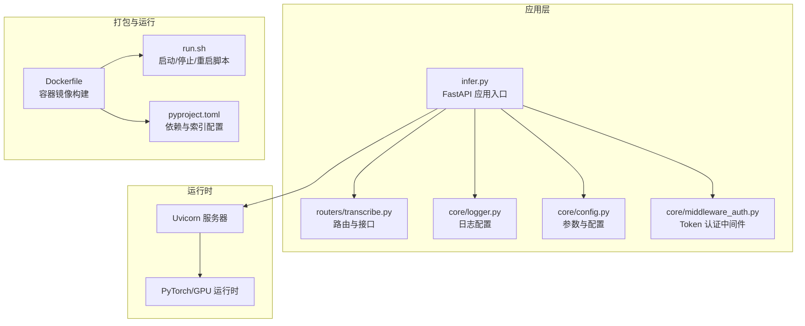
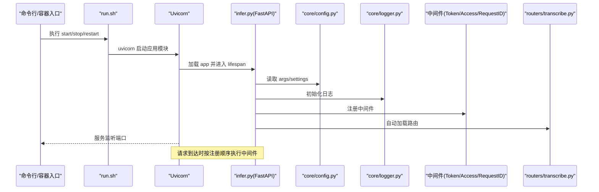
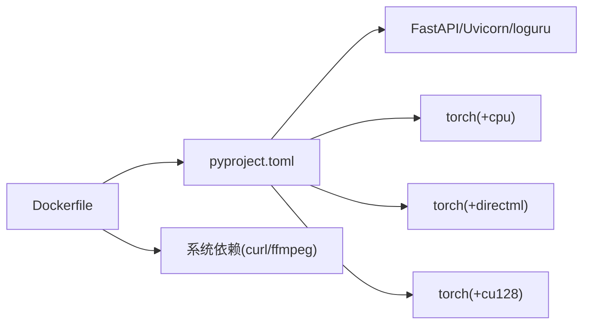

# 部署配置

<cite>
**本文引用的文件**
- [Dockerfile](file://Dockerfile)
- [run.sh](file://run.sh)
- [pyproject.toml](file://pyproject.toml)
- [infer.py](file://infer.py)
- [core/config.py](file://core/config.py)
- [core/logger.py](file://core/logger.py)
- [core/middleware_auth.py](file://core/middleware_auth.py)
- [routers/transcribe.py](file://routers/transcribe.py)
</cite>

## 目录
1. [简介](#简介)
2. [项目结构](#项目结构)
3. [核心组件](#核心组件)
4. [架构总览](#架构总览)
5. [详细组件分析](#详细组件分析)
6. [依赖分析](#依赖分析)
7. [性能考虑](#性能考虑)
8. [故障排查指南](#故障排查指南)
9. [结论](#结论)
10. [附录](#附录)

## 简介
本文件面向部署工程师与运维人员，系统性说明本项目的部署配置与最佳实践，覆盖以下方面：
- 多环境部署：Docker 容器、Kubernetes（概念性说明）、本地部署
- 服务启动参数、网络配置、端口设置与安全配置
- 生产环境最佳实践：负载均衡、高可用、监控与可观测性
- 配置文件热更新与配置验证方法
- 常见部署问题排查与解决方案

## 项目结构
本项目采用“Python 应用 + FastAPI 服务 + 配置与中间件”的分层组织方式，核心入口为服务启动脚本与主程序，配置与日志、认证中间件分别位于独立模块，路由集中在 routers 目录。

图表来源
- [Dockerfile:1-66](file://Dockerfile#L1-L66)
- [run.sh:1-63](file://run.sh#L1-L63)
- [pyproject.toml:1-102](file://pyproject.toml#L1-L102)
- [infer.py:1-123](file://infer.py#L1-L123)
- [core/config.py:1-109](file://core/config.py#L1-L109)
- [core/logger.py:1-73](file://core/logger.py#L1-L73)
- [core/middleware_auth.py:1-26](file://core/middleware_auth.py#L1-L26)
- [routers/transcribe.py:1-383](file://routers/transcribe.py#L1-L383)

章节来源
- [Dockerfile:1-66](file://Dockerfile#L1-L66)
- [run.sh:1-63](file://run.sh#L1-L63)
- [pyproject.toml:1-102](file://pyproject.toml#L1-L102)
- [infer.py:1-123](file://infer.py#L1-L123)
- [core/config.py:1-109](file://core/config.py#L1-L109)
- [core/logger.py:1-73](file://core/logger.py#L1-L73)
- [core/middleware_auth.py:1-26](file://core/middleware_auth.py#L1-L26)
- [routers/transcribe.py:1-383](file://routers/transcribe.py#L1-L383)

## 核心组件
- 服务入口与生命周期：应用在 lifespan 中初始化 ASR 引擎，在关闭时优雅释放；支持命令行参数与环境变量驱动的配置。
- 配置与参数：通过 argparse 解析命令行参数，并映射到 pydantic-settings 的 Settings 类，支持环境变量前缀 ASR_。
- 日志系统：基于 loguru，按环境输出到控制台与多类日志文件，支持请求 ID 上下文注入。
- 安全中间件：Token 认证中间件，除特定路径外强制校验 Authorization 头与密钥。
- 路由与接口：提供离线转写、批量转写、流式转写（SSE）与健康检查接口。

章节来源
- [infer.py:55-82](file://infer.py#L55-L82)
- [core/config.py:19-47](file://core/config.py#L19-L47)
- [core/config.py:52-109](file://core/config.py#L52-L109)
- [core/logger.py:14-73](file://core/logger.py#L14-L73)
- [core/middleware_auth.py:10-26](file://core/middleware_auth.py#L10-L26)
- [routers/transcribe.py:120-383](file://routers/transcribe.py#L120-L383)

## 架构总览
下图展示了服务启动、请求处理与资源管理的关键流程。

图表来源
- [run.sh:9-29](file://run.sh#L9-L29)
- [infer.py:85-102](file://infer.py#L85-L102)
- [core/config.py:47-109](file://core/config.py#L47-L109)
- [core/logger.py:12-42](file://core/logger.py#L12-L42)
- [core/middleware_auth.py:10-26](file://core/middleware_auth.py#L10-L26)
- [routers/transcribe.py:40-102](file://routers/transcribe.py#L40-L102)

## 详细组件分析

### Docker 容器配置
- 基础镜像与系统依赖：使用 slim 镜像，配置阿里云 Debian 源，安装 curl、procps、ffmpeg、ca-certificates 等。
- Python 与包管理：设置国内 PyPI 源与下载超时，使用 uv 安装依赖，再同步项目代码。
- 工作目录与权限：创建工作目录与日志目录，赋予 run.sh 可执行权限。
- 端口暴露与启动命令：容器暴露服务端口，CMD 默认启动 run.sh start。

章节来源
- [Dockerfile:1-66](file://Dockerfile#L1-L66)

### 本地部署配置
- 启动脚本：run.sh 提供 start/stop/restart 子命令，后台启动 uvicorn，写入 PID 文件与日志文件。
- 服务绑定：默认监听 0.0.0.0，端口可在命令行或环境变量中配置。
- 进程管理：通过 PID 文件判断是否已运行，支持优雅停止。

章节来源
- [run.sh:9-63](file://run.sh#L9-L63)

### 服务启动参数与网络配置
- 参数来源：命令行参数优先，随后由配置模块解析并映射到 Settings。
- 关键参数：主机绑定、端口、基础路径、是否使用 GPU、认证密钥等。
- 网络与超时：SSE 场景使用较长 keep-alive 超时，确保长音频流式传输稳定。

章节来源
- [core/config.py:19-47](file://core/config.py#L19-L47)
- [infer.py:115-122](file://infer.py#L115-L122)

### 安全配置
- Token 认证：除根路径与部分公开路径外，所有受保护路径需携带 Bearer Token。
- 密钥来源：从配置参数读取，建议通过环境变量注入。
- 中间件顺序：访问日志、认证、请求 ID 中间件按固定顺序注册。

章节来源
- [core/middleware_auth.py:7-26](file://core/middleware_auth.py#L7-L26)
- [core/config.py:33-34](file://core/config.py#L33-L34)
- [infer.py:93-95](file://infer.py#L93-L95)

### 配置文件与热更新机制
- 配置来源：命令行参数 + 环境变量（ASR_ 前缀）。
- 热更新能力：当前实现未内置配置热重载逻辑；建议通过滚动更新容器或重启进程的方式生效新配置。
- 验证方法：可通过健康检查接口确认服务状态，结合日志级别与输出定位问题。

章节来源
- [core/config.py:52-109](file://core/config.py#L52-L109)
- [routers/transcribe.py:372-383](file://routers/transcribe.py#L372-L383)
- [core/logger.py:14-17](file://core/logger.py#L14-L17)

### 路由与接口
- 接口类型：离线转写、批量离线转写、流式转写（SSE）、健康检查。
- SSE 特性：心跳保活、按分片实时推送、支持 SRT 与对齐信息。
- 文件大小限制：统一校验上传文件大小，超限返回 413。

章节来源
- [routers/transcribe.py:120-383](file://routers/transcribe.py#L120-L383)

## 依赖分析
- 运行时依赖：FastAPI、Uvicorn、loguru、pydantic-settings、torch（可选 GPU/CPU/Windows 轮子）。
- 容器构建依赖：uv、PyPI 镜像源、系统工具链。
- 依赖冲突与索引：通过 pyproject.toml 的 optional-dependencies 与索引配置隔离不同平台与 GPU 架构。

图表来源
- [pyproject.toml:7-23](file://pyproject.toml#L7-L23)
- [pyproject.toml:28-48](file://pyproject.toml#L28-L48)
- [pyproject.toml:50-102](file://pyproject.toml#L50-L102)
- [Dockerfile:24-31](file://Dockerfile#L24-L31)

章节来源
- [pyproject.toml:1-102](file://pyproject.toml#L1-L102)
- [Dockerfile:1-66](file://Dockerfile#L1-L66)

## 性能考虑
- SSE 与长连接：为长音频流式转写设置了较长的 keep-alive 超时，减少连接中断。
- VAD 与分片：默认分片长度与动态分片策略由全局配置决定，建议在生产中根据业务特征调优。
- 日志级别：生产环境控制台仅输出 WARNING 及以上，降低日志噪声。
- GPU 使用：可通过参数控制是否启用 GPU，建议在具备合适硬件与驱动的环境中开启。

章节来源
- [infer.py:121-122](file://infer.py#L121-L122)
- [core/logger.py:14-17](file://core/logger.py#L14-L17)
- [core/config.py:68-91](file://core/config.py#L68-L91)

## 故障排查指南
- 无法启动或端口占用
  - 检查 run.sh 是否已有 PID 文件，必要时清理后重试。
  - 确认端口未被占用，或调整端口参数。
- 认证失败
  - 确认 Authorization 头格式为 Bearer 令牌，且与配置中的密钥一致。
  - 排查中间件是否正确注册。
- SSE 无法接收数据
  - 确认客户端使用正确的 EventSource/SSE 客户端，避免浏览器 UI 直接访问。
  - 检查 Nginx/代理是否禁用了缓冲（已在响应头中设置）。
- 健康检查失败
  - 通过健康检查接口确认引擎就绪状态与 GPU 开关状态。
- 日志定位
  - 生产环境关注错误日志文件，开发环境可查看调试日志。

章节来源
- [run.sh:9-29](file://run.sh#L9-L29)
- [core/middleware_auth.py:10-26](file://core/middleware_auth.py#L10-L26)
- [routers/transcribe.py:246-369](file://routers/transcribe.py#L246-L369)
- [routers/transcribe.py:372-383](file://routers/transcribe.py#L372-L383)
- [core/logger.py:44-73](file://core/logger.py#L44-L73)

## 结论
本项目提供了清晰的容器化与本地部署入口，配合完善的参数与配置体系、安全中间件与日志系统，能够满足从开发到生产的多种部署需求。建议在生产环境中结合负载均衡、高可用与监控方案，持续优化性能与稳定性。

## 附录

### A. 端口与环境变量对照
- 端口：容器 EXPOSE 8001，run.sh 默认 8002；实际监听由命令行参数与配置决定。
- 环境变量：日志环境变量用于控制控制台级别；配置类支持 ASR_ 前缀的环境变量覆盖。

章节来源
- [Dockerfile:63](file://Dockerfile#L63)
- [run.sh:5](file://run.sh#L5)
- [core/logger.py:15](file://core/logger.py#L15)
- [core/config.py:105](file://core/config.py#L105)

### B. Kubernetes 部署要点（概念性说明）
- 资源与副本：建议设置合理的资源请求与限制，使用多副本实现高可用。
- 健康检查：使用 HTTP GET /asr/health 作为存活/就绪探针。
- 暴露方式：使用 Service 暴露 ClusterIP，结合 Ingress/NLB 实现外部访问。
- 配置注入：通过 ConfigMap/Secret 注入环境变量与密钥，避免硬编码。
- 存储：持久化日志目录与上传目录，确保滚动更新后数据不丢失。

[本节为概念性说明，不直接分析具体文件，故无章节来源]