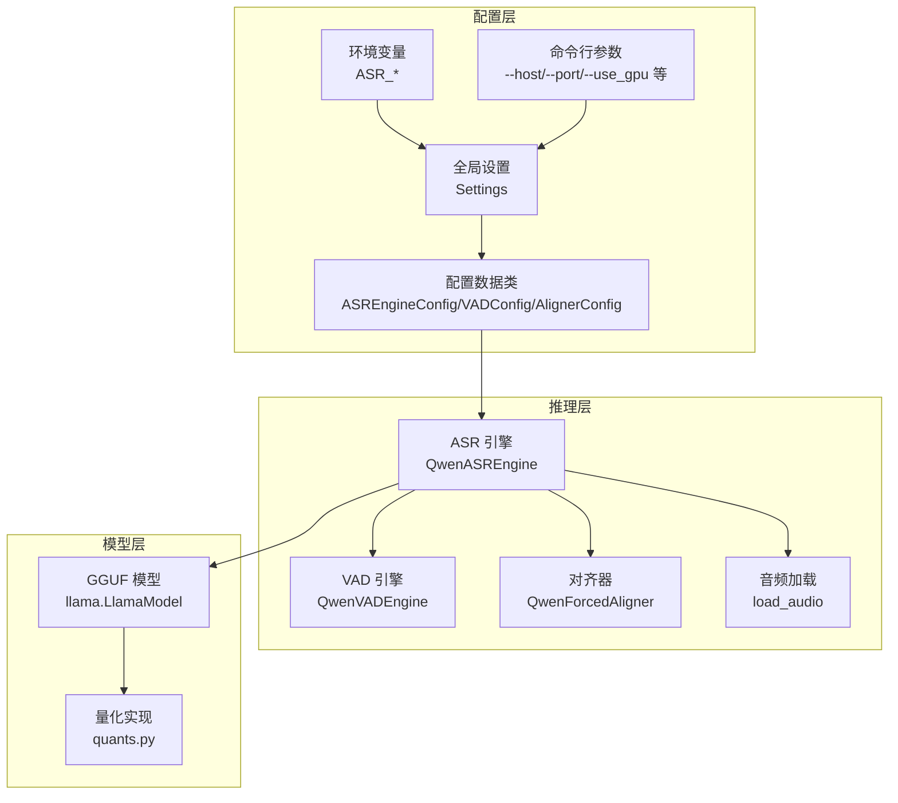
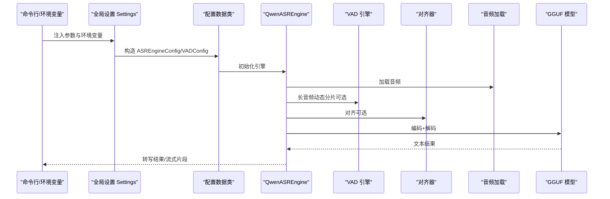
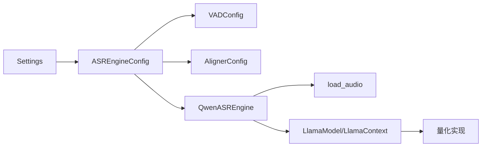

# 配置管理

<cite>
**本文引用的文件**   
- [core/config.py](file://core/config.py)
- [qwen_asr_gguf/inference/schema.py](file://qwen_asr_gguf/inference/schema.py)
- [qwen_asr_gguf/inference/asr.py](file://qwen_asr_gguf/inference/asr.py)
- [qwen_asr_gguf/inference/audio.py](file://qwen_asr_gguf/inference/audio.py)
- [qwen_asr_gguf/inference/utils.py](file://qwen_asr_gguf/inference/utils.py)
- [export_config.py](file://export_config.py)
- [21-Run-ASR.py](file://21-Run-ASR.py)
- [ref/llama.cpp/docs/build.md](file://ref/llama.cpp/docs/build.md)
- [qwen_asr_gguf/export/convert_hf_to_gguf.py](file://qwen_asr_gguf/export/convert_hf_to_gguf.py)
- [qwen_asr_gguf/export/gguf/quants.py](file://qwen_asr_gguf/export/gguf/quants.py)
</cite>

## 目录
1. [简介](#简介)
2. [项目结构](#项目结构)
3. [核心组件](#核心组件)
4. [架构总览](#架构总览)
5. [详细组件分析](#详细组件分析)
6. [依赖分析](#依赖分析)
7. [性能考虑](#性能考虑)
8. [故障排查指南](#故障排查指南)
9. [结论](#结论)
10. [附录](#附录)

## 简介
本文件面向 Qwen3-ASR GGUF 的配置管理，系统性说明环境变量与配置项、配置文件结构、运行时参数与性能调优、全局与请求级配置的优先级与继承关系，并提供 CPU-only、GPU、Vulkan 等部署场景的推荐配置与最佳实践。文档还覆盖模型量化类型（如 int4、q4_k）、内存管理、并发与缓存策略、配置验证与错误处理、调试技巧以及配置模板与常见问题解答。

## 项目结构
本项目围绕“配置即代码”的理念组织，核心配置来源包括：
- 运行参数与环境变量：通过命令行参数与环境变量注入全局设置
- 配置数据类：定义引擎、VAD、对齐器等配置的数据结构
- 推理引擎：根据配置执行编码、VAD、对齐与解码流程
- 模型导出与量化：提供 GGUF 转换与量化实现，支撑不同硬件后端

图表来源
- [core/config.py:52-108](file://core/config.py#L52-L108)
- [qwen_asr_gguf/inference/schema.py:163-210](file://qwen_asr_gguf/inference/schema.py#L163-L210)
- [qwen_asr_gguf/inference/asr.py:40-106](file://qwen_asr_gguf/inference/asr.py#L40-L106)

章节来源
- [core/config.py:19-47](file://core/config.py#L19-L47)
- [core/config.py:52-108](file://core/config.py#L52-L108)
- [qwen_asr_gguf/inference/schema.py:163-210](file://qwen_asr_gguf/inference/schema.py#L163-L210)

## 核心组件
- 全局设置 Settings：从命令行参数与环境变量构建，提供主机、端口、模型路径、上传目录、默认语言、VAD 默认参数等
- 配置数据类：
  - ASREngineConfig：ASR 引擎配置，包含模型路径、分片大小、记忆窗口、上下文长度、是否启用对齐器、VAD 配置与动态分片阈值
  - VADConfig：VAD 引擎配置，包含模型路径、GPU 开关、平滑窗口、语音阈值、最短/最长语音段、静音合并、边界扩展等
  - AlignerConfig：对齐器配置，包含前后端 ONNX 文件、LLM GGUF 文件、上下文长度、是否启用 GPU 等
- 推理引擎 QwenASREngine：根据配置执行编码、VAD、对齐与解码流程，支持一次性与流式转写
- 音频处理：load_audio 支持多种格式，自动重采样与通道转换
- 量化实现：提供多种 GGML 量化类型（如 Q4_0、Q4_1、Q4_K、Q5_K、Q6_K、Q8_0、BF16、TQ1_0、TQ2_0 等）

章节来源
- [core/config.py:52-108](file://core/config.py#L52-L108)
- [qwen_asr_gguf/inference/schema.py:163-210](file://qwen_asr_gguf/inference/schema.py#L163-L210)
- [qwen_asr_gguf/inference/asr.py:40-106](file://qwen_asr_gguf/inference/asr.py#L40-L106)
- [qwen_asr_gguf/inference/audio.py:129-149](file://qwen_asr_gguf/inference/audio.py#L129-L149)
- [qwen_asr_gguf/export/gguf/quants.py:220-402](file://qwen_asr_gguf/export/gguf/quants.py#L220-L402)

## 架构总览
下图展示配置在系统中的流向：命令行与环境变量 → 全局设置 → 引擎配置 → 推理执行 → 输出结果。

图表来源
- [core/config.py:52-108](file://core/config.py#L52-L108)
- [qwen_asr_gguf/inference/schema.py:163-210](file://qwen_asr_gguf/inference/schema.py#L163-L210)
- [qwen_asr_gguf/inference/asr.py:432-596](file://qwen_asr_gguf/inference/asr.py#L432-L596)

## 详细组件分析

### 全局配置与环境变量
- 命令行参数
  - --use_gpu：是否使用 GPU 预测，默认基于 CUDA 可用性
  - --host / --port：服务监听地址与端口
  - --base_url：接口基础路径
  - --configs：配置文件路径（用于后续扩展）
- 环境变量前缀 ASR_：Settings 类通过 env_prefix="ASR_" 自动映射环境变量，如 ASR_MODEL_DIR、ASR_HOST、ASR_PORT 等
- 全局默认值
  - 模型目录、数据目录、热词文件路径
  - 转写阈值、最大热词数、CTC 开关
  - ASR 分片大小、记忆窗口、动态分片阈值、默认语言
  - VAD 模型目录、VAD GPU 开关、VAD 参数（平滑窗口、语音阈值、最短/最长语音段、静音合并、边界扩展、分片最大帧数）
  - 上传目录与最大文件大小
  - 默认上下文

章节来源
- [core/config.py:19-47](file://core/config.py#L19-L47)
- [core/config.py:52-108](file://core/config.py#L52-L108)

### 配置数据类与优先级
- ASREngineConfig
  - model_dir：模型根目录
  - encoder_frontend_fn / encoder_backend_fn：编码器前后端模型文件
  - llm_fn：ASR 解码器 GGUF 文件
  - use_gpu：是否启用 GPU
  - n_ctx：上下文长度
  - chunk_size：分片时长（秒）
  - memory_num：保留的历史分片数量
  - enable_aligner / align_config：是否启用对齐器及对齐器配置
  - vad_config：VAD 配置对象
  - dynamic_chunk_threshold：动态分片阈值（秒）
  - __post_init__：自动补齐对齐器与 VAD 的默认值
- VADConfig
  - model_dir：VAD 模型目录
  - use_gpu：VAD 是否使用 GPU
  - 平滑窗口、语音阈值、最短/最长语音段、静音合并、边界扩展、分片最大帧数、最小持续时长
- AlignerConfig
  - 前后端 ONNX 文件、LLM GGUF 文件、use_gpu、n_ctx、pad_to

优先级与继承关系
- 全局设置 Settings 为默认值来源，命令行参数与环境变量覆盖默认值
- ASREngineConfig 作为运行期配置，优先使用传入的显式配置；未显式设置时，自动继承默认值（如 AlignerConfig、VADConfig）
- VAD 由 dynamic_chunk_threshold 控制：当音频时长超过阈值时自动延迟加载

章节来源
- [qwen_asr_gguf/inference/schema.py:163-210](file://qwen_asr_gguf/inference/schema.py#L163-L210)
- [qwen_asr_gguf/inference/schema.py:87-113](file://qwen_asr_gguf/inference/schema.py#L87-L113)
- [qwen_asr_gguf/inference/schema.py:72-86](file://qwen_asr_gguf/inference/schema.py#L72-L86)

### 推理引擎与运行时参数
- 初始化阶段
  - 解析模型路径（前端/后端/LLM）
  - 根据 use_gpu 与 pad_to 初始化编码器
  - 可选初始化对齐器
  - VAD 延迟初始化：仅在需要时加载
- 转写流程
  - 一次性转写：transcribe → asr → _asr_core → 生成最终文本
  - 流式转写：transcribe_stream → asr_stream → _asr_core → 逐片产出
- 动态分片策略
  - 短音频（≤ 阈值）：单片处理
  - 长音频（> 阈值）：VAD 自适应检测，按语音边界动态切分
  - VAD 不可用：固定等长分片
- 抗幻觉与稳定性
  - token 级重复熔断、n-gram 短语级重复熔断、max_new_tokens 上限
  - 重试与温度递增、去重后处理

章节来源
- [qwen_asr_gguf/inference/asr.py:40-106](file://qwen_asr_gguf/inference/asr.py#L40-L106)
- [qwen_asr_gguf/inference/asr.py:432-596](file://qwen_asr_gguf/inference/asr.py#L432-L596)
- [qwen_asr_gguf/inference/asr.py:602-774](file://qwen_asr_gguf/inference/asr.py#L602-L774)

### 音频加载与预处理
- 支持格式：基于 soundfile 与 ffmpeg 的混合策略
- 自动重采样至目标采样率（默认 16kHz 或更高）
- 单声道化与裁剪（start_second、duration）

章节来源
- [qwen_asr_gguf/inference/audio.py:129-149](file://qwen_asr_gguf/inference/audio.py#L129-L149)

### 模型量化与导出
- GGUF 转换
  - 从 Hugging Face 模型转换为 GGUF，支持多种量化类型
  - 自动推断张量类型与量化策略
- 量化类型
  - Q4_0、Q4_1、Q4_K、Q5_K、Q6_K、Q8_0、BF16、TQ1_0、TQ2_0 等
- 量化实现
  - 提供量化/反量化实现，保证行大小与块大小对齐

章节来源
- [qwen_asr_gguf/export/convert_hf_to_gguf.py:513-689](file://qwen_asr_gguf/export/convert_hf_to_gguf.py#L513-L689)
- [qwen_asr_gguf/export/gguf/quants.py:220-402](file://qwen_asr_gguf/export/gguf/quants.py#L220-L402)

### 部署场景与推荐配置

#### CPU-only
- 配置要点
  - use_gpu=false
  - ASR 分片大小适中（如 30s），memory_num=1
  - 关闭对齐器以降低 RTF
  - VAD 使用 CPU，speech_threshold 保持默认
- 性能建议
  - 合理设置 chunk_size 与 memory_num，避免过长分片导致内存压力
  - 使用 f16/f32 GGUF 文件，避免更高压缩带来的解码开销

章节来源
- [21-Run-ASR.py:77-95](file://21-Run-ASR.py#L77-L95)
- [qwen_asr_gguf/inference/schema.py:163-210](file://qwen_asr_gguf/inference/schema.py#L163-L210)

#### GPU（CUDA）
- 配置要点
  - use_gpu=true
  - ASR 与 Aligner 的 use_gpu=true
  - 合理设置 n_ctx 与 n_batch（参考推理引擎初始化参数）
- 性能建议
  - 选择合适的量化类型（如 Q4_K/Q5_K）在精度与速度间平衡
  - 注意 VRAM 与显存溢出，必要时降低 batch 或切换更轻量的量化

章节来源
- [ref/llama.cpp/docs/build.md:132-207](file://ref/llama.cpp/docs/build.md#L132-L207)
- [qwen_asr_gguf/inference/asr.py:93-95](file://qwen_asr_gguf/inference/asr.py#L93-L95)

#### Vulkan
- 配置要点
  - 启用 Vulkan 后端（编译时 -DGGML_VULKAN=ON）
  - 运行时选择设备与参数（参考构建文档）
- 性能建议
  - 使用合适的量化类型与上下文长度
  - 注意驱动与 SDK 版本兼容性

章节来源
- [ref/llama.cpp/docs/build.md:369-489](file://ref/llama.cpp/docs/build.md#L369-L489)

### 模型量化配置（int4、q4_k 等）
- 支持类型
  - Q4_0、Q4_1、Q4_K、Q5_K、Q6_K、Q8_0、BF16、TQ1_0、TQ2_0
- 选择建议
  - Q4_K/Q5_K：在精度与体积间平衡，适合大多数场景
  - Q8_0：更高精度，体积更大
  - BF16：半精度，更快但略失真
- 导出与量化
  - 通过转换脚本自动选择量化类型与块大小，确保对齐

章节来源
- [qwen_asr_gguf/export/gguf/quants.py:220-402](file://qwen_asr_gguf/export/gguf/quants.py#L220-L402)
- [qwen_asr_gguf/export/convert_hf_to_gguf.py:513-689](file://qwen_asr_gguf/export/convert_hf_to_gguf.py#L513-L689)

### 内存管理与并发
- 内存管理
  - ASR_MEMORY_NUM 控制历史分片记忆窗口，避免上下文无限增长
  - n_ctx 控制上下文长度，防止越界导致崩溃
- 并发与缓存
  - 推理引擎内部使用队列与批处理，避免频繁分配
  - VAD 与对齐器可独立启用，按需加载以节省内存

章节来源
- [core/config.py:68-73](file://core/config.py#L68-L73)
- [qwen_asr_gguf/inference/asr.py:229-237](file://qwen_asr_gguf/inference/asr.py#L229-L237)
- [qwen_asr_gguf/inference/asr.py:643-656](file://qwen_asr_gguf/inference/asr.py#L643-L656)

### 请求级配置与全局配置
- 全局配置（Settings）：默认值与环境变量覆盖
- 请求级配置（ASREngineConfig）：每次转写可传入独立配置，覆盖全局默认
- 优先级
  - 显式传入的 ASREngineConfig > Settings > 默认值
  - VAD 与 Aligner 配置在 ASREngineConfig.__post_init__ 中自动补齐

章节来源
- [core/config.py:52-108](file://core/config.py#L52-L108)
- [qwen_asr_gguf/inference/schema.py:188-209](file://qwen_asr_gguf/inference/schema.py#L188-L209)

### 配置验证与错误处理
- 语言校验：normalize_language_name 与 validate_language
- 音频加载：检查文件存在、ffmpeg 可用性、采样率与通道转换
- 推理越界保护：n_ctx 越界时提前返回空结果并记录警告
- VAD 加载失败：降级为固定分片模式

章节来源
- [qwen_asr_gguf/inference/utils.py:38-56](file://qwen_asr_gguf/inference/utils.py#L38-L56)
- [qwen_asr_gguf/inference/audio.py:129-149](file://qwen_asr_gguf/inference/audio.py#L129-L149)
- [qwen_asr_gguf/inference/asr.py:229-237](file://qwen_asr_gguf/inference/asr.py#L229-L237)
- [qwen_asr_gguf/inference/asr.py:133-135](file://qwen_asr_gguf/inference/asr.py#L133-L135)

### 调试技巧
- 启用 verbose：查看分片、编码、解码耗时与 RTF 统计
- 逐步缩小问题范围：先关闭对齐器与 VAD，确认基本功能
- 检查模型路径与量化类型一致性
- 使用小音频片段快速验证配置

章节来源
- [qwen_asr_gguf/inference/schema.py:163-177](file://qwen_asr_gguf/inference/schema.py#L163-L177)
- [qwen_asr_gguf/inference/asr.py:351-388](file://qwen_asr_gguf/inference/asr.py#L351-L388)

## 依赖分析
- 配置依赖
  - Settings 依赖命令行参数与环境变量
  - ASREngineConfig 依赖 VADConfig 与 AlignerConfig 的默认值
- 推理依赖
  - QwenASREngine 依赖 llama 模型与上下文、编码器、VAD、对齐器
  - 音频依赖 ffmpeg 或 soundfile
- 量化依赖
  - GGUF 转换依赖 transformers 与 gguf 库
  - 量化实现依赖 numpy 与 GGML 块大小规则

图表来源
- [core/config.py:52-108](file://core/config.py#L52-L108)
- [qwen_asr_gguf/inference/schema.py:163-210](file://qwen_asr_gguf/inference/schema.py#L163-L210)
- [qwen_asr_gguf/inference/asr.py:40-106](file://qwen_asr_gguf/inference/asr.py#L40-L106)

章节来源
- [core/config.py:52-108](file://core/config.py#L52-L108)
- [qwen_asr_gguf/inference/schema.py:163-210](file://qwen_asr_gguf/inference/schema.py#L163-L210)
- [qwen_asr_gguf/inference/asr.py:40-106](file://qwen_asr_gguf/inference/asr.py#L40-L106)

## 性能考虑
- 分片策略
  - 动态分片显著减少静音处理，提升 RTF
  - memory_num 控制上下文长度，避免过长导致解码缓慢
- 量化与精度
  - Q4_K/Q5_K 在精度与体积间取得良好平衡
  - BF16 提升速度但牺牲一定精度
- GPU 与后端
  - CUDA/Vulkan 后端可加速推理，注意显存与驱动版本
- 编码器填充
  - pad_to 与 chunk_size 对齐，避免多余填充带来的计算浪费

章节来源
- [qwen_asr_gguf/inference/asr.py:602-774](file://qwen_asr_gguf/inference/asr.py#L602-L774)
- [qwen_asr_gguf/inference/schema.py:188-192](file://qwen_asr_gguf/inference/schema.py#L188-L192)
- [ref/llama.cpp/docs/build.md:132-207](file://ref/llama.cpp/docs/build.md#L132-L207)

## 故障排查指南
- ffmpeg 未安装
  - 现象：加载音频失败
  - 处理：安装 ffmpeg 并加入 PATH
- 模型路径错误
  - 现象：初始化失败或找不到模型文件
  - 处理：确认 model_dir 与各子文件名正确
- n_ctx 越界
  - 现象：推理提前终止或警告
  - 处理：减小 memory_num 或提高 n_ctx
- VAD 加载失败
  - 现象：长音频无法动态分片
  - 处理：检查 VAD 模型路径与依赖，系统将自动降级为固定分片
- 量化不兼容
  - 现象：加载 GGUF 失败或量化错误
  - 处理：确认量化类型与块大小对齐，重新导出模型

章节来源
- [qwen_asr_gguf/inference/audio.py:88-96](file://qwen_asr_gguf/inference/audio.py#L88-L96)
- [qwen_asr_gguf/inference/asr.py:229-237](file://qwen_asr_gguf/inference/asr.py#L229-L237)
- [qwen_asr_gguf/inference/asr.py:133-135](file://qwen_asr_gguf/inference/asr.py#L133-L135)
- [qwen_asr_gguf/export/gguf/quants.py:14-26](file://qwen_asr_gguf/export/gguf/quants.py#L14-L26)

## 结论
Qwen3-ASR GGUF 的配置体系以 Settings 与配置数据类为核心，结合命令行与环境变量实现灵活覆盖。通过 ASREngineConfig 的动态分片、VAD 与对齐器的按需加载，以及量化与后端选择，可在不同硬件环境下获得良好的性能与稳定性。建议在生产环境中优先采用 Q4_K/Q5_K 量化、合理设置分片与记忆窗口，并针对具体硬件启用相应后端。

## 附录

### 配置模板
- 全局设置（环境变量）
  - ASR_MODEL_DIR：模型根目录
  - ASR_HOST / ASR_PORT：服务监听地址与端口
  - ASR_UPLOAD_DIR / ASR_MAX_FILE_SIZE_MB：上传目录与最大文件大小
  - ASR_DEFAULT_LANGUAGE：默认语言
- 引擎配置（ASREngineConfig）
  - model_dir：模型目录
  - use_gpu：是否启用 GPU
  - chunk_size / memory_num：分片与记忆窗口
  - n_ctx：上下文长度
  - enable_aligner / align_config：对齐器开关与配置
  - vad_config / dynamic_chunk_threshold：VAD 配置与动态分片阈值

章节来源
- [core/config.py:52-108](file://core/config.py#L52-L108)
- [qwen_asr_gguf/inference/schema.py:163-210](file://qwen_asr_gguf/inference/schema.py#L163-L210)

### 常见问题与解决方案
- 问：如何启用 GPU？
  - 答：设置 use_gpu=true，并确保后端编译与驱动正确
- 问：如何降低 RTF？
  - 答：启用 VAD 动态分片、关闭对齐器、使用更轻量的量化类型
- 问：如何避免显存不足？
  - 答：降低 n_ctx、n_batch，或切换更低精度的量化
- 问：如何验证配置是否生效？
  - 答：启用 verbose 查看统计信息，逐步关闭功能定位问题

章节来源
- [ref/llama.cpp/docs/build.md:132-207](file://ref/llama.cpp/docs/build.md#L132-L207)
- [qwen_asr_gguf/inference/asr.py:351-388](file://qwen_asr_gguf/inference/asr.py#L351-L388)