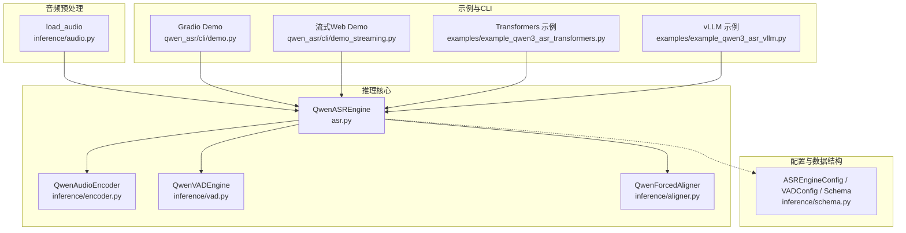
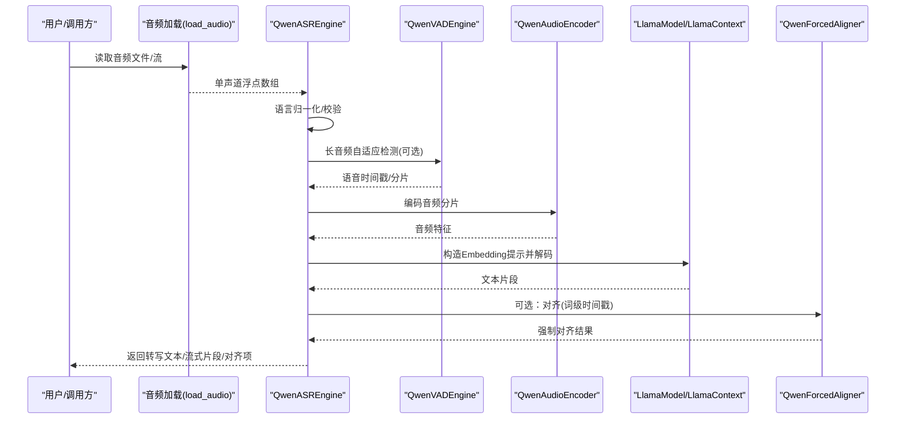
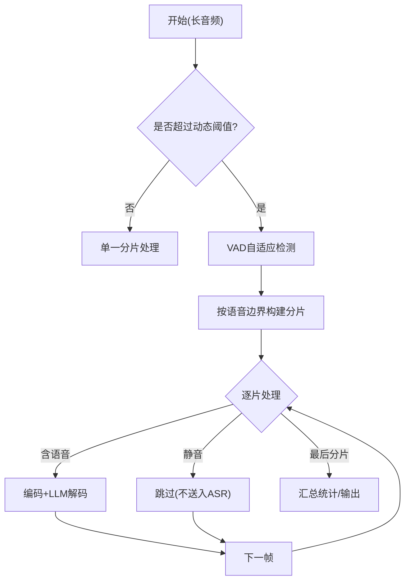
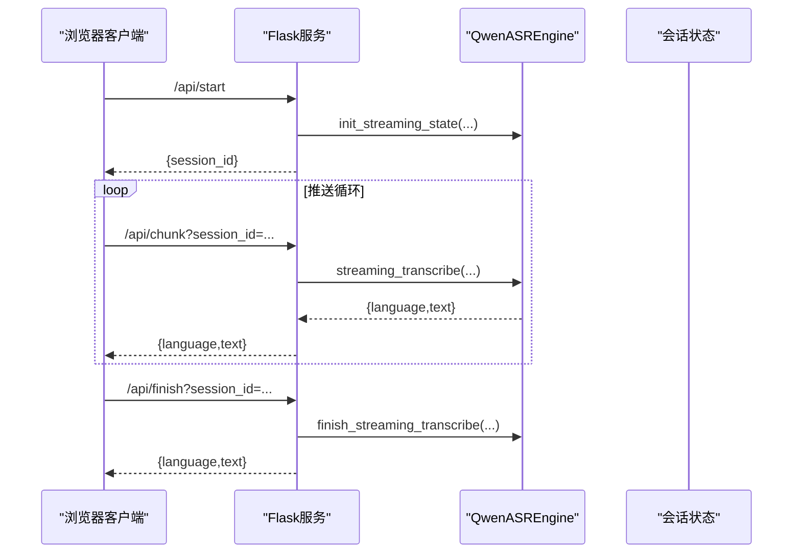
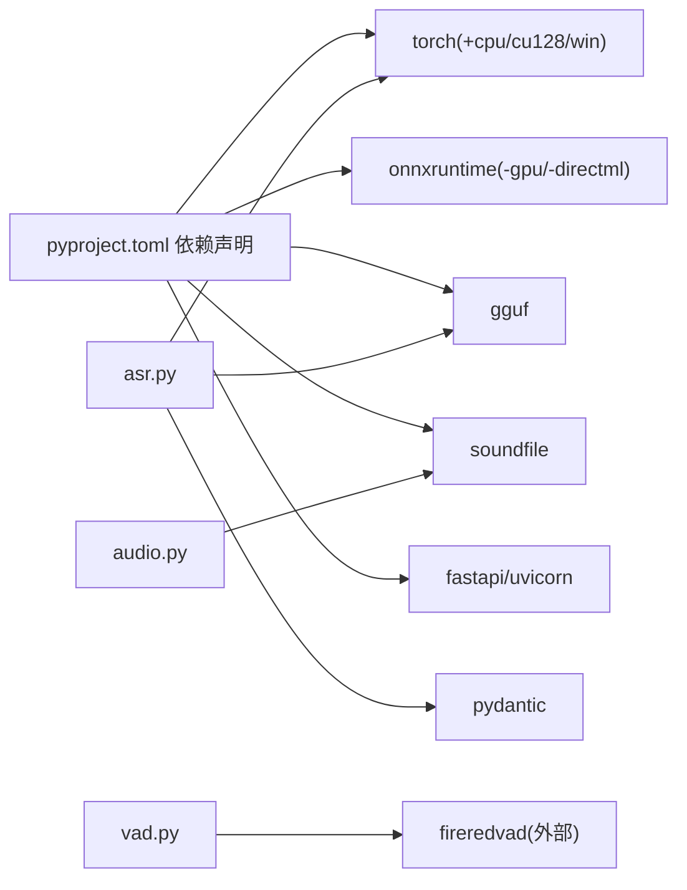

# 应用场景

<cite>
**本文引用的文件**
- [main.py](file://main.py)
- [qwen_asr_gguf/inference/asr.py](file://qwen_asr_gguf/inference/asr.py)
- [qwen_asr_gguf/inference/audio.py](file://qwen_asr_gguf/inference/audio.py)
- [qwen_asr_gguf/inference/vad.py](file://qwen_asr_gguf/inference/vad.py)
- [qwen_asr_gguf/inference/schema.py](file://qwen_asr_gguf/inference/schema.py)
- [qwen_asr_gguf/inference/utils.py](file://qwen_asr_gguf/inference/utils.py)
- [examples/example_qwen3_asr_transformers.py](file://examples/example_qwen3_asr_transformers.py)
- [examples/example_qwen3_asr_vllm.py](file://examples/example_qwen3_asr_vllm.py)
- [qwen_asr/cli/demo.py](file://qwen_asr/cli/demo.py)
- [qwen_asr/cli/demo_streaming.py](file://qwen_asr/cli/demo_streaming.py)
- [export_config.py](file://export_config.py)
- [pyproject.toml](file://pyproject.toml)
</cite>

## 目录
1. [简介](#简介)
2. [项目结构](#项目结构)
3. [核心组件](#核心组件)
4. [架构总览](#架构总览)
5. [详细场景分析](#详细场景分析)
6. [依赖关系分析](#依赖关系分析)
7. [性能考量](#性能考量)
8. [故障排查指南](#故障排查指南)
9. [结论](#结论)
10. [附录](#附录)

## 简介
本文件面向 Qwen3-ASR GGUF 项目，系统性梳理其在多种真实业务场景下的应用方式与最佳实践，涵盖短音频离线转写、长音频流式转写、批量文件处理、实时语音识别、字幕生成等典型用例。文档同时给出不同行业（新闻媒体、教育培训、企业服务、个人消费）的落地建议，以及在模型规模、量化精度与后端配置方面的权衡策略，帮助用户在性能与成本之间取得最优平衡。

## 项目结构
该项目围绕“音频加载与重采样”“语音活动检测（VAD）”“声学编码器（Encoder）”“语言模型（LLM）推理”“强制对齐（可选）”“流式/批处理管线”等模块组织，形成可插拔、可扩展的 ASR 引擎。核心入口位于推理模块，CLI 提供演示与流式 Web Demo，示例脚本展示 Transformers 与 vLLM 后端的使用方式。

图示来源
- [qwen_asr_gguf/inference/asr.py](file://qwen_asr_gguf/inference/asr.py)
- [qwen_asr_gguf/inference/audio.py](file://qwen_asr_gguf/inference/audio.py)
- [qwen_asr_gguf/inference/vad.py](file://qwen_asr_gguf/inference/vad.py)
- [qwen_asr_gguf/inference/schema.py](file://qwen_asr_gguf/inference/schema.py)
- [qwen_asr/cli/demo.py](file://qwen_asr/cli/demo.py)
- [qwen_asr/cli/demo_streaming.py](file://qwen_asr/cli/demo_streaming.py)
- [examples/example_qwen3_asr_transformers.py](file://examples/example_qwen3_asr_transformers.py)
- [examples/example_qwen3_asr_vllm.py](file://examples/example_qwen3_asr_vllm.py)

章节来源
- [qwen_asr_gguf/inference/asr.py](file://qwen_asr_gguf/inference/asr.py)
- [qwen_asr_gguf/inference/audio.py](file://qwen_asr_gguf/inference/audio.py)
- [qwen_asr_gguf/inference/vad.py](file://qwen_asr_gguf/inference/vad.py)
- [qwen_asr_gguf/inference/schema.py](file://qwen_asr_gguf/inference/schema.py)
- [qwen_asr/cli/demo.py](file://qwen_asr/cli/demo.py)
- [qwen_asr/cli/demo_streaming.py](file://qwen_asr/cli/demo_streaming.py)
- [examples/example_qwen3_asr_transformers.py](file://examples/example_qwen3_asr_transformers.py)
- [examples/example_qwen3_asr_vllm.py](file://examples/example_qwen3_asr_vllm.py)

## 核心组件
- 引擎与流水线
  - QwenASREngine：统一的离线/流式转录引擎，内置 VAD 前置过滤、动态分片、记忆上下文、强制对齐等能力，支持一次性与生成器两种调用形态。
- 音频预处理
  - load_audio：兼容多种音频格式，自动重采样至目标采样率并转为单声道浮点数组，支持 soundfile 与 ffmpeg 两条路径。
- VAD 引擎
  - QwenVADEngine：基于 FireRedVAD 的非流式检测，提供自适应阈值、时间戳构建、静音跳过等功能，显著降低长音频处理的无效计算。
- 配置与数据结构
  - ASREngineConfig/VADConfig/TranscribeResult/StreamChunkResult 等，定义了模型路径、分片策略、上下文记忆、性能统计等关键参数。
- CLI 与示例
  - Gradio Demo 与流式 Web Demo 提供交互式体验；Transformers 与 vLLM 示例展示不同后端的推理方式。

章节来源
- [qwen_asr_gguf/inference/asr.py](file://qwen_asr_gguf/inference/asr.py)
- [qwen_asr_gguf/inference/audio.py](file://qwen_asr_gguf/inference/audio.py)
- [qwen_asr_gguf/inference/vad.py](file://qwen_asr_gguf/inference/vad.py)
- [qwen_asr_gguf/inference/schema.py](file://qwen_asr_gguf/inference/schema.py)
- [qwen_asr/cli/demo.py](file://qwen_asr/cli/demo.py)
- [qwen_asr/cli/demo_streaming.py](file://qwen_asr/cli/demo_streaming.py)
- [examples/example_qwen3_asr_transformers.py](file://examples/example_qwen3_asr_transformers.py)
- [examples/example_qwen3_asr_vllm.py](file://examples/example_qwen3_asr_vllm.py)

## 架构总览
下图展示了从音频输入到最终文本输出的关键路径，以及 VAD、Encoder、LLM、对齐模块之间的协作关系。

图示来源
- [qwen_asr_gguf/inference/asr.py](file://qwen_asr_gguf/inference/asr.py)
- [qwen_asr_gguf/inference/audio.py](file://qwen_asr_gguf/inference/audio.py)
- [qwen_asr_gguf/inference/vad.py](file://qwen_asr_gguf/inference/vad.py)
- [qwen_asr_gguf/inference/schema.py](file://qwen_asr_gguf/inference/schema.py)

## 详细场景分析

### 短音频离线转写（会议记录、语音备忘录）
- 适用特征
  - 音频时长较短，通常小于动态分片阈值，引擎采用“单一分片直接处理”的策略，无需 VAD。
  - 适合一次性转录接口，追求吞吐与稳定性。
- 最佳实践
  - 语言参数：显式指定语言以提升准确性。
  - 上下文：在会议/备忘录场景可传入上下文，增强领域术语一致性。
  - 对齐：如需词级时间戳，开启强制对齐模块。
  - 温度与采样：温度设为 0，提高确定性。
- 性能要点
  - 固定分片模式下，编码器输入长度固定，推理开销稳定；可通过减少 memory_num 降低上下文占用。
- 参考实现
  - 离线转录入口与一次性流水线见引擎核心方法与配置。

章节来源
- [qwen_asr_gguf/inference/asr.py](file://qwen_asr_gguf/inference/asr.py)
- [qwen_asr_gguf/inference/schema.py](file://qwen_asr_gguf/inference/schema.py)

### 长音频流式转写（播客节目、讲座录音）
- 适用特征
  - 音频较长，启用 VAD 动态分片：按语音边界智能切分，跳过静音段，显著降低无效计算。
  - 适合 SSE/WS 等实时推送场景，逐步产出文本。
- 最佳实践
  - VAD 参数
    - 初始阈值：在安静环境中适当提高，避免误检；嘈杂环境可使用自适应阈值。
    - 最小语音/静音段：根据内容节奏调整，避免过度切分或合并。
    - 扩展边界：为语音首尾增加少量缓冲，提升词边界完整性。
  - 分片与上下文
    - 分片时长：默认 30s 平衡延迟与吞吐；长内容可适度增大以降低分片次数。
    - 记忆窗口：保留前 N 片文本上下文，避免跨段重复与混乱。
  - 温度与采样
    - 适度提高温度以缓解幻觉，配合重试与去重后处理。
- 参考实现
  - VAD 自适应检测、分片构建与流式生成器。

图示来源
- [qwen_asr_gguf/inference/asr.py](file://qwen_asr_gguf/inference/asr.py)
- [qwen_asr_gguf/inference/vad.py](file://qwen_asr_gguf/inference/vad.py)

章节来源
- [qwen_asr_gguf/inference/asr.py](file://qwen_asr_gguf/inference/asr.py)
- [qwen_asr_gguf/inference/vad.py](file://qwen_asr_gguf/inference/vad.py)
- [qwen_asr_gguf/inference/schema.py](file://qwen_asr_gguf/inference/schema.py)

### 批量文件处理（大规模音频归档）
- 适用特征
  - 面向离线批处理，强调吞吐与稳定性，可关闭实时性要求。
- 最佳实践
  - 任务拆分：按目录/批次划分，利用多进程/多实例并行。
  - I/O 优化：优先使用本地高带宽存储，减少网络抖动。
  - 输出格式：统一输出文本与可选对齐信息，便于后续检索与二次加工。
  - 资源调度：合理分配 GPU/CPU，避免显存碎片与上下文溢出。
- 参考实现
  - 离线转录接口与流式接口均可用于批量场景，前者一次性聚合，后者可边处理边落盘。

章节来源
- [qwen_asr_gguf/inference/asr.py](file://qwen_asr_gguf/inference/asr.py)

### 实时语音识别（语音助手、会议同传）
- 适用特征
  - 低延迟、高并发，强调流式输出与会话状态管理。
- 最佳实践
  - 流式 Web Demo
    - 会话生命周期：建立/推送/收尾，避免长时间闲置导致资源占用。
    - 分片大小：较小分片缩短首包延迟，但会增加往返次数；需在延迟与稳定性间折中。
    - 不固定分片数/令牌数：允许模型在会话内动态调整生成步长。
  - 后端选择
    - vLLM：适合高并发、长会话；Transformers：适合小规模、确定性更强的场景。
- 参考实现
  - 流式 Web Demo 与会话管理逻辑。

图示来源
- [qwen_asr/cli/demo_streaming.py](file://qwen_asr/cli/demo_streaming.py)

章节来源
- [qwen_asr/cli/demo_streaming.py](file://qwen_asr/cli/demo_streaming.py)
- [examples/example_qwen3_asr_vllm.py](file://examples/example_qwen3_asr_vllm.py)

### 字幕生成（视频内容、在线教育）
- 适用特征
  - 需要高保真的词级时间戳，以便与视频同步。
- 最佳实践
  - 强制对齐：开启对齐模块，获得词级起止时间，再转换为 SRT/ASS 等字幕格式。
  - 语言与上下文：明确语言与课程术语上下文，提升对齐准确率。
  - 后处理：对齐结果排序、去重、合并短片段，保证字幕可读性。
- 参考实现
  - 对齐结果的数据结构与处理流程。

章节来源
- [qwen_asr_gguf/inference/asr.py](file://qwen_asr_gguf/inference/asr.py)
- [qwen_asr_gguf/inference/schema.py](file://qwen_asr_gguf/inference/schema.py)

## 依赖关系分析
- 模块耦合
  - ASR 引擎与 VAD/Encoder/Aligner 通过配置与接口解耦，便于替换与扩展。
  - 音频预处理模块独立于推理管线，支持多格式与重采样。
- 外部依赖
  - 推理后端：Transformers、vLLM、GGUF（llama.cpp）等，通过配置切换。
  - 工具库：numpy、soundfile、gguf、pydantic 等。
- 可能的环路
  - 代码层面未见循环导入；配置对象在初始化阶段统一注入，避免运行期环路。

图示来源
- [pyproject.toml](file://pyproject.toml)
- [qwen_asr_gguf/inference/asr.py](file://qwen_asr_gguf/inference/asr.py)
- [qwen_asr_gguf/inference/audio.py](file://qwen_asr_gguf/inference/audio.py)
- [qwen_asr_gguf/inference/vad.py](file://qwen_asr_gguf/inference/vad.py)

章节来源
- [pyproject.toml](file://pyproject.toml)
- [qwen_asr_gguf/inference/asr.py](file://qwen_asr_gguf/inference/asr.py)
- [qwen_asr_gguf/inference/audio.py](file://qwen_asr_gguf/inference/audio.py)
- [qwen_asr_gguf/inference/vad.py](file://qwen_asr_gguf/inference/vad.py)

## 性能考量
- 实时率（RTF）与吞吐
  - VAD 跳过静音段可显著降低 RTF；固定分片模式下，编码器输入长度固定，推理更稳定。
  - 通过减少 memory_num 与合理设置 n_ctx，可降低显存占用与 KV 缓存压力。
- 生成稳定性
  - 温度递增重试、token 级/短语级重复熔断、max_new_tokens 上限等机制共同抑制幻觉。
- 后端与量化
  - GGUF（llama.cpp）在 CPU/GPU 上均有良好表现；量化精度（f16/bf16/f32）与分片大小、上下文长度共同决定吞吐与延迟。
- I/O 与并发
  - 音频解码与编码尽量使用内存缓冲；批处理时注意磁盘与网络 I/O 峰值。

[本节为通用指导，不直接分析具体文件]

## 故障排查指南
- 常见问题
  - VAD 未安装或阈值不当：导致静音未跳过或误判。建议检查 fireredvad 安装与 smooth_window_size、speech_threshold 等参数。
  - 音频格式不支持：优先使用 ffmpeg 路径；确认 ffmpeg 已安装且可执行。
  - 上下文越界：n_ctx 过小导致序列长度超限，引擎会主动跳过推理以避免崩溃。建议增大 n_ctx 或减小分片/上下文。
  - 幻觉与重复：提高温度、启用去重后处理、缩短分片、限制 max_new_tokens。
- 定位手段
  - 性能统计：引擎会输出 RTF、编码/解码耗时、VAD 过滤统计等，便于定位瓶颈。
  - 日志：按模块开启 verbose，查看分片、对齐、解码等关键步骤的耗时与结果。

章节来源
- [qwen_asr_gguf/inference/asr.py](file://qwen_asr_gguf/inference/asr.py)
- [qwen_asr_gguf/inference/vad.py](file://qwen_asr_gguf/inference/vad.py)
- [qwen_asr_gguf/inference/audio.py](file://qwen_asr_gguf/inference/audio.py)

## 结论
Qwen3-ASR GGUF 提供了从短音频到长音频、从离线到实时、从单次到批量的全栈能力。通过 VAD 动态分片、可插拔的后端与对齐模块，项目可在不同行业与场景中灵活适配。建议在实际部署中结合业务 SLA 与成本目标，选择合适的模型规模、量化精度与后端配置，并以性能统计与日志为依据持续优化。

[本节为总结性内容，不直接分析具体文件]

## 附录

### 不同行业应用建议
- 新闻媒体
  - 场景：播客、访谈、会议纪要。
  - 建议：启用 VAD 与对齐，语言显式指定；长音频采用动态分片；对齐结果用于字幕与索引。
- 教育培训
  - 场景：课堂实录、在线课程字幕。
  - 建议：固定分片略增，提升边界稳定性；加入课程术语上下文；批量处理归档。
- 企业服务
  - 场景：会议同传、客服录音转写。
  - 建议：流式 Web Demo；小分片降低延迟；vLLM 后端支撑高并发；会话生命周期管理。
- 个人消费
  - 场景：语音备忘录、语音笔记。
  - 建议：一次性转录，温度设为 0；可选对齐；Gradio Demo 快速验证。

[本节为概念性建议，不直接分析具体文件]

### 模型规模、量化与后端配置建议
- 模型规模
  - 小模型（如 1.7B）：适合边缘设备与低延迟场景；大模型：更优的准确性但更高资源消耗。
- 量化精度
  - f16/bf16：兼顾精度与速度；f32：最高精度但显存与速度压力更大。
- 后端配置
  - GGUF（llama.cpp）：CPU/GPU 均可；Transformers：适合小规模与确定性；vLLM：高并发长会话。
- 导出与部署
  - 参考导出配置与依赖声明，确保运行环境与依赖版本一致。

章节来源
- [export_config.py](file://export_config.py)
- [pyproject.toml](file://pyproject.toml)
- [examples/example_qwen3_asr_transformers.py](file://examples/example_qwen3_asr_transformers.py)
- [examples/example_qwen3_asr_vllm.py](file://examples/example_qwen3_asr_vllm.py)