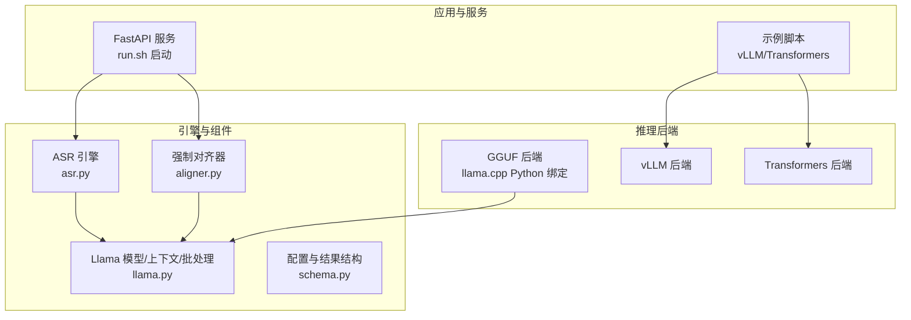
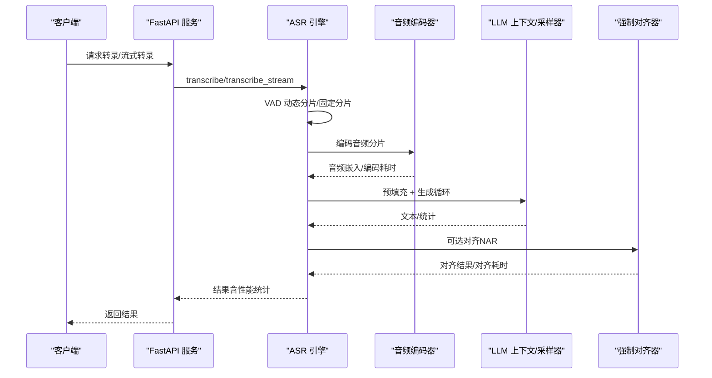
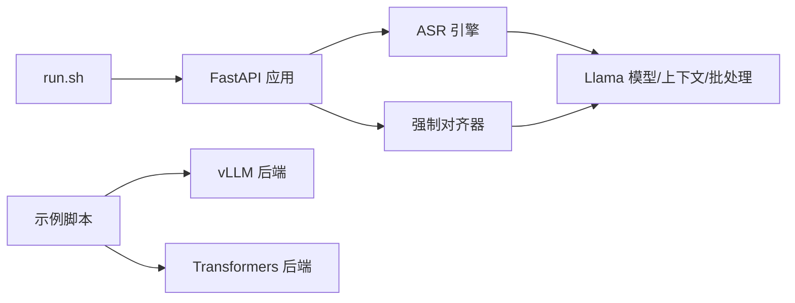

# 性能表现

<cite>
**本文引用的文件**
- [simpread-Qwen3-ASR 技术报告.md](file://simpread-Qwen3-ASR%20Technical%20Report.md)
- [run.sh](file://run.sh)
- [qwen_asr_gguf/inference/asr.py](file://qwen_asr_gguf/inference/asr.py)
- [qwen_asr_gguf/inference/aligner.py](file://qwen_asr_gguf/inference/aligner.py)
- [qwen_asr_gguf/inference/llama.py](file://qwen_asr_gguf/inference/llama.py)
- [qwen_asr_gguf/inference/schema.py](file://qwen_asr_gguf/inference/schema.py)
- [examples/example_qwen3_asr_vllm.py](file://examples/example_qwen3_asr_vllm.py)
- [examples/example_qwen3_asr_transformers.py](file://examples/example_qwen3_asr_transformers.py)
- [ref/llama.cpp/tests/test-quantize-perf.cpp](file://ref/llama.cpp/tests/test-quantize-perf.cpp)
- [ref/llama.cpp/ggml/src/ggml-quants.c](file://ref/llama.cpp/ggml/src/ggml-quants.c)
- [ref/llama.cpp/tools/llama-bench/llama-bench.cpp](file://ref/llama.cpp/tools/llama-bench/llama-bench.cpp)
- [ref/llama.cpp/docs/build.md](file://ref/llama.cpp/docs/build.md)
</cite>

## 目录
1. [简介](#简介)
2. [项目结构](#项目结构)
3. [核心组件](#核心组件)
4. [架构总览](#架构总览)
5. [详细组件分析](#详细组件分析)
6. [依赖关系分析](#依赖关系分析)
7. [性能考量](#性能考量)
8. [故障排查指南](#故障排查指南)
9. [结论](#结论)
10. [附录](#附录)

## 简介
本文件围绕 Qwen3-ASR GGUF 项目的性能表现展开，结合仓库中提供的技术报告与代码实现，系统梳理实时率（RTF）、音频时长、总处理耗时、编码等待时间、对齐总时长、LLM 预填充与生成阶段的统计口径，并对比 GPU 与 CPU 两种运行模式的差异。同时，结合量化技术（int4、q4_k 等）在推理吞吐与精度上的权衡，给出显存占用概览（ASR Encoder、Aligner Encoder、ASR Decoder 等），并总结不同加速后端的资源消耗特点。最后提供性能优化建议、硬件配置推荐与瓶颈分析，帮助用户在不同场景下选择最优配置。

## 项目结构
本项目采用“推理后端 + 引擎 + 工具”的分层组织方式：
- 推理后端：GGUF 后端（基于 llama.cpp 的 Python 绑定）与 vLLM/Transformers 后端示例
- 引擎与流水线：ASR 引擎、强制对齐器、VAD、音频加载与分片策略
- 工具与基准：量化性能测试、llama-bench 基准工具、构建文档

图示来源
- [run.sh:1-63](file://run.sh#L1-L63)
- [qwen_asr_gguf/inference/asr.py:1-893](file://qwen_asr_gguf/inference/asr.py#L1-L893)
- [qwen_asr_gguf/inference/aligner.py:1-350](file://qwen_asr_gguf/inference/aligner.py#L1-L350)
- [qwen_asr_gguf/inference/llama.py:1-992](file://qwen_asr_gguf/inference/llama.py#L1-L992)
- [examples/example_qwen3_asr_vllm.py:1-153](file://examples/example_qwen3_asr_vllm.py#L1-L153)
- [examples/example_qwen3_asr_transformers.py:1-151](file://examples/example_qwen3_asr_transformers.py#L1-L151)

章节来源
- [run.sh:1-63](file://run.sh#L1-L63)
- [qwen_asr_gguf/inference/asr.py:1-893](file://qwen_asr_gguf/inference/asr.py#L1-L893)
- [qwen_asr_gguf/inference/aligner.py:1-350](file://qwen_asr_gguf/inference/aligner.py#L1-L350)
- [qwen_asr_gguf/inference/llama.py:1-992](file://qwen_asr_gguf/inference/llama.py#L1-L992)
- [examples/example_qwen3_asr_vllm.py:1-153](file://examples/example_qwen3_asr_vllm.py#L1-L153)
- [examples/example_qwen3_asr_transformers.py:1-151](file://examples/example_qwen3_asr_transformers.py#L1-L151)

## 核心组件
- ASR 引擎：负责音频分片、VAD 过滤、编码器特征提取、LLM 预填充与生成、对齐（可选）以及统计打印
- 强制对齐器：基于统一编码器与 LLM 的 NAR 时间戳预测
- Llama 后端：GGUF 模型加载、上下文与批处理封装、采样器与日志路由
- 配置与结构：ASR/对齐器配置、VAD 配置、分片与流式结果结构

章节来源
- [qwen_asr_gguf/inference/asr.py:1-893](file://qwen_asr_gguf/inference/asr.py#L1-L893)
- [qwen_asr_gguf/inference/aligner.py:1-350](file://qwen_asr_gguf/inference/aligner.py#L1-L350)
- [qwen_asr_gguf/inference/llama.py:1-992](file://qwen_asr_gguf/inference/llama.py#L1-L992)
- [qwen_asr_gguf/inference/schema.py:1-235](file://qwen_asr_gguf/inference/schema.py#L1-L235)

## 架构总览
ASR 与对齐的总体流程如下：

图示来源
- [qwen_asr_gguf/inference/asr.py:432-893](file://qwen_asr_gguf/inference/asr.py#L432-L893)
- [qwen_asr_gguf/inference/aligner.py:230-350](file://qwen_asr_gguf/inference/aligner.py#L230-L350)
- [qwen_asr_gguf/inference/llama.py:487-738](file://qwen_asr_gguf/inference/llama.py#L487-L738)

## 详细组件分析

### 实时率（RTF）与统计口径
- RTF（实时因子）定义为总处理耗时（秒）除以音频时长（秒），数值越小表示越快
- 引擎在完成主流程后会打印关键统计，包括：
  - 音频时长、总处理耗时
  - VAD 过滤耗时与跳过的静音分片数（若启用）
  - 编码耗时、LLM 预填充耗时与生成耗时、Token 数
  - 对齐耗时（若启用）

章节来源
- [qwen_asr_gguf/inference/asr.py:351-388](file://qwen_asr_gguf/inference/asr.py#L351-L388)

### 分片策略与 VAD
- 短音频（≤ 阈值）：不分片，直接处理
- 长音频（> 阈值）：启用 VAD 动态分片，仅对含语音片段送入 ASR，静音片段跳过
- 固定分片（降级）：当 VAD 不可用时，按固定时长切分
- 边界缓冲：固定分片模式下在非末尾分片尾部追加 1 秒，提升边界词完整性

章节来源
- [qwen_asr_gguf/inference/asr.py:602-721](file://qwen_asr_gguf/inference/asr.py#L602-L721)
- [qwen_asr_gguf/inference/schema.py:162-210](file://qwen_asr_gguf/inference/schema.py#L162-L210)

### LLM 预填充与生成阶段
- 预填充：将嵌入序列注入批处理并执行 decode，记录耗时与 token 数
- 生成循环：采样器按温度与 Top-k/Top-p 等策略迭代生成，累计生成耗时与 token 数
- 熔断与重试：若出现异常重复/幻觉，触发重试与温度提升，必要时熔断避免崩溃

章节来源
- [qwen_asr_gguf/inference/asr.py:212-345](file://qwen_asr_gguf/inference/asr.py#L212-L345)
- [qwen_asr_gguf/inference/llama.py:520-738](file://qwen_asr_gguf/inference/llama.py#L520-L738)

### 对齐（强制对齐器）
- 编码阶段：统一编码器提取音频嵌入
- Prompt 构建：将文本分词并插入时间戳占位，形成完整序列
- 解码阶段：仅对时间戳位置计算 logits，得到离散时间戳索引，再换算为秒
- 后处理：将缺失标点与空格恢复，补齐时间戳序列

章节来源
- [qwen_asr_gguf/inference/aligner.py:230-350](file://qwen_asr_gguf/inference/aligner.py#L230-L350)

### GPU 与 CPU 运行模式对比
- GGUF 后端：通过 n_gpu_layers 参数控制 GPU 推理层数，支持多后端（CUDA/Metal/Vulkan 等）编译选项
- vLLM/Transformers 示例：展示在 GPU 上的批量与在线异步推理能力
- 性能差异：GPU 显存占用更高但吞吐更快；CPU 更省显存但吞吐受限

章节来源
- [qwen_asr_gguf/inference/llama.py:443-548](file://qwen_asr_gguf/inference/llama.py#L443-L548)
- [examples/example_qwen3_asr_vllm.py:1-153](file://examples/example_qwen3_asr_vllm.py#L1-L153)
- [examples/example_qwen3_asr_transformers.py:1-151](file://examples/example_qwen3_asr_transformers.py#L1-L151)
- [ref/llama.cpp/docs/build.md:132-265](file://ref/llama.cpp/docs/build.md#L132-L265)

### 量化技术（int4、q4_k）对性能与精度的影响
- 量化类型：仓库包含多种量化实现与性能测试（如 q4_0、q4_1、q3_K 等）
- 性能测试：通过基准测试统计 float32 与量化吞吐（GB/s），评估不同量化类型的性能开销
- 精度权衡：更细粒度量化（如 int4）通常带来更高压缩比与更低显存占用，但可能引入精度损失；需结合任务容忍度选择

章节来源
- [ref/llama.cpp/ggml/src/ggml-quants.c:1239-1979](file://ref/llama.cpp/ggml/src/ggml-quants.c#L1239-L1979)
- [ref/llama.cpp/tests/test-quantize-perf.cpp:1-319](file://ref/llama.cpp/tests/test-quantize-perf.cpp#L1-L319)

### 显存占用概览（来自技术报告）
- ASR Encoder：约 473 MB
- Aligner Encoder：约 420 MB
- ASR Decoder：约 1.6 GB
- 以上为典型 1.7B 模型在 RTX 5050 笔记本上的参考值，具体以实际部署环境为准

章节来源
- [simpread-Qwen3-ASR 技术报告.md:1-329](file://simpread-Qwen3-ASR%20Technical%20Report.md#L1-L329)

### 不同加速后端的资源消耗特点
- CUDA：NVIDIA GPU 加速，支持统一内存与多种编译选项，适合高吞吐场景
- Metal：macOS 默认 GPU 后端，便于本地开发与测试
- Vulkan：跨平台 GPU 后端，适合 Linux/Windows 多厂商显卡
- SYCL/CANN/ROCm/HIP：针对特定厂商或架构的加速后端，按需选择

章节来源
- [ref/llama.cpp/docs/build.md:117-691](file://ref/llama.cpp/docs/build.md#L117-L691)

## 依赖关系分析
ASR 引擎与对齐器依赖 Llama 后端完成模型加载、上下文与批处理；服务层通过 FastAPI 提供接口；示例脚本演示 vLLM/Transformers 后端的批量与在线推理。

图示来源
- [run.sh:1-63](file://run.sh#L1-L63)
- [qwen_asr_gguf/inference/asr.py:1-893](file://qwen_asr_gguf/inference/asr.py#L1-L893)
- [qwen_asr_gguf/inference/aligner.py:1-350](file://qwen_asr_gguf/inference/aligner.py#L1-L350)
- [qwen_asr_gguf/inference/llama.py:1-992](file://qwen_asr_gguf/inference/llama.py#L1-L992)
- [examples/example_qwen3_asr_vllm.py:1-153](file://examples/example_qwen3_asr_vllm.py#L1-L153)
- [examples/example_qwen3_asr_transformers.py:1-151](file://examples/example_qwen3_asr_transformers.py#L1-L151)

章节来源
- [run.sh:1-63](file://run.sh#L1-L63)
- [qwen_asr_gguf/inference/asr.py:1-893](file://qwen_asr_gguf/inference/asr.py#L1-L893)
- [qwen_asr_gguf/inference/aligner.py:1-350](file://qwen_asr_gguf/inference/aligner.py#L1-L350)
- [qwen_asr_gguf/inference/llama.py:1-992](file://qwen_asr_gguf/inference/llama.py#L1-L992)
- [examples/example_qwen3_asr_vllm.py:1-153](file://examples/example_qwen3_asr_vllm.py#L1-L153)
- [examples/example_qwen3_asr_transformers.py:1-151](file://examples/example_qwen3_asr_transformers.py#L1-L151)

## 性能考量
- RTF 优化
  - 启用 VAD 动态分片，跳过静音片段，显著降低 RTF
  - 固定分片模式下使用边界缓冲提升边界完整性
- 批处理与并发
  - vLLM/Transformers 示例展示批量与在线异步推理，适合高并发场景
- 量化与后端
  - 选择合适量化类型（int4/q4_k）在显存与精度间折衷
  - 根据硬件选择 CUDA/Metal/Vulkan 等后端，充分利用 GPU 资源
- 线程与上下文
  - 合理设置 n_ctx、n_batch、n_threads 等参数，平衡吞吐与延迟

章节来源
- [qwen_asr_gguf/inference/asr.py:602-721](file://qwen_asr_gguf/inference/asr.py#L602-L721)
- [qwen_asr_gguf/inference/llama.py:419-548](file://qwen_asr_gguf/inference/llama.py#L419-L548)
- [examples/example_qwen3_asr_vllm.py:127-153](file://examples/example_qwen3_asr_vllm.py#L127-L153)
- [examples/example_qwen3_asr_transformers.py:127-151](file://examples/example_qwen3_asr_transformers.py#L127-L151)
- [ref/llama.cpp/tests/test-quantize-perf.cpp:70-108](file://ref/llama.cpp/tests/test-quantize-perf.cpp#L70-L108)

## 故障排查指南
- 进程崩溃与上下文越界
  - 当序列长度超过 n_ctx 时，引擎会拦截并返回空结果，避免 GGML 断言导致崩溃
- 重复/幻觉问题
  - 生成阶段内置重复熔断与重试机制，必要时提升温度或缩短 max_new_tokens
- 日志与调试
  - llama.cpp 日志回调统一路由到 logger，便于定位问题

章节来源
- [qwen_asr_gguf/inference/asr.py:226-238](file://qwen_asr_gguf/inference/asr.py#L226-L238)
- [qwen_asr_gguf/inference/asr.py:319-345](file://qwen_asr_gguf/inference/asr.py#L319-L345)
- [qwen_asr_gguf/inference/llama.py:772-800](file://qwen_asr_gguf/inference/llama.py#L772-L800)

## 结论
本项目在 GGUF 后端与 vLLM/Transformers 后端下均提供了完善的性能统计与优化手段。通过 VAD 动态分片、量化与多后端选择，可在不同硬件与任务需求下取得良好 RTF 与吞吐表现。结合技术报告中的显存占用与基准数据，用户可根据自身资源与精度要求选择合适的配置与后端。

## 附录
- 基准工具与测试
  - llama-bench：提供字段与测试项，可用于评估不同后端与参数组合的性能
  - 量化性能测试：评估不同量化类型的吞吐与误差

章节来源
- [ref/llama.cpp/tools/llama-bench/llama-bench.cpp:1416-1839](file://ref/llama.cpp/tools/llama-bench/llama-bench.cpp#L1416-L1839)
- [ref/llama.cpp/tests/test-quantize-perf.cpp:1-319](file://ref/llama.cpp/tests/test-quantize-perf.cpp#L1-L319)