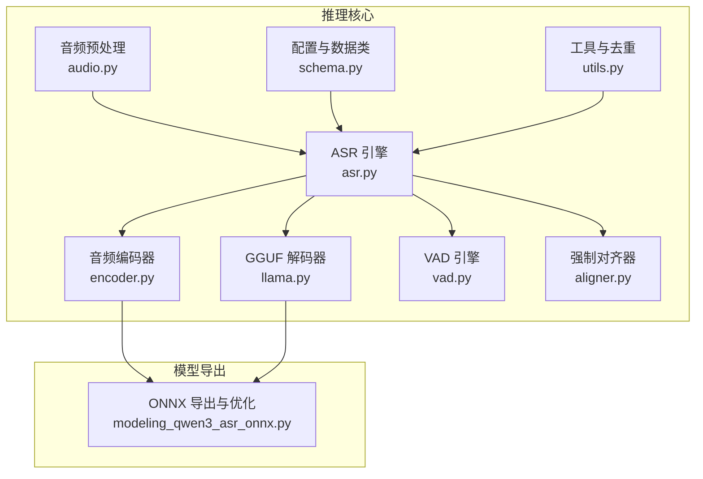
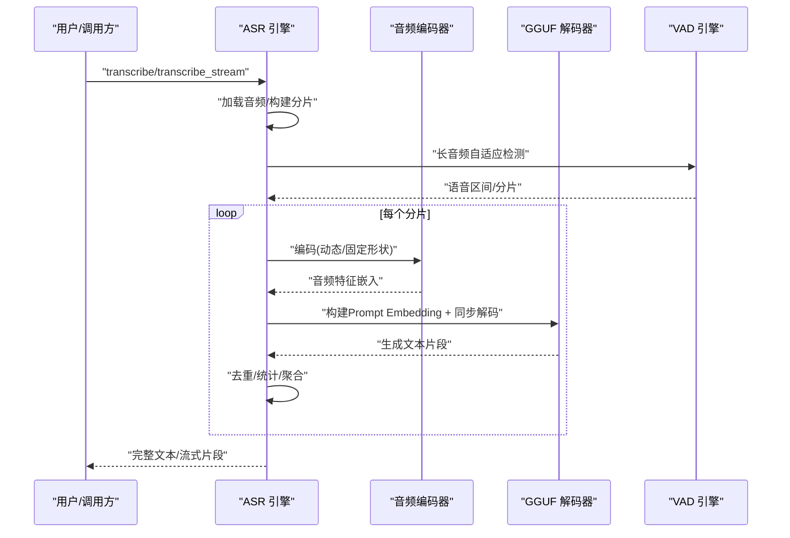
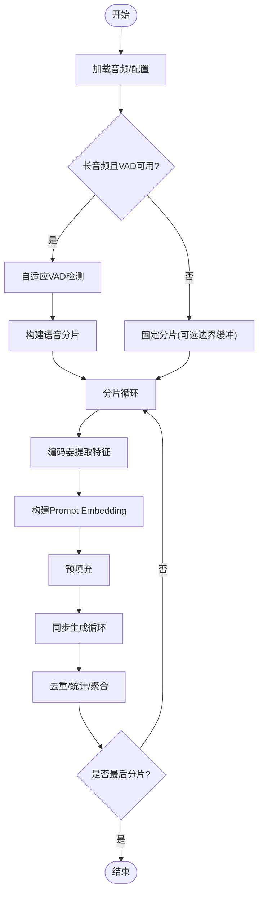
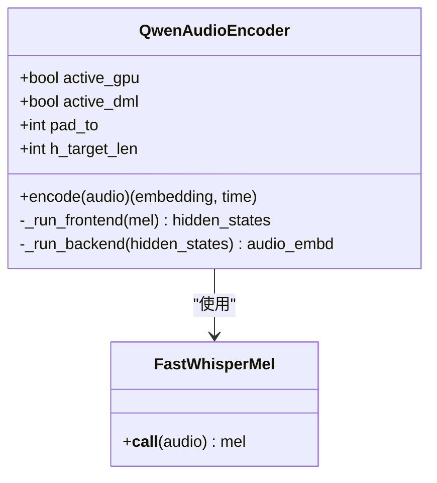
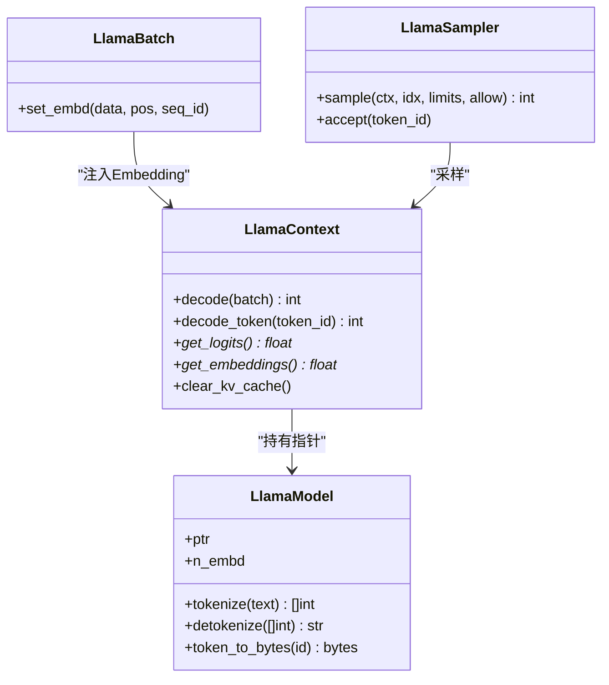
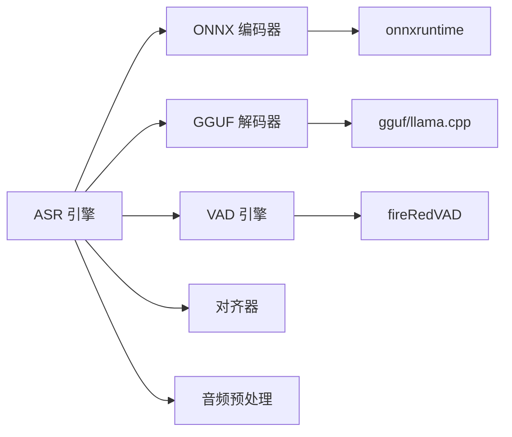

# 技术架构

<cite>
**本文档引用的文件**
- [qwen_asr_gguf/inference/asr.py](file://qwen_asr_gguf/inference/asr.py)
- [qwen_asr_gguf/inference/encoder.py](file://qwen_asr_gguf/inference/encoder.py)
- [qwen_asr_gguf/inference/llama.py](file://qwen_asr_gguf/inference/llama.py)
- [qwen_asr_gguf/inference/schema.py](file://qwen_asr_gguf/inference/schema.py)
- [qwen_asr_gguf/inference/audio.py](file://qwen_asr_gguf/inference/audio.py)
- [qwen_asr_gguf/inference/utils.py](file://qwen_asr_gguf/inference/utils.py)
- [qwen_asr_gguf/inference/vad.py](file://qwen_asr_gguf/inference/vad.py)
- [qwen_asr_gguf/inference/aligner.py](file://qwen_asr_gguf/inference/aligner.py)
- [qwen_asr_gguf/export/qwen3_asr_custom/modeling_qwen3_asr_onnx.py](file://qwen_asr_gguf/export/qwen3_asr_custom/modeling_qwen3_asr_onnx.py)
- [ref/llama.cpp/docs/backend/CUDA-FEDORA.md](file://ref/llama.cpp/docs/backend/CUDA-FEDORA.md)
</cite>

## 目录
1. [简介](#简介)
2. [项目结构](#项目结构)
3. [核心组件](#核心组件)
4. [架构总览](#架构总览)
5. [详细组件分析](#详细组件分析)
6. [依赖分析](#依赖分析)
7. [性能考量](#性能考量)
8. [故障排查指南](#故障排查指南)
9. [结论](#结论)
10. [附录](#附录)

## 简介
本项目为 Qwen3-ASR GGUF 的混合推理架构实现，采用“ONNX Encoder（音频特征提取）+ llama.cpp GGUF Decoder（语言模型解码）”的协同方案。系统以同步执行为核心设计，强调低延迟、强抗幻觉与高稳定性，适用于离线转录与流式转写场景。架构在 Windows 平台通过 DirectML Provider 实现形状固定优化，在 Linux/CUDA 平台通过 CUDA Provider 获得高效张量运算加速。本文档系统阐述数据流、组件交互、平台差异与性能权衡，并提供可视化图示帮助开发者快速理解整体设计。

## 项目结构
项目采用“功能域划分 + 分层组织”的结构：
- qwen_asr_gguf/inference：推理核心（编码器、解码器、VAD、对齐器、音频预处理、配置与工具）
- qwen_asr_gguf/export：模型导出与转换（ONNX 前后端、GGUF 转换）
- ref/llama.cpp：llama.cpp 源码与文档（后端支持、构建与平台差异）

**图表来源**
- [qwen_asr_gguf/inference/asr.py:40-103](file://qwen_asr_gguf/inference/asr.py#L40-L103)
- [qwen_asr_gguf/inference/encoder.py:119-196](file://qwen_asr_gguf/inference/encoder.py#L119-L196)
- [qwen_asr_gguf/inference/llama.py:159-218](file://qwen_asr_gguf/inference/llama.py#L159-L218)
- [qwen_asr_gguf/inference/vad.py:29-81](file://qwen_asr_gguf/inference/vad.py#L29-L81)
- [qwen_asr_gguf/inference/aligner.py:229-259](file://qwen_asr_gguf/inference/aligner.py#L229-L259)
- [qwen_asr_gguf/inference/audio.py:129-149](file://qwen_asr_gguf/inference/audio.py#L129-L149)
- [qwen_asr_gguf/inference/schema.py:162-210](file://qwen_asr_gguf/inference/schema.py#L162-L210)
- [qwen_asr_gguf/inference/utils.py:58-134](file://qwen_asr_gguf/inference/utils.py#L58-L134)
- [qwen_asr_gguf/export/qwen3_asr_custom/modeling_qwen3_asr_onnx.py:117-127](file://qwen_asr_gguf/export/qwen3_asr_custom/modeling_qwen3_asr_onnx.py#L117-L127)

**章节来源**
- [qwen_asr_gguf/inference/asr.py:1-120](file://qwen_asr_gguf/inference/asr.py#L1-L120)
- [qwen_asr_gguf/inference/encoder.py:119-196](file://qwen_asr_gguf/inference/encoder.py#L119-L196)
- [qwen_asr_gguf/inference/llama.py:159-218](file://qwen_asr_gguf/inference/llama.py#L159-L218)
- [qwen_asr_gguf/inference/schema.py:162-210](file://qwen_asr_gguf/inference/schema.py#L162-L210)

## 核心组件
- ASR 引擎：统一调度编码、解码、VAD、对齐与统计，支持一次性与流式两种模式。
- 音频编码器：Split ONNX（前端+后端）+ DirectML/CPU Provider，支持动态/固定形状模式。
- GGUF 解码器：llama.cpp 封装（模型、上下文、批处理、采样器），跨平台加载。
- VAD 引擎：FireRedVAD 封装，支持自适应阈值与分片构建。
- 强制对齐器：基于统一编码器与 GGUF 解码器的时序对齐。
- 音频预处理：ffmpeg/soundfile 双通道读取，resample poly 实现高质量重采样。
- 配置与工具：统一配置类、语言校验、重复文本修复等。

**章节来源**
- [qwen_asr_gguf/inference/asr.py:40-103](file://qwen_asr_gguf/inference/asr.py#L40-L103)
- [qwen_asr_gguf/inference/encoder.py:119-196](file://qwen_asr_gguf/inference/encoder.py#L119-L196)
- [qwen_asr_gguf/inference/llama.py:443-549](file://qwen_asr_gguf/inference/llama.py#L443-L549)
- [qwen_asr_gguf/inference/vad.py:29-81](file://qwen_asr_gguf/inference/vad.py#L29-L81)
- [qwen_asr_gguf/inference/aligner.py:229-259](file://qwen_asr_gguf/inference/aligner.py#L229-L259)
- [qwen_asr_gguf/inference/audio.py:129-149](file://qwen_asr_gguf/inference/audio.py#L129-L149)
- [qwen_asr_gguf/inference/schema.py:162-210](file://qwen_asr_gguf/inference/schema.py#L162-L210)
- [qwen_asr_gguf/inference/utils.py:58-134](file://qwen_asr_gguf/inference/utils.py#L58-L134)

## 架构总览
混合推理架构以“同步执行”为核心：音频输入经编码器提取特征嵌入，随后与系统/用户提示共同构成 LLM 的 Embedding 序列，再由解码器进行同步生成，最终输出稳定文本。系统通过 VAD 前置过滤与上下文记忆控制，降低 RTF 并抑制幻觉。

**图表来源**
- [qwen_asr_gguf/inference/asr.py:602-799](file://qwen_asr_gguf/inference/asr.py#L602-L799)
- [qwen_asr_gguf/inference/encoder.py:260-280](file://qwen_asr_gguf/inference/encoder.py#L260-L280)
- [qwen_asr_gguf/inference/llama.py:520-549](file://qwen_asr_gguf/inference/llama.py#L520-L549)
- [qwen_asr_gguf/inference/vad.py:160-223](file://qwen_asr_gguf/inference/vad.py#L160-L223)

## 详细组件分析

### ASR 引擎（同步执行与统一流水线）
- 统一流水线：_asr_core 生成器统一处理一次性与流式场景，支持 VAD 动态分片与固定分片双策略。
- VAD 集成：长音频自动启用 FireRedVAD，短音频或不可用时降级为固定分片。
- Prompt 构建：严格遵循官方 Chat Template，将系统提示、音频嵌入、用户指令与历史上下文拼接为 Embedding 序列。
- 解码内核：预填充 + 同步生成循环，内置温度递增与重复熔断，最后统一去重修复。
- 性能统计：编码、解码、VAD、对齐等耗时汇总，支持 RTF 计算。

**图表来源**
- [qwen_asr_gguf/inference/asr.py:602-799](file://qwen_asr_gguf/inference/asr.py#L602-L799)
- [qwen_asr_gguf/inference/vad.py:160-223](file://qwen_asr_gguf/inference/vad.py#L160-L223)
- [qwen_asr_gguf/inference/encoder.py:260-280](file://qwen_asr_gguf/inference/encoder.py#L260-L280)
- [qwen_asr_gguf/inference/utils.py:58-134](file://qwen_asr_gguf/inference/utils.py#L58-L134)

**章节来源**
- [qwen_asr_gguf/inference/asr.py:40-103](file://qwen_asr_gguf/inference/asr.py#L40-L103)
- [qwen_asr_gguf/inference/asr.py:602-799](file://qwen_asr_gguf/inference/asr.py#L602-L799)
- [qwen_asr_gguf/inference/utils.py:58-134](file://qwen_asr_gguf/inference/utils.py#L58-L134)

### 音频编码器（ONNX Split 前后端 + DirectML 形状固定优化）
- Split 模型：前端（原子 100 帧块）、后端（Transformer）分离，前端循环推理，后端支持固定形状 Mask。
- Provider 选择：优先 CUDA/ROCM/TensorRT，其次 DmlExecutionProvider（Windows DirectML），否则回退 CPU。
- 形状固定优化（Windows/DirectML）：当启用 DML 且序列长度不足目标长度时，对隐藏状态进行零填充并构造注意力掩码，避免动态形状带来的内核编译与调度开销。
- 预热策略：固定形状模式预热 pad_to 秒，动态形状模式预热短音频，减少首帧抖动。

**图表来源**
- [qwen_asr_gguf/inference/encoder.py:119-196](file://qwen_asr_gguf/inference/encoder.py#L119-L196)
- [qwen_asr_gguf/inference/encoder.py:230-280](file://qwen_asr_gguf/inference/encoder.py#L230-L280)

**章节来源**
- [qwen_asr_gguf/inference/encoder.py:119-196](file://qwen_asr_gguf/inference/encoder.py#L119-L196)
- [qwen_asr_gguf/inference/encoder.py:230-280](file://qwen_asr_gguf/inference/encoder.py#L230-L280)

### GGUF 解码器（llama.cpp 封装）
- 跨平台库加载：Windows/Linux/macOS 分别定位 DLL/so/dylib，初始化后端并加载模型。
- 模型/上下文/批处理/采样器：提供面向对象封装，支持 KV Cache 清理、Logits/Embeddings 读取、采样链配置。
- 解码流程：预填充 + 同步生成循环，支持温度递增与重复熔断，最终统一 UTF-8 解码与去重。

**图表来源**
- [qwen_asr_gguf/inference/llama.py:443-549](file://qwen_asr_gguf/inference/llama.py#L443-L549)
- [qwen_asr_gguf/inference/llama.py:550-625](file://qwen_asr_gguf/inference/llama.py#L550-L625)
- [qwen_asr_gguf/inference/llama.py:635-738](file://qwen_asr_gguf/inference/llama.py#L635-L738)

**章节来源**
- [qwen_asr_gguf/inference/llama.py:159-218](file://qwen_asr_gguf/inference/llama.py#L159-L218)
- [qwen_asr_gguf/inference/llama.py:443-549](file://qwen_asr_gguf/inference/llama.py#L443-L549)
- [qwen_asr_gguf/inference/llama.py:550-625](file://qwen_asr_gguf/inference/llama.py#L550-L625)
- [qwen_asr_gguf/inference/llama.py:635-738](file://qwen_asr_gguf/inference/llama.py#L635-L738)

### VAD 引擎（长音频动态分片与静音过滤）
- 自适应阈值：两遍法，先以初始阈值检测，再基于语音概率分布计算自适应阈值，必要时重新分割。
- 分片构建：合并近邻语音段、贪心打包、插入静音分片，保证覆盖全时域。
- 快速判断：has_speech 仅返回布尔值，适合热路径跳过静音。

**章节来源**
- [qwen_asr_gguf/inference/vad.py:29-81](file://qwen_asr_gguf/inference/vad.py#L29-L81)
- [qwen_asr_gguf/inference/vad.py:160-223](file://qwen_asr_gguf/inference/vad.py#L160-L223)
- [qwen_asr_gguf/inference/vad.py:299-406](file://qwen_asr_gguf/inference/vad.py#L299-L406)

### 强制对齐器（时间戳对齐与文本重建）
- 统一编码器：与 ASR 共享 Split ONNX 编码器，确保对齐与转录的一致性。
- Prompt 构建：将音频嵌入与词序列拼接，时间戳位置仅计算对应 logits。
- 时间戳修复：DP/LIS 方法修复单调性与异常跳跃，再与原文本重建对齐。

**章节来源**
- [qwen_asr_gguf/inference/aligner.py:229-259](file://qwen_asr_gguf/inference/aligner.py#L229-L259)
- [qwen_asr_gguf/inference/aligner.py:260-348](file://qwen_asr_gguf/inference/aligner.py#L260-L348)

### 音频预处理与工具
- 音频读取：soundfile 与 ffmpeg 双通道，支持多种格式；ffmpeg 路径不存在时报错。
- 重采样：poly 插值实现高质量 resample，支持 up/down rate。
- 语言与去重：语言名称归一化与校验、重复文本修复算法。

**章节来源**
- [qwen_asr_gguf/inference/audio.py:129-149](file://qwen_asr_gguf/inference/audio.py#L129-L149)
- [qwen_asr_gguf/inference/audio.py:59-86](file://qwen_asr_gguf/inference/audio.py#L59-L86)
- [qwen_asr_gguf/inference/utils.py:38-56](file://qwen_asr_gguf/inference/utils.py#L38-L56)
- [qwen_asr_gguf/inference/utils.py:58-134](file://qwen_asr_gguf/inference/utils.py#L58-L134)

## 依赖分析
- 组件耦合：ASR 引擎对编码器、解码器、VAD、对齐器形成高内聚低耦合的协调关系；编码器与 ONNX 模型导出模块松耦合。
- 外部依赖：onnxruntime（编码器）、gguf/llama.cpp（解码器）、fireRedVAD（VAD）、ffmpeg/soundfile（音频）。
- 平台差异：Windows 通过 DirectML Provider 优化形状固定；Linux 通过 CUDA Provider 获得更高吞吐。

**图表来源**
- [qwen_asr_gguf/inference/asr.py:40-103](file://qwen_asr_gguf/inference/asr.py#L40-L103)
- [qwen_asr_gguf/inference/encoder.py:119-196](file://qwen_asr_gguf/inference/encoder.py#L119-L196)
- [qwen_asr_gguf/inference/llama.py:159-218](file://qwen_asr_gguf/inference/llama.py#L159-L218)
- [qwen_asr_gguf/inference/vad.py:51-81](file://qwen_asr_gguf/inference/vad.py#L51-L81)
- [qwen_asr_gguf/inference/audio.py:88-96](file://qwen_asr_gguf/inference/audio.py#L88-L96)

**章节来源**
- [qwen_asr_gguf/inference/asr.py:40-103](file://qwen_asr_gguf/inference/asr.py#L40-L103)
- [qwen_asr_gguf/inference/encoder.py:119-196](file://qwen_asr_gguf/inference/encoder.py#L119-L196)
- [qwen_asr_gguf/inference/llama.py:159-218](file://qwen_asr_gguf/inference/llama.py#L159-L218)
- [qwen_asr_gguf/inference/vad.py:51-81](file://qwen_asr_gguf/inference/vad.py#L51-L81)
- [qwen_asr_gguf/inference/audio.py:88-96](file://qwen_asr_gguf/inference/audio.py#L88-L96)

## 性能考量
- 同步执行优势：避免异步流水线中的锁竞争与跨线程数据搬运，降低延迟与抖动，适合低 RTF 与高稳定性场景。
- DirectML 形状固定优化：在 Windows 平台，当序列长度不足目标长度时，通过零填充与掩码固定形状，减少内核编译与调度开销，提升吞吐。
- CUDA 平台优化：Linux/CUDA 通过 CUDA ExecutionProvider 获得更强的张量并行能力，适合大规模批处理与高并发推理。
- VAD 前置过滤：长音频动态分片与静音跳过显著降低无效推理，减少 RTF 并抑制幻觉。
- 采样与去重：温度递增、重复熔断与后处理去重共同抑制幻觉与重复，提升输出稳定性。

[本节为通用性能讨论，无需特定文件引用]

## 故障排查指南
- 编码器 Provider 选择失败：检查可用 Provider 列表，确认 CUDA/DML 是否正确安装与驱动版本兼容。
- DirectML 形状固定异常：确认 pad_to 与 h_target_len 计算一致，检查掩码维度与填充宽度。
- llama.cpp 加载失败：检查库文件路径与平台命名（Windows DLL、Linux SO、macOS DYLIB），确认后端初始化成功。
- VAD 未安装：安装 fireRedVAD 依赖，确保模型路径与阈值参数合理。
- ffmpeg 未安装：安装 ffmpeg 并加入 PATH，或改用 soundfile 支持的格式。

**章节来源**
- [qwen_asr_gguf/inference/encoder.py:137-165](file://qwen_asr_gguf/inference/encoder.py#L137-L165)
- [qwen_asr_gguf/inference/encoder.py:234-247](file://qwen_asr_gguf/inference/encoder.py#L234-L247)
- [qwen_asr_gguf/inference/llama.py:179-218](file://qwen_asr_gguf/inference/llama.py#L179-L218)
- [qwen_asr_gguf/inference/vad.py:53-60](file://qwen_asr_gguf/inference/vad.py#L53-L60)
- [qwen_asr_gguf/inference/audio.py:88-96](file://qwen_asr_gguf/inference/audio.py#L88-L96)

## 结论
本项目通过“ONNX Encoder + llama.cpp GGUF Decoder”的混合架构，结合同步执行、VAD 前置过滤与 DirectML 形状固定优化，在 Windows 与 Linux 平台上实现了低 RTF、强抗幻觉与高稳定性的语音识别系统。架构设计兼顾易用性与扩展性，适合在离线与流式场景中部署与演进。

[本节为总结性内容，无需特定文件引用]

## 附录
- 平台差异参考：CUDA 在 Fedora 环境下的安装与验证流程可参考 llama.cpp 文档。
- ONNX 导出：前端采用原子 100 帧块处理，后端为 Transformer，支持 DML 友好 Mask 与符号追踪修复。

**章节来源**
- [ref/llama.cpp/docs/backend/CUDA-FEDORA.md:1-284](file://ref/llama.cpp/docs/backend/CUDA-FEDORA.md#L1-L284)
- [qwen_asr_gguf/export/qwen3_asr_custom/modeling_qwen3_asr_onnx.py:117-127](file://qwen_asr_gguf/export/qwen3_asr_custom/modeling_qwen3_asr_onnx.py#L117-L127)