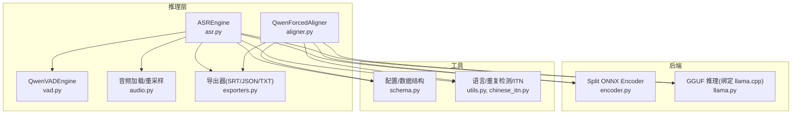
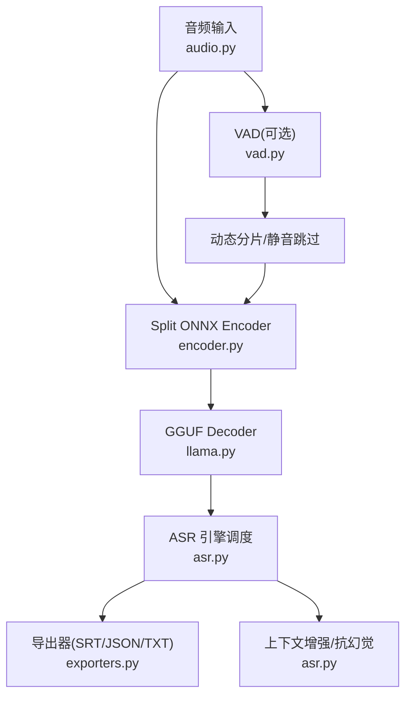
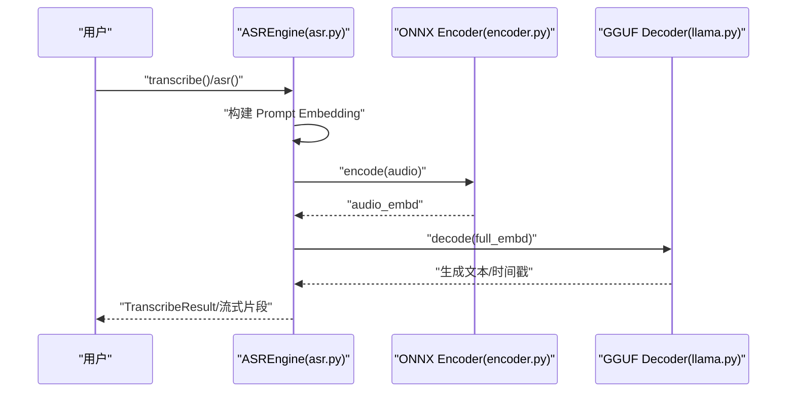
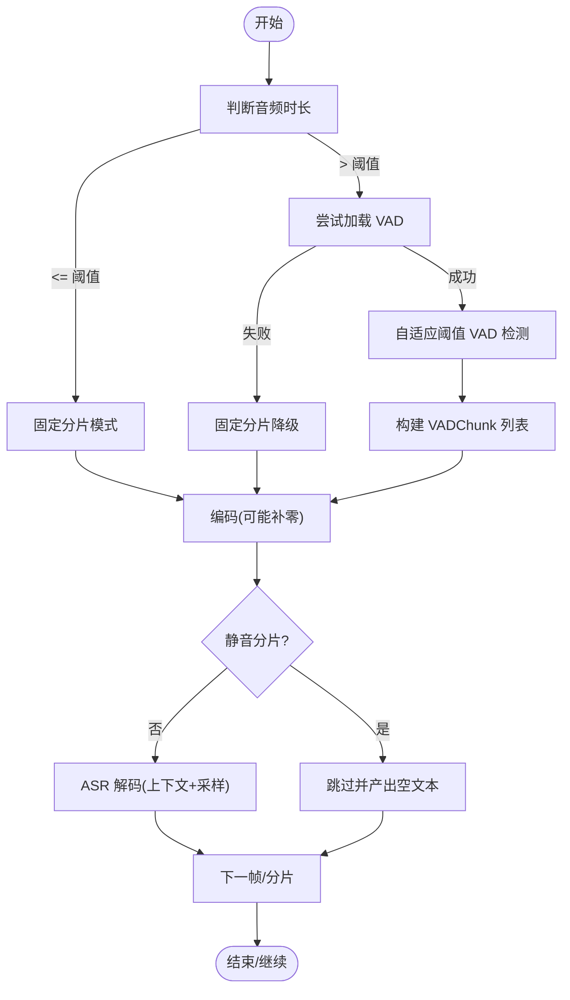
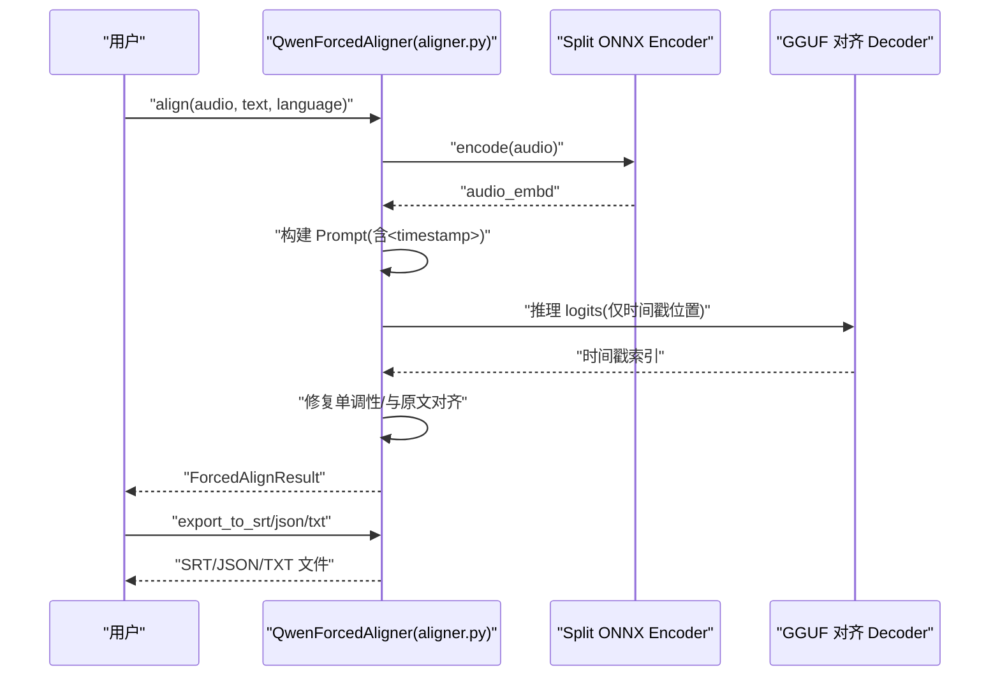
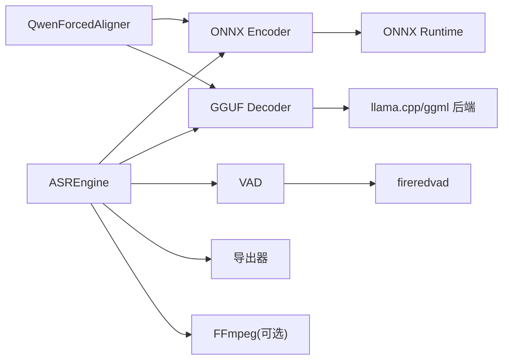

# 核心特性

<cite>
**本文引用的文件**
- [qwen_asr_gguf/inference/asr.py](file://qwen_asr_gguf/inference/asr.py)
- [qwen_asr_gguf/inference/encoder.py](file://qwen_asr_gguf/inference/encoder.py)
- [qwen_asr_gguf/inference/aligner.py](file://qwen_asr_gguf/inference/aligner.py)
- [qwen_asr_gguf/inference/audio.py](file://qwen_asr_gguf/inference/audio.py)
- [qwen_asr_gguf/inference/utils.py](file://qwen_asr_gguf/inference/utils.py)
- [qwen_asr_gguf/inference/schema.py](file://qwen_asr_gguf/inference/schema.py)
- [qwen_asr_gguf/inference/vad.py](file://qwen_asr_gguf/inference/vad.py)
- [qwen_asr_gguf/inference/exporters.py](file://qwen_asr_gguf/inference/exporters.py)
- [qwen_asr_gguf/inference/llama.py](file://qwen_asr_gguf/inference/llama.py)
- [qwen_asr_gguf/inference/chinese_itn.py](file://qwen_asr_gguf/inference/chinese_itn.py)
- [examples/example_qwen3_asr_transformers.py](file://examples/example_qwen3_asr_transformers.py)
- [examples/example_qwen3_asr_vllm.py](file://examples/example_qwen3_asr_vllm.py)
- [examples/example_qwen3_asr_vllm_streaming.py](file://examples/example_qwen3_asr_vllm_streaming.py)
- [examples/example_qwen3_forced_aligner.py](file://examples/example_qwen3_forced_aligner.py)
</cite>

## 目录
1. [简介](#简介)
2. [项目结构](#项目结构)
3. [核心组件](#核心组件)
4. [架构总览](#架构总览)
5. [详细组件分析](#详细组件分析)
6. [依赖关系分析](#依赖关系分析)
7. [性能考量](#性能考量)
8. [故障排查指南](#故障排查指南)
9. [结论](#结论)
10. [附录](#附录)

## 简介
本文件聚焦 Qwen3-ASR GGUF 项目的四大核心特性：
- 纯本地运行：保障数据隐私、无网络依赖
- 混合推理架构：ONNX Encoder + GGUF Decoder 的协同工作机制
- GPU 加速支持：CUDA、ROCm、DirectML 等多后端
- 流式输出能力：基于 VAD 的动态分片与实时流式转录

此外，文档还详解字幕输出（ForceAligner）的字级时间戳对齐与 SRT/JSON 导出、上下文增强机制（ASR 上下文记忆与 VAD 抗幻觉策略）的技术实现与使用场景，并提供性能对比与配置建议。

## 项目结构
项目采用“推理层 + 后端绑定 + 工具模块”的分层组织：
- 推理层：ASR 引擎、对齐器、VAD、音频加载与导出
- 后端绑定：GGUF 推理（llama.cpp 绑定）、ONNX 推理（Encoder）
- 工具模块：语言与重复检测、ITN、数据结构与配置

图表来源
- [qwen_asr_gguf/inference/asr.py:40-103](file://qwen_asr_gguf/inference/asr.py#L40-L103)
- [qwen_asr_gguf/inference/encoder.py:119-196](file://qwen_asr_gguf/inference/encoder.py#L119-L196)
- [qwen_asr_gguf/inference/llama.py:443-548](file://qwen_asr_gguf/inference/llama.py#L443-L548)
- [qwen_asr_gguf/inference/aligner.py:229-258](file://qwen_asr_gguf/inference/aligner.py#L229-L258)
- [qwen_asr_gguf/inference/vad.py:29-81](file://qwen_asr_gguf/inference/vad.py#L29-L81)
- [qwen_asr_gguf/inference/audio.py:129-149](file://qwen_asr_gguf/inference/audio.py#L129-L149)
- [qwen_asr_gguf/inference/exporters.py:10-120](file://qwen_asr_gguf/inference/exporters.py#L10-L120)
- [qwen_asr_gguf/inference/schema.py:162-210](file://qwen_asr_gguf/inference/schema.py#L162-L210)
- [qwen_asr_gguf/inference/utils.py:38-134](file://qwen_asr_gguf/inference/utils.py#L38-L134)

章节来源
- [qwen_asr_gguf/inference/asr.py:40-103](file://qwen_asr_gguf/inference/asr.py#L40-L103)
- [qwen_asr_gguf/inference/encoder.py:119-196](file://qwen_asr_gguf/inference/encoder.py#L119-L196)
- [qwen_asr_gguf/inference/llama.py:443-548](file://qwen_asr_gguf/inference/llama.py#L443-L548)
- [qwen_asr_gguf/inference/aligner.py:229-258](file://qwen_asr_gguf/inference/aligner.py#L229-L258)
- [qwen_asr_gguf/inference/vad.py:29-81](file://qwen_asr_gguf/inference/vad.py#L29-L81)
- [qwen_asr_gguf/inference/audio.py:129-149](file://qwen_asr_gguf/inference/audio.py#L129-L149)
- [qwen_asr_gguf/inference/exporters.py:10-120](file://qwen_asr_gguf/inference/exporters.py#L10-L120)
- [qwen_asr_gguf/inference/schema.py:162-210](file://qwen_asr_gguf/inference/schema.py#L162-L210)
- [qwen_asr_gguf/inference/utils.py:38-134](file://qwen_asr_gguf/inference/utils.py#L38-L134)

## 核心组件
- ASR 引擎（QwenASREngine）：统一的转录流水线，支持一次性与流式两种模式；内置 VAD 动态分片、上下文记忆、抗幻觉策略与性能统计。
- ONNX Split Encoder：将音频转为 Mel 特征，分块推理（Frontend）与拼接后 Transformer（Backend），支持 GPU Provider（CUDA/ROCm/DirectML/CPU）。
- GGUF 推理（llama.cpp 绑定）：加载 GGUF 模型，提供 LlamaModel/LlamaContext/LlamaBatch/LlamaSampler 等封装，支持多线程与 KV Cache。
- 强制对齐器（QwenForcedAligner）：基于 Split Encoder + GGUF Decoder 的字级时间戳对齐，支持 SRT/JSON/TXT 导出。
- VAD（FireRedVAD）：长音频自适应阈值检测，动态分片与静音跳过，减少无效推理。
- 音频工具：统一的音频加载与重采样，支持多种格式与起止裁剪。
- 导出器：SRT/JSON/TXT 格式导出，含 ITN（中文数字规范化）与标点换行。

章节来源
- [qwen_asr_gguf/inference/asr.py:40-103](file://qwen_asr_gguf/inference/asr.py#L40-L103)
- [qwen_asr_gguf/inference/encoder.py:119-196](file://qwen_asr_gguf/inference/encoder.py#L119-L196)
- [qwen_asr_gguf/inference/llama.py:443-548](file://qwen_asr_gguf/inference/llama.py#L443-L548)
- [qwen_asr_gguf/inference/aligner.py:229-258](file://qwen_asr_gguf/inference/aligner.py#L229-L258)
- [qwen_asr_gguf/inference/vad.py:29-81](file://qwen_asr_gguf/inference/vad.py#L29-L81)
- [qwen_asr_gguf/inference/audio.py:129-149](file://qwen_asr_gguf/inference/audio.py#L129-L149)
- [qwen_asr_gguf/inference/exporters.py:10-120](file://qwen_asr_gguf/inference/exporters.py#L10-L120)

## 架构总览
混合推理架构由“前端 ONNX + 后端 GGUF”构成：音频先经 Split ONNX Encoder 提取隐藏状态，再由 GGUF Decoder 生成文本与时间戳。ASR 引擎统一调度 Encoder/GGUF/VAD/导出，支持纯本地部署与多 GPU 后端。

图表来源
- [qwen_asr_gguf/inference/audio.py:129-149](file://qwen_asr_gguf/inference/audio.py#L129-L149)
- [qwen_asr_gguf/inference/encoder.py:260-280](file://qwen_asr_gguf/inference/encoder.py#L260-L280)
- [qwen_asr_gguf/inference/llama.py:443-548](file://qwen_asr_gguf/inference/llama.py#L443-L548)
- [qwen_asr_gguf/inference/vad.py:160-223](file://qwen_asr_gguf/inference/vad.py#L160-L223)
- [qwen_asr_gguf/inference/asr.py:602-790](file://qwen_asr_gguf/inference/asr.py#L602-L790)
- [qwen_asr_gguf/inference/exporters.py:10-120](file://qwen_asr_gguf/inference/exporters.py#L10-L120)

## 详细组件分析

### 纯本地运行与隐私保护
- 本地部署：所有模型（ONNX Encoder + GGUF Decoder）与推理均在本地执行，无需上传音频或文本到云端。
- 依赖最小化：ONNX Runtime 与 llama.cpp 绑定，配合 Python 标准库与少量必要依赖。
- 隐私保障：音频在本地完成编码与解码，时间戳与文本仅在本地生成与导出。

章节来源
- [qwen_asr_gguf/inference/encoder.py:119-196](file://qwen_asr_gguf/inference/encoder.py#L119-L196)
- [qwen_asr_gguf/inference/llama.py:159-218](file://qwen_asr_gguf/inference/llama.py#L159-L218)
- [qwen_asr_gguf/inference/audio.py:88-125](file://qwen_asr_gguf/inference/audio.py#L88-L125)

### 混合推理架构：ONNX Encoder + GGUF Decoder
- Split ONNX Encoder：
  - 前端（Frontend）：分块推理（100 帧为块），逐块执行 ONNX Session，拼接后按有效帧切片。
  - 后端（Backend）：Transformer 编码器，支持固定形状填充（DirectML）与注意力掩码。
  - Provider 选择：优先 CUDA/ROCm/TensorRT/Dml，否则回退 CPU。
- GGUF Decoder：
  - 通过 llama.cpp 绑定加载 GGUF 模型，提供 Token 化、嵌入、采样与 KV Cache 管理。
  - 支持温度、Top-K/Top-P、重复惩罚等采样策略，保证稳定性与多样性平衡。

图表来源
- [qwen_asr_gguf/inference/asr.py:147-206](file://qwen_asr_gguf/inference/asr.py#L147-L206)
- [qwen_asr_gguf/inference/encoder.py:260-280](file://qwen_asr_gguf/inference/encoder.py#L260-L280)
- [qwen_asr_gguf/inference/llama.py:520-540](file://qwen_asr_gguf/inference/llama.py#L520-L540)

章节来源
- [qwen_asr_gguf/inference/encoder.py:198-258](file://qwen_asr_gguf/inference/encoder.py#L198-L258)
- [qwen_asr_gguf/inference/llama.py:443-548](file://qwen_asr_gguf/inference/llama.py#L443-L548)
- [qwen_asr_gguf/inference/asr.py:147-206](file://qwen_asr_gguf/inference/asr.py#L147-L206)

### GPU 加速支持：CUDA/ROCm/DirectML/Vulkan
- ONNX Runtime Provider 选择：
  - 优先 CUDAExecutionProvider、ROCMExecutionProvider、TensorrtExecutionProvider、DmlExecutionProvider
  - 未检测到 GPU Provider 时回退 CPUExecutionProvider
  - DirectML 在固定形状模式下进行预热，避免首帧抖动
- llama.cpp 后端：
  - 通过 ggml 后端加载（CUDA/ROCm/Vulkan/Metal/OpenCL 等），在初始化时自动探测可用后端
  - 支持多线程与 Flash Attention、Offload KQV 等优化参数

章节来源
- [qwen_asr_gguf/inference/encoder.py:137-164](file://qwen_asr_gguf/inference/encoder.py#L137-L164)
- [qwen_asr_gguf/inference/llama.py:159-218](file://qwen_asr_gguf/inference/llama.py#L159-L218)

### 流式输出能力：动态分片与实时流式转录
- VAD 动态分片：
  - 长音频（> 阈值）自动启用 VAD，自适应阈值检测语音段，按语音边界贪心打包，避免静音与句中截断
  - 静音分片直接跳过，显著降低 RTF 与幻觉
- 流式接口：
  - asr_stream()/transcribe_stream() 逐分片产出 StreamChunkResult，支持 SSE/WebSocket 实时推送
  - 边界缓冲（固定分片模式）：在非末尾分片尾部追加 1 秒音频，提升边界词完整性

图表来源
- [qwen_asr_gguf/inference/asr.py:602-790](file://qwen_asr_gguf/inference/asr.py#L602-L790)
- [qwen_asr_gguf/inference/vad.py:160-294](file://qwen_asr_gguf/inference/vad.py#L160-L294)

章节来源
- [qwen_asr_gguf/inference/asr.py:602-790](file://qwen_asr_gguf/inference/asr.py#L602-L790)
- [qwen_asr_gguf/inference/vad.py:160-294](file://qwen_asr_gguf/inference/vad.py#L160-L294)

### 字幕输出：ForceAligner 字级时间戳对齐与导出
- 对齐流程：
  - Split Encoder 提取音频嵌入，对齐 LLM 构建包含 <audio> 与 <timestamp> 的 Prompt
  - 仅对时间戳位置计算 logits，加速推理
  - 使用动态规划修复时间戳序列单调性，再与原文本对齐，补齐标点与空格
- 导出：
  - SRT：按中文/英文标点与换行分割，应用 ITN（中文数字转阿拉伯数字）
  - JSON：字级时间戳列表
  - TXT：ITN + 标点换行

图表来源
- [qwen_asr_gguf/inference/aligner.py:250-348](file://qwen_asr_gguf/inference/aligner.py#L250-L348)
- [qwen_asr_gguf/inference/exporters.py:10-120](file://qwen_asr_gguf/inference/exporters.py#L10-L120)
- [qwen_asr_gguf/inference/chinese_itn.py:507-511](file://qwen_asr_gguf/inference/chinese_itn.py#L507-L511)

章节来源
- [qwen_asr_gguf/inference/aligner.py:250-348](file://qwen_asr_gguf/inference/aligner.py#L250-L348)
- [qwen_asr_gguf/inference/exporters.py:10-120](file://qwen_asr_gguf/inference/exporters.py#L10-L120)
- [qwen_asr_gguf/inference/chinese_itn.py:507-511](file://qwen_asr_gguf/inference/chinese_itn.py#L507-L511)

### 上下文增强机制与抗幻觉策略
- 上下文增强：
  - ASR：保留前 N 个分片的文本作为上下文（不重放音频），避免非连续音频拼接导致的模型混乱
  - 对齐：对齐 LLM 仅注入音频与文本，不注入历史音频
- 抗幻觉：
  - 重复熔断：token 级（15 窗口，≤3 类 token）与短语级（5/8 字符重复 ≥4 次）
  - 生成上限：max_new_tokens 按语音时长等比缩放（speech_sec × 12，最大 512）
  - 温度重试：最多 3 次，逐步升温（0.2/次）直至稳定
  - 去重后处理：detect_and_fix_repetitions

章节来源
- [qwen_asr_gguf/inference/asr.py:628-632](file://qwen_asr_gguf/inference/asr.py#L628-L632)
- [qwen_asr_gguf/inference/asr.py:319-345](file://qwen_asr_gguf/inference/asr.py#L319-L345)
- [qwen_asr_gguf/inference/utils.py:58-134](file://qwen_asr_gguf/inference/utils.py#L58-L134)

### 配置与使用示例
- ASR 配置（ASREngineConfig）：模型路径、分片大小、上下文记忆、VAD 阈值、是否启用对齐器等
- 对齐器配置（AlignerConfig）：对齐 LLM 与 Split Encoder 路径、上下文窗口、是否启用 GPU
- 示例脚本：
  - Transformers 后端示例（批量/时间戳）
  - vLLM 后端示例（批量/时间戳）
  - vLLM 流式示例（步长控制）
  - ForceAligner 示例（多输入类型）

章节来源
- [qwen_asr_gguf/inference/schema.py:162-210](file://qwen_asr_gguf/inference/schema.py#L162-L210)
- [qwen_asr_gguf/inference/schema.py:72-85](file://qwen_asr_gguf/inference/schema.py#L72-L85)
- [examples/example_qwen3_asr_transformers.py:127-151](file://examples/example_qwen3_asr_transformers.py#L127-L151)
- [examples/example_qwen3_asr_vllm.py:131-153](file://examples/example_qwen3_asr_vllm.py#L131-L153)
- [examples/example_qwen3_asr_vllm_streaming.py:64-86](file://examples/example_qwen3_asr_vllm_streaming.py#L64-L86)
- [examples/example_qwen3_forced_aligner.py:198-214](file://examples/example_qwen3_forced_aligner.py#L198-L214)

## 依赖关系分析
- 组件耦合：
  - ASR 引擎依赖 ONNX Encoder 与 GGUF Decoder；可选依赖 VAD；输出结果可交给导出器
  - 对齐器复用统一的 Split Encoder 与 GGUF Decoder，共享上下文与采样策略
- 外部依赖：
  - ONNX Runtime（Provider 选择）
  - llama.cpp（ggml 后端，自动探测 CUDA/ROCm/Vulkan 等）
  - FFmpeg（音频读取，fallback）
  - fireredvad（VAD 模型加载与检测）

图表来源
- [qwen_asr_gguf/inference/encoder.py:137-164](file://qwen_asr_gguf/inference/encoder.py#L137-L164)
- [qwen_asr_gguf/inference/llama.py:159-218](file://qwen_asr_gguf/inference/llama.py#L159-L218)
- [qwen_asr_gguf/inference/vad.py:51-81](file://qwen_asr_gguf/inference/vad.py#L51-L81)
- [qwen_asr_gguf/inference/audio.py:88-125](file://qwen_asr_gguf/inference/audio.py#L88-L125)

章节来源
- [qwen_asr_gguf/inference/encoder.py:137-164](file://qwen_asr_gguf/inference/encoder.py#L137-L164)
- [qwen_asr_gguf/inference/llama.py:159-218](file://qwen_asr_gguf/inference/llama.py#L159-L218)
- [qwen_asr_gguf/inference/vad.py:51-81](file://qwen_asr_gguf/inference/vad.py#L51-L81)
- [qwen_asr_gguf/inference/audio.py:88-125](file://qwen_asr_gguf/inference/audio.py#L88-L125)

## 性能考量
- 实时率（RTF）与吞吐：
  - VAD 动态分片显著降低无效推理，短音频 RTF 更低
  - ONNX GPU Provider（CUDA/ROCm/Dml）与 DirectML 固定形状预热减少首帧开销
  - llama.cpp 多线程与 Flash Attention、Offload KQV 参数可提升吞吐
- 生成稳定性：
  - 采样策略（温度、Top-K/Top-P、重复惩罚）与去重后处理共同抑制幻觉
  - max_new_tokens 与上下文记忆限制生成长度，避免长尾噪声
- 导出与 ITN：
  - SRT/JSON/TXT 导出与 ITN（中文数字规范化）在保持准确性的同时提升可读性

[本节为通用性能讨论，不直接分析具体文件]

## 故障排查指南
- VAD 未安装或不可用：
  - 现象：长音频无法启用 VAD，自动降级为固定分片
  - 处理：安装 fireredvad 或在配置中禁用 VAD
- FFmpeg 未安装：
  - 现象：非标准格式音频读取失败
  - 处理：安装 FFmpeg 并加入 PATH
- DirectML 固定形状预热：
  - 现象：首次推理延迟较高
  - 处理：等待预热完成或切换动态形状模式
- llama.cpp 日志：
  - 现象：推理异常或性能问题
  - 处理：查看日志回调输出，定位 Provider/线程/内存问题

章节来源
- [qwen_asr_gguf/inference/vad.py:51-81](file://qwen_asr_gguf/inference/vad.py#L51-L81)
- [qwen_asr_gguf/inference/audio.py:88-125](file://qwen_asr_gguf/inference/audio.py#L88-L125)
- [qwen_asr_gguf/inference/encoder.py:186-196](file://qwen_asr_gguf/inference/encoder.py#L186-L196)
- [qwen_asr_gguf/inference/llama.py:772-800](file://qwen_asr_gguf/inference/llama.py#L772-L800)

## 结论
Qwen3-ASR GGUF 通过“ONNX Encoder + GGUF Decoder”的混合架构实现了高性能、低延迟与强隐私的本地推理方案。结合 VAD 动态分片、上下文增强与抗幻觉策略，系统在长音频与多语言场景下具备稳定表现；ForceAligner 提供高精度字级时间戳与多格式导出，满足字幕制作需求。多后端 GPU 支持进一步提升了吞吐与实时性，适合离线批处理与在线流式场景。

[本节为总结性内容，不直接分析具体文件]

## 附录
- 示例脚本路径：
  - Transformers 后端示例：[examples/example_qwen3_asr_transformers.py:127-151](file://examples/example_qwen3_asr_transformers.py#L127-L151)
  - vLLM 后端示例：[examples/example_qwen3_asr_vllm.py:131-153](file://examples/example_qwen3_asr_vllm.py#L131-L153)
  - vLLM 流式示例：[examples/example_qwen3_asr_vllm_streaming.py:64-86](file://examples/example_qwen3_asr_vllm_streaming.py#L64-L86)
  - ForceAligner 示例：[examples/example_qwen3_forced_aligner.py:198-214](file://examples/example_qwen3_forced_aligner.py#L198-L214)

[本节为补充信息，不直接分析具体文件]