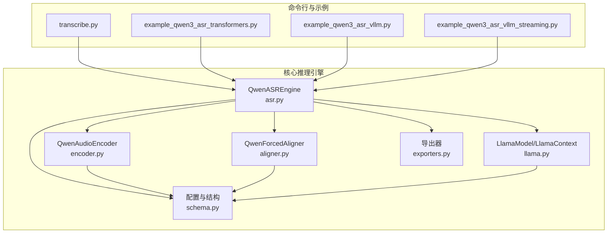
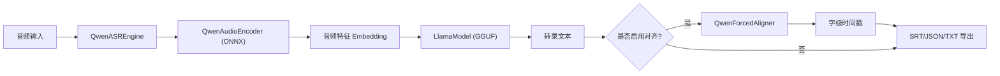
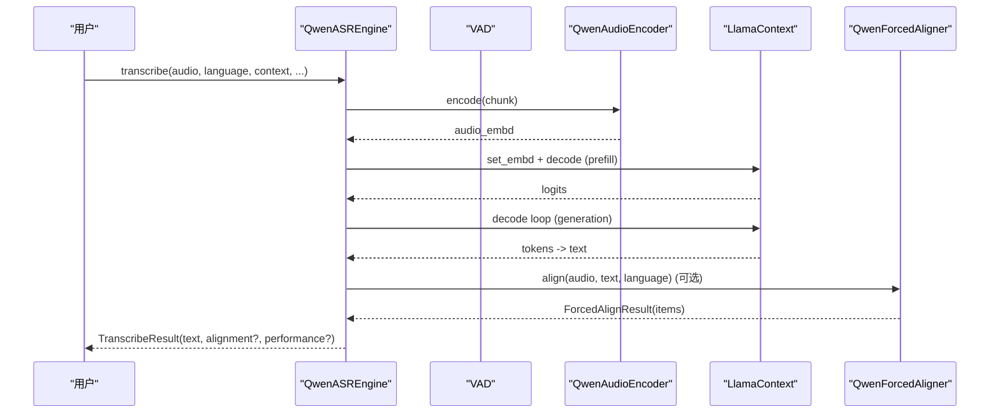
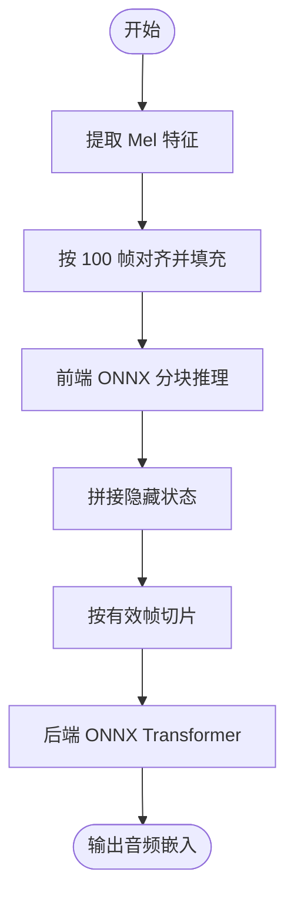
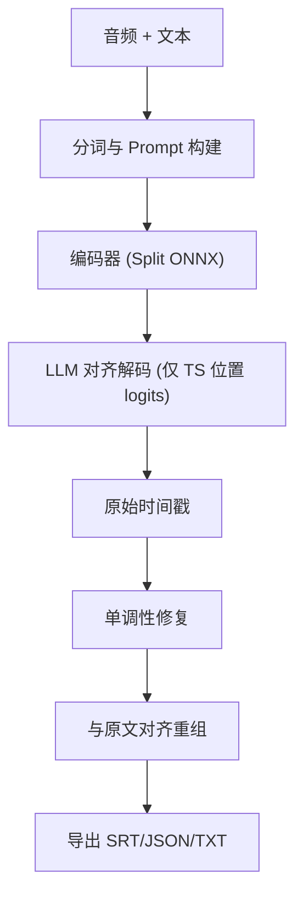
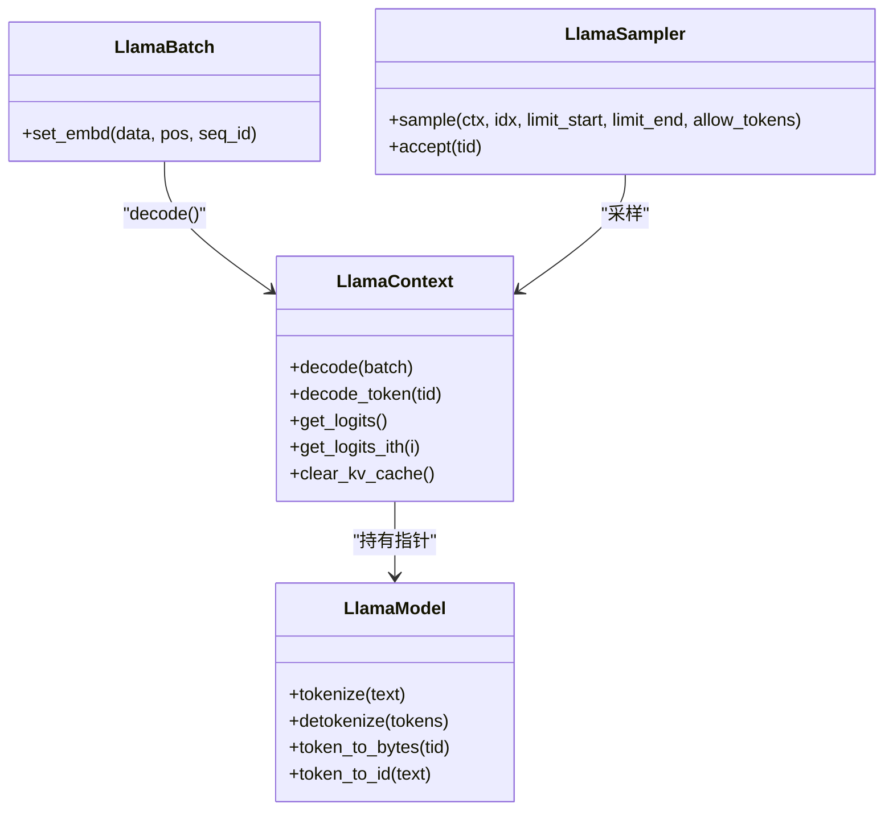
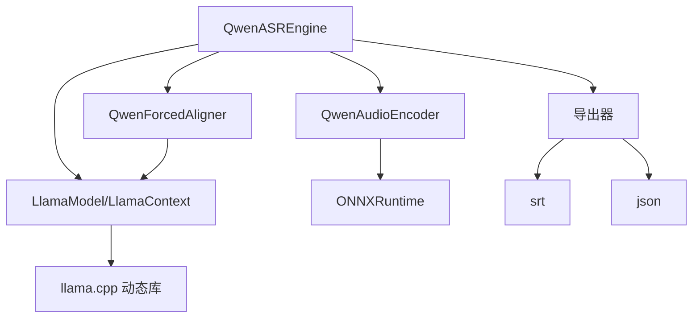

# 项目概述

<cite>
**本文档引用的文件**
- [README.md](file://README.md)
- [simpread-Qwen3-ASR Technical Report.md](file://simpread-Qwen3-ASR Technical Report.md)
- [qwen_asr_gguf/inference/asr.py](file://qwen_asr_gguf/inference/asr.py)
- [qwen_asr_gguf/inference/encoder.py](file://qwen_asr_gguf/inference/encoder.py)
- [qwen_asr_gguf/inference/llama.py](file://qwen_asr_gguf/inference/llama.py)
- [qwen_asr_gguf/inference/aligner.py](file://qwen_asr_gguf/inference/aligner.py)
- [qwen_asr_gguf/inference/exporters.py](file://qwen_asr_gguf/inference/exporters.py)
- [qwen_asr_gguf/inference/schema.py](file://qwen_asr_gguf/inference/schema.py)
- [transcribe.py](file://transcribe.py)
- [examples/example_qwen3_asr_transformers.py](file://examples/example_qwen3_asr_transformers.py)
- [examples/example_qwen3_asr_vllm.py](file://examples/example_qwen3_asr_vllm.py)
- [examples/example_qwen3_asr_vllm_streaming.py](file://examples/example_qwen3_asr_vllm_streaming.py)
</cite>

## 目录
1. [简介](#简介)
2. [项目结构](#项目结构)
3. [核心组件](#核心组件)
4. [架构总览](#架构总览)
5. [详细组件分析](#详细组件分析)
6. [依赖关系分析](#依赖关系分析)
7. [性能考量](#性能考量)
8. [故障排查指南](#故障排查指南)
9. [结论](#结论)
10. [附录](#附录)

## 简介
Qwen3-ASR GGUF 是一个将 Qwen3-ASR 语音识别模型转换为可在本地高效运行的混合推理系统，核心价值主张包括：
- 纯本地运行：无需网络，数据不出域，保障隐私与安全
- 快速高效：混合推理架构（ONNX Encoder + GGUF Decoder），在 RTX 5050 上实测 50 秒中文音频总处理时长约 2.59 秒（RTF≈0.052），CPU 上约 19.6 秒（RTF≈0.39）
- GPU 加速：支持 CUDA/ROCM/Vulkan/DirectML 等多后端，显存占用合理（ASR+Aligner 共计约 2.5GB）
- 流式输出：支持无限长音频的分片流式转录，结合 VAD 动态分片，显著降低 RTF
- 字幕输出：基于 Qwen3-ForcedAligner 的字级时间戳对齐，输出 SRT/JSON/TXT，满足字幕生成需求
- 上下文增强：支持上下文提示词，提升准确率与领域适配能力

本项目面向初学者提供易用的命令行工具与示例，同时为有经验的开发者提供灵活的 API 与可扩展的架构。

## 项目结构
项目采用“核心推理引擎 + 多后端适配 + 工具与示例”的组织方式：
- 核心推理：qwen_asr_gguf/inference/ 下的 ASR 引擎、编码器、对齐器、GGUF 绑定与导出工具
- 配置与数据结构：schema.py 定义配置、消息与结果结构
- 命令行工具：transcribe.py 提供一键转录与导出
- 示例：examples/ 下提供 Transformers/vLLM 后端与流式推理示例
- README 与技术报告：说明特性、性能、部署与使用

**图表来源**
- [transcribe.py:68-205](file://transcribe.py#L68-L205)
- [qwen_asr_gguf/inference/asr.py:40-142](file://qwen_asr_gguf/inference/asr.py#L40-L142)
- [qwen_asr_gguf/inference/encoder.py:119-280](file://qwen_asr_gguf/inference/encoder.py#L119-L280)
- [qwen_asr_gguf/inference/aligner.py:229-350](file://qwen_asr_gguf/inference/aligner.py#L229-L350)
- [qwen_asr_gguf/inference/llama.py:443-549](file://qwen_asr_gguf/inference/llama.py#L443-L549)
- [qwen_asr_gguf/inference/exporters.py:10-120](file://qwen_asr_gguf/inference/exporters.py#L10-L120)
- [qwen_asr_gguf/inference/schema.py:162-235](file://qwen_asr_gguf/inference/schema.py#L162-L235)

**章节来源**
- [README.md:118-344](file://README.md#L118-L344)
- [transcribe.py:68-205](file://transcribe.py#L68-L205)

## 核心组件
- QwenASREngine：统一的 ASR 引擎，负责分片策略、VAD、编码、解码、对齐与结果导出
- QwenAudioEncoder：Split ONNX 编码器（Frontend + Backend），支持 CUDA/ROCM/Vulkan/DirectML
- QwenForcedAligner：基于 LLM 的强制对齐器，输出字级时间戳
- LlamaModel/LlamaContext：GGUF 推理绑定，封装 llama.cpp 的模型、上下文与批处理
- 导出器：SRT/JSON/TXT 导出工具，支持 ITN 与标点换行
- 配置与数据结构：ASREngineConfig、AlignerConfig、VADConfig、结果结构等

**章节来源**
- [qwen_asr_gguf/inference/asr.py:40-142](file://qwen_asr_gguf/inference/asr.py#L40-L142)
- [qwen_asr_gguf/inference/encoder.py:119-280](file://qwen_asr_gguf/inference/encoder.py#L119-L280)
- [qwen_asr_gguf/inference/aligner.py:229-350](file://qwen_asr_gguf/inference/aligner.py#L229-L350)
- [qwen_asr_gguf/inference/llama.py:443-549](file://qwen_asr_gguf/inference/llama.py#L443-L549)
- [qwen_asr_gguf/inference/exporters.py:10-120](file://qwen_asr_gguf/inference/exporters.py#L10-L120)
- [qwen_asr_gguf/inference/schema.py:162-235](file://qwen_asr_gguf/inference/schema.py#L162-L235)

## 架构总览
混合推理架构将传统 ASR 的“声学前端 + 大语言模型解码器”拆分为：
- ONNX Encoder：负责音频特征提取（Split 前端 + 后端 Transformer），支持 GPU Provider 与固定形状优化
- GGUF Decoder（llama.cpp）：负责基于音频嵌入与上下文的文本生成与流式解码

**图表来源**
- [README.md:296-314](file://README.md#L296-L314)
- [qwen_asr_gguf/inference/asr.py:40-142](file://qwen_asr_gguf/inference/asr.py#L40-L142)
- [qwen_asr_gguf/inference/encoder.py:119-280](file://qwen_asr_gguf/inference/encoder.py#L119-L280)
- [qwen_asr_gguf/inference/llama.py:443-549](file://qwen_asr_gguf/inference/llama.py#L443-L549)
- [qwen_asr_gguf/inference/aligner.py:229-350](file://qwen_asr_gguf/inference/aligner.py#L229-L350)
- [qwen_asr_gguf/inference/exporters.py:10-120](file://qwen_asr_gguf/inference/exporters.py#L10-L120)

## 详细组件分析

### QwenASREngine（ASR 引擎）
- 分片策略：短音频单片处理；长音频按 VAD 动态分片，静音段跳过，语音段按边界对齐，避免非连续音频拼接导致的幻觉
- VAD 集成：FireRedVAD，自适应阈值，合并静音，扩展边界，降低 RTF
- 解码内核：预填充 + 生成循环，支持温度与采样器链，内置重复熔断与去重后处理
- 统一入口：transcribe（离线）、transcribe_stream（流式）、asr/asr_stream（核心）

**图表来源**
- [qwen_asr_gguf/inference/asr.py:432-596](file://qwen_asr_gguf/inference/asr.py#L432-L596)
- [qwen_asr_gguf/inference/encoder.py:260-280](file://qwen_asr_gguf/inference/encoder.py#L260-L280)
- [qwen_asr_gguf/inference/llama.py:520-549](file://qwen_asr_gguf/inference/llama.py#L520-L549)
- [qwen_asr_gguf/inference/aligner.py:260-348](file://qwen_asr_gguf/inference/aligner.py#L260-L348)

**章节来源**
- [qwen_asr_gguf/inference/asr.py:432-596](file://qwen_asr_gguf/inference/asr.py#L432-L596)

### QwenAudioEncoder（ONNX 编码器）
- Split 模式：前端 CNN 分块推理 + 后端 Transformer，支持固定形状（DirectML）与动态形状（CUDA/ROCM）
- Provider 选择：优先 CUDA/ROCM/TensorRT/Dml，回退 CPU
- 固定形状优化：DirectML 下预热与固定长度填充，配合注意力掩码，稳定显存分配
- 输出：音频嵌入（T, D），供 LLM 解码

**图表来源**
- [qwen_asr_gguf/inference/encoder.py:198-258](file://qwen_asr_gguf/inference/encoder.py#L198-L258)

**章节来源**
- [qwen_asr_gguf/inference/encoder.py:119-280](file://qwen_asr_gguf/inference/encoder.py#L119-L280)

### QwenForcedAligner（强制对齐器）
- 输入：音频嵌入 + 文本分词序列（插入时间戳占位）
- 推理：仅对时间戳位置计算 logits，加速对齐
- 后处理：时间戳单调性修复、与原文对齐重组、标点与空格还原
- 输出：字级时间戳序列，支持 SRT/JSON/TXT 导出

**图表来源**
- [qwen_asr_gguf/inference/aligner.py:260-348](file://qwen_asr_gguf/inference/aligner.py#L260-L348)
- [qwen_asr_gguf/inference/exporters.py:10-120](file://qwen_asr_gguf/inference/exporters.py#L10-L120)

**章节来源**
- [qwen_asr_gguf/inference/aligner.py:229-350](file://qwen_asr_gguf/inference/aligner.py#L229-L350)
- [qwen_asr_gguf/inference/exporters.py:10-120](file://qwen_asr_gguf/inference/exporters.py#L10-L120)

### LlamaModel/LlamaContext（GGUF 推理绑定）
- 模型封装：加载 GGUF 模型，提供 token 化、字节解码、嵌入查询
- 上下文封装：管理 KV 缓存、批处理、采样器链
- 批处理：set_embd 支持复杂位置编码，decode_token 原子解码
- 采样器：温度、Top-K、Top-P、Min-P、重复惩罚等链式控制

**图表来源**
- [qwen_asr_gguf/inference/llama.py:443-738](file://qwen_asr_gguf/inference/llama.py#L443-L738)

**章节来源**
- [qwen_asr_gguf/inference/llama.py:443-738](file://qwen_asr_gguf/inference/llama.py#L443-L738)

### 配置与数据结构
- ASREngineConfig：模型路径、编码器/解码器文件名、GPU 开关、上下文窗口、分片与记忆、VAD 配置、对齐开关
- AlignerConfig：对齐器模型路径、前后端 ONNX 文件、GPU 开关、上下文窗口、填充时长
- VADConfig：平滑窗口、阈值、最短/最长语音段、最短静音、合并静音、扩展边界、分片上限、最小启用时长
- 结果结构：TranscribeResult、ForcedAlignResult、StreamChunkResult、VADChunk 等

**章节来源**
- [qwen_asr_gguf/inference/schema.py:162-235](file://qwen_asr_gguf/inference/schema.py#L162-L235)

## 依赖关系分析
- 引擎依赖：ASR 引擎依赖编码器、解码器（GGUF）、可选对齐器与 VAD
- 编码器依赖：ONNXRuntime，支持 CUDA/ROCM/Vulkan/Dml Provider
- 解码器依赖：llama.cpp 动态库与 GGUF 文件
- 导出器依赖：srt、json、ITN（中文数字规整）

**图表来源**
- [qwen_asr_gguf/inference/asr.py:49-96](file://qwen_asr_gguf/inference/asr.py#L49-L96)
- [qwen_asr_gguf/inference/encoder.py:130-176](file://qwen_asr_gguf/inference/encoder.py#L130-L176)
- [qwen_asr_gguf/inference/llama.py:159-218](file://qwen_asr_gguf/inference/llama.py#L159-L218)
- [qwen_asr_gguf/inference/exporters.py:1-120](file://qwen_asr_gguf/inference/exporters.py#L1-L120)

**章节来源**
- [qwen_asr_gguf/inference/asr.py:49-96](file://qwen_asr_gguf/inference/asr.py#L49-L96)
- [qwen_asr_gguf/inference/encoder.py:130-176](file://qwen_asr_gguf/inference/encoder.py#L130-L176)
- [qwen_asr_gguf/inference/llama.py:159-218](file://qwen_asr_gguf/inference/llama.py#L159-L218)
- [qwen_asr_gguf/inference/exporters.py:1-120](file://qwen_asr_gguf/inference/exporters.py#L1-L120)

## 性能考量
- 实测性能（RTX 5050，50 秒音频）：总处理时长约 2.59 秒（RTF≈0.052），CPU 约 19.6 秒（RTF≈0.39）
- 显存占用：开启 ONNX GPU Provider（CUDA/ROCM/DirectML）时，ASR+Aligner 共计约 2.5GB；Vulkan 模式下约 1.6GB+0.9GB
- 编码器量化：Encoder int4，Decoder q4_k，数值质量与速度平衡良好
- VAD 降噪：长音频启用 VAD，跳过静音段，显著降低 RTF 与幻觉
- DirectML 固定形状优化：填充到固定长度并配合注意力掩码，减少显存抖动

**章节来源**
- [README.md:19-116](file://README.md#L19-L116)

## 故障排查指南
- 输出乱码或“!!!!”：Intel 集显 FP16 计算溢出，设置环境变量禁用 FP16（如 GGML_VK_DISABLE_F16=1）
- 模型文件缺失：transcribe 命令会检查模型文件，缺失时给出下载指引
- GPU/DirectML 不可用：自动回退 CPU，或关闭 Vulkan/CUDA/ROCM 后重试
- 日志定位：日志文件默认在 logs/latest.log，便于定位初始化与推理异常

**章节来源**
- [README.md:373-382](file://README.md#L373-L382)
- [transcribe.py:37-67](file://transcribe.py#L37-L67)

## 结论
Qwen3-ASR GGUF 通过“ONNX Encoder + GGUF Decoder”的混合推理架构，实现了纯本地、高速、可扩展的语音识别与字幕生成能力。它在保证高精度的同时，兼顾了易用性与部署灵活性，适合个人隐私保护、边缘计算与大规模离线转录等多种场景。

## 附录

### 项目背景与应用场景
- 背景：Qwen3-ASR 家族包含 ASR 与强制对齐模型，支持多语种、方言与长音频，具备强大的鲁棒性与泛化能力
- 应用场景：本地化会议记录、视频字幕生成、离线语音标注、隐私敏感行业应用（金融、医疗、政务）

**章节来源**
- [simpread-Qwen3-ASR Technical Report.md:5-32](file://simpread-Qwen3-ASR Technical Report.md#L5-L32)

### 性能指标与对比
- RTX 5050 实测：50 秒音频 RTF≈0.052（GPU），CPU RTF≈0.39
- 显存占用：ONNX GPU Provider 约 2.5GB，Vulkan 约 1.6GB+0.9GB
- 量化策略：Encoder int4、Decoder q4_k，兼顾精度与速度

**章节来源**
- [README.md:19-116](file://README.md#L19-L116)

### 与其他语音识别方案的差异化优势
- 纯本地：无需网络，数据不出域
- 混合推理：ONNX 编码器 + GGUF 解码器，兼顾速度与精度
- 流式与字幕：VAD 动态分片 + 强制对齐，输出 SRT/JSON/TXT
- 多后端：CUDA/ROCM/Vulkan/DirectML，适配不同硬件生态

**章节来源**
- [README.md:10-18](file://README.md#L10-L18)

### 使用场景示例
- 命令行转录：transcribe.py 支持多种参数，一键导出文本与字幕
- 示例脚本：Transformers/vLLM 后端与流式推理示例，便于迁移与扩展

**章节来源**
- [transcribe.py:68-205](file://transcribe.py#L68-L205)
- [examples/example_qwen3_asr_transformers.py:1-151](file://examples/example_qwen3_asr_transformers.py#L1-L151)
- [examples/example_qwen3_asr_vllm.py:1-153](file://examples/example_qwen3_asr_vllm.py#L1-L153)
- [examples/example_qwen3_asr_vllm_streaming.py:1-106](file://examples/example_qwen3_asr_vllm_streaming.py#L1-L106)